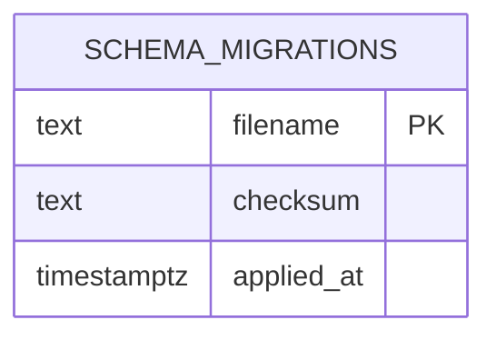

# Entity Relationship Diagram

Application-owned tables only. Update this file in any checkpoint that adds, removes or changes a foreign key (`pnpm data-model:check` requires it when a foreign key in the schema snapshot changes).

`public.schema_migrations` has no relationships. Third-party schemas (`pgboss`, PostGIS) are intentionally omitted. Planned domain schemas (identity, catalog, booking, finance, ...) will appear here as their tables are created.
