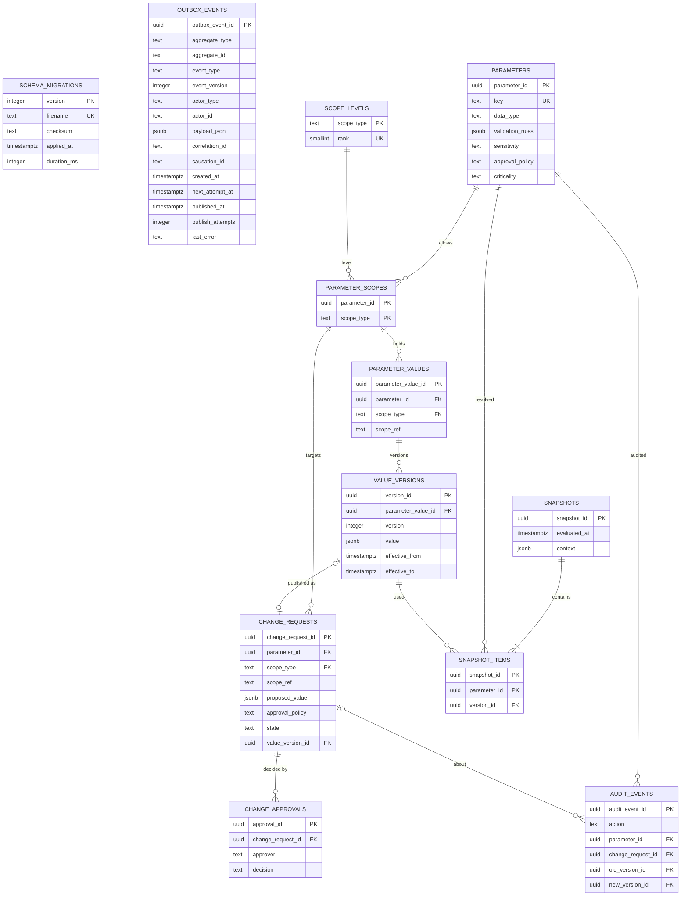
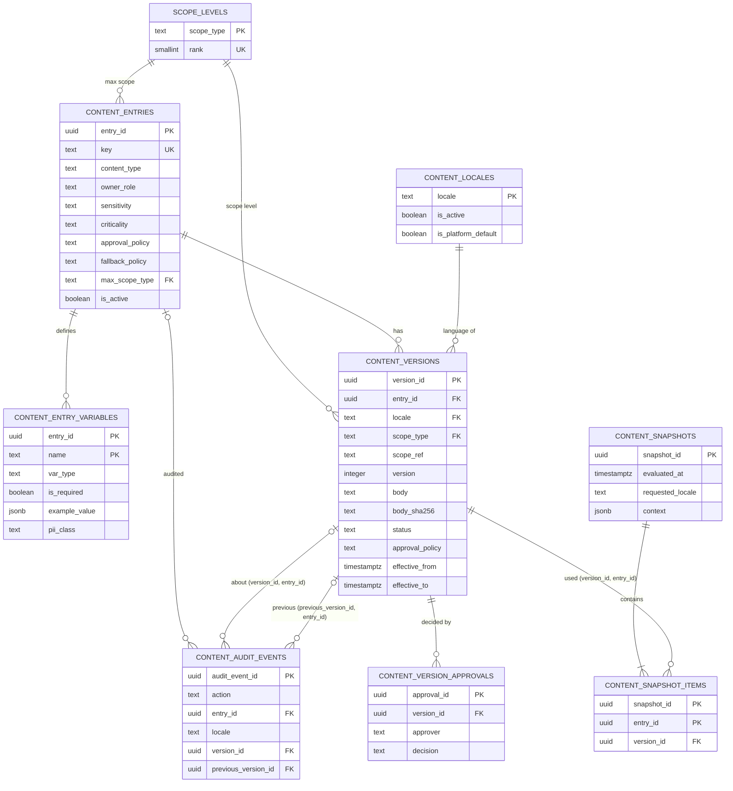
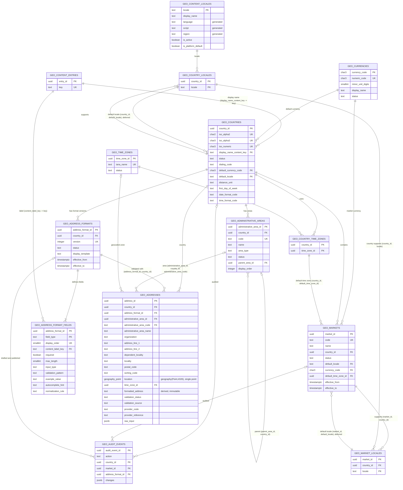
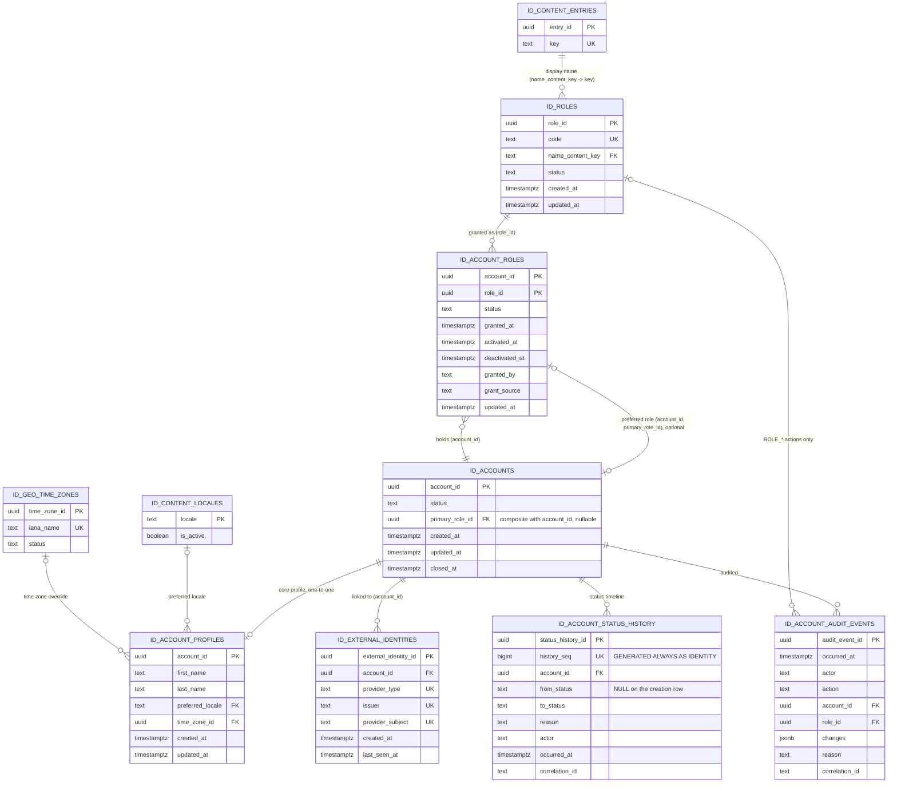

# Entity Relationship Diagram

Application-owned tables only. Update this file in any checkpoint that adds, removes or changes a table or foreign key (`pnpm data-model:check` additionally requires it when a foreign key in the schema snapshot changes).

`public.schema_migrations` and `integration.outbox_events` have no relationships. `schema_migrations` is migration infrastructure. `outbox_events` is intentionally domain-agnostic: `aggregate_type` and `aggregate_id` point at domain tables by value, never by foreign key.

The `configuration` schema (CFG-001) is a self-contained cluster (its `scope_levels` is also referenced read-only by the `content` schema, see below). `parameter_values.scope_ref` and `change_requests.scope_ref` reference future domain entities (market, category, provider, ...) by opaque value with no foreign key, so the registry does not depend on tables that do not exist yet; the level itself is enforced through `parameter_scopes -> scope_levels`. `audit_events.change_request_id` is nullable (parameter creation has no request). Third-party schemas (`pgboss`, PostGIS) are omitted. Planned domain schemas appear here as their tables are created.

## content schema (CFG-002)

The `content` schema is a second cluster. It shares exactly one table with `configuration`: `configuration.scope_levels` (the single scope hierarchy). Entity names are prefixed `CONTENT_` where they would collide with `configuration` entities in the diagram above.

`content.versions.scope_ref` references future domain entities (country, market) by opaque value with no foreign key, as in `configuration`; the level is enforced through `versions.scope_type -> configuration.scope_levels` and bounded by `entries.max_scope_type`. `content.snapshot_items` references versions through the composite key `(version_id, entry_id)`, which is why `entry_id` is repeated there. `content.audit_events.entry_id` is NULL for locale actions and `version_id` is NULL for entry and locale actions; `audit_events` references versions through the composite keys `(version_id, entry_id)` and `(previous_version_id, entry_id)` (so a version can only be named together with its own entry); `audit_events.locale` is a plain value (no foreign key) stored only for locale actions. Legal documents are `LEGAL` entries in this same cluster; future acceptance records (ID-005) will reference `content.versions.version_id`.

## geography schema (GEO-001, GEO-002)

The `geography` schema is a third cluster (GEO-001 reference data; GEO-002 added the address model: `GEO_ADMINISTRATIVE_AREAS`, `GEO_ADDRESS_FORMATS`, `GEO_ADDRESS_FORMAT_FIELDS`, `GEO_ADDRESSES`). It depends on `content` only (foreign keys go geography -> content, never the other way): `content.locales` is the single locale authority, and `content.entries` holds the country display name. Entity names are prefixed `GEO_` throughout (including the referenced content tables, which are the same tables as `CONTENT_LOCALES` and `CONTENT_ENTRIES` above) so that they stay unique across the diagrams in this file.

`GEO_CONTENT_LOCALES` is `content.locales` (changed in GEO-001: `display_name` plus the generated `language`, `script`, `region`); there is no `geography.locales`. `GEO_CONTENT_ENTRIES` is `content.entries`; only its `key` is referenced (`fk_countries__display_name_content_key`). The two default-locale relationships point from the child to a membership row: a country's default locale must be one of its supported locales and a market's default locale one of the market's supported locales, both checked at commit (deferred composite foreign keys), which is why `GEO_COUNTRIES` and `GEO_MARKETS` appear on the many side of a relationship to their own link tables. `GEO_MARKET_LOCALES.country_id` repeats the market's country so that the composite key `(country_id, locale)` forces every market locale to be supported by the market's country; the key `(market_id, country_id)` to `geography.markets` prevents drift. `GEO_AUDIT_EVENTS` has two nullable subject keys (exactly one is set, `ck_audit_events__subject`) instead of a polymorphic id.

**Address model (GEO-002).** `GEO_ADDRESSES` is the one canonical, immutable structured address; it has NO owner column (customer, provider, booking and business tables will reference `address_id` from their own schemas). Three composite foreign keys carry a repeated value on purpose: `(address_format_id, country_id)` to `GEO_ADDRESS_FORMATS` keeps the format version in the address country (`uq_address_formats__format_country`), `(administrative_area_id, country_id, administrative_area_code)` to `GEO_ADMINISTRATIVE_AREAS` keeps the area in the country and the stored code equal to the area code (`uq_administrative_areas__area_country_code`; all three NULL for a free-text or absent area, MATCH SIMPLE), and `(parent_area_id, country_id)` keeps a parent area in the same country (`uq_administrative_areas__area_country`). `GEO_ADDRESS_FORMATS` is one row per country VERSION; a partial exclusion constraint (`ex_address_formats__no_overlap`, gist) allows at most one `PUBLISHED` format of a country in force at any instant, so the relationship country to formats is 1-N with a no-overlap rule that a diagram cannot show. `GEO_ADDRESS_FORMAT_FIELDS` has a composite key `(address_format_id, field_type)` and a second unique key `(address_format_id, display_order)`; its label points at `content.entries (key)`. `GEO_AUDIT_EVENTS` now has three nullable subject keys (exactly one is set, `ck_audit_events__subject`). `location` is the only PostGIS column in the database; the diagram type name `geography_point` stands for `geography(Point,4326)`. There is no `postal_code_rules` table: the postal rule is the pattern on the `POSTAL_CODE` field row.

`geography` has no foreign key to `integration.outbox_events`: geography events (aggregate types `geography_country`, `geography_market` and `geography_address_format`) point at their aggregate by value, as for every outbox producer. `configuration` and `content` `scope_ref` values for COUNTRY (ISO alpha-2, upper case) and MARKET (market code, lower-case kebab) scopes stay opaque text with no foreign key (DEBT-0024 remains open); they are validated against `geography` by the service layer through a port, not by the database.

## identity schema (ID-001)

The `identity` schema is a fourth cluster and the first application (not registry) schema. It depends on `content` (role display names, the preferred locale) and `geography` (the time zone override) and nothing depends on it yet: foreign keys go identity -> content and identity -> geography, never the other way, and `integration.outbox_events` points at it by value. Entity names are prefixed `ID_` (the referenced tables are the same tables as `GEO_CONTENT_ENTRIES`, `GEO_CONTENT_LOCALES` and `GEO_TIME_ZONES` above).

**Account versus external identity.** `ID_ACCOUNTS` carries no Keycloak subject. `ID_EXTERNAL_IDENTITIES` maps `(provider_type, issuer, provider_subject)`, one unique key marked `UK` on the three columns in the diagram, to an account: one login links at most one account, an account may have several links (no unique key on `account_id`). No Keycloak table is referenced, and nothing of credentials, MFA or sessions is mirrored.

**Role membership and the preferred role.** `ID_ACCOUNT_ROLES` has the composite primary key `(account_id, role_id)`: one membership row per account and role, so a login can be a customer and a provider (two rows) but never holds a role twice. The relationship from `ID_ACCOUNT_ROLES` to `ID_ACCOUNTS` runs the other way round on purpose: `accounts.primary_role_id` is the composite foreign key `fk_accounts__primary_role (account_id, primary_role_id)` to `account_roles (account_id, role_id)` (MATCH SIMPLE, so NULL means no preference). The key includes `account_id`, which is why the preference can only name a membership of the SAME account (the account's own id is part of the key, so a membership of another account cannot match), and a trigger adds that the membership is ACTIVE. The two tables reference each other without a deferred key because an account is inserted without a primary role.

**Status current state and history.** `accounts.status` is the current state and `ID_ACCOUNT_STATUS_HISTORY` holds every change (intentional denormalization); the relationship has no database key that carries the equality, so two deferred constraint triggers check it at commit in both directions, each against the CURRENT account status: `trg_accounts__status_history` (on `accounts`) requires the newest history row (highest `history_seq`) to equal `accounts.status`, and `trg_account_status_history__consistent` (on the history table) refuses a stray row, a row whose `from_status` does not continue the previous row's `to_status` (NULL for the first row) and a newest row that differs from the account status.

**Profile, audit, and what is deliberately absent.** `ID_ACCOUNT_PROFILES` is one-to-one with the account (`account_id` is primary key and foreign key) and optional (the row exists once a name was given); there is no `display_name`. `ID_ACCOUNT_AUDIT_EVENTS.role_id` is set only for `ROLE_*` actions (`ck_account_audit_events__role`). There are no contact tables (email and phone: ID-002, ID-003), no address column or table (`geography.addresses` stays ownerless; a saved address will reference `address_id` from its own table with `ON DELETE RESTRICT`), no admin identity table (admin logins have no account, DEBT-0046) and no foreign key to `integration.outbox_events` (identity events, aggregate type `identity_account`, point at their aggregate by value).
