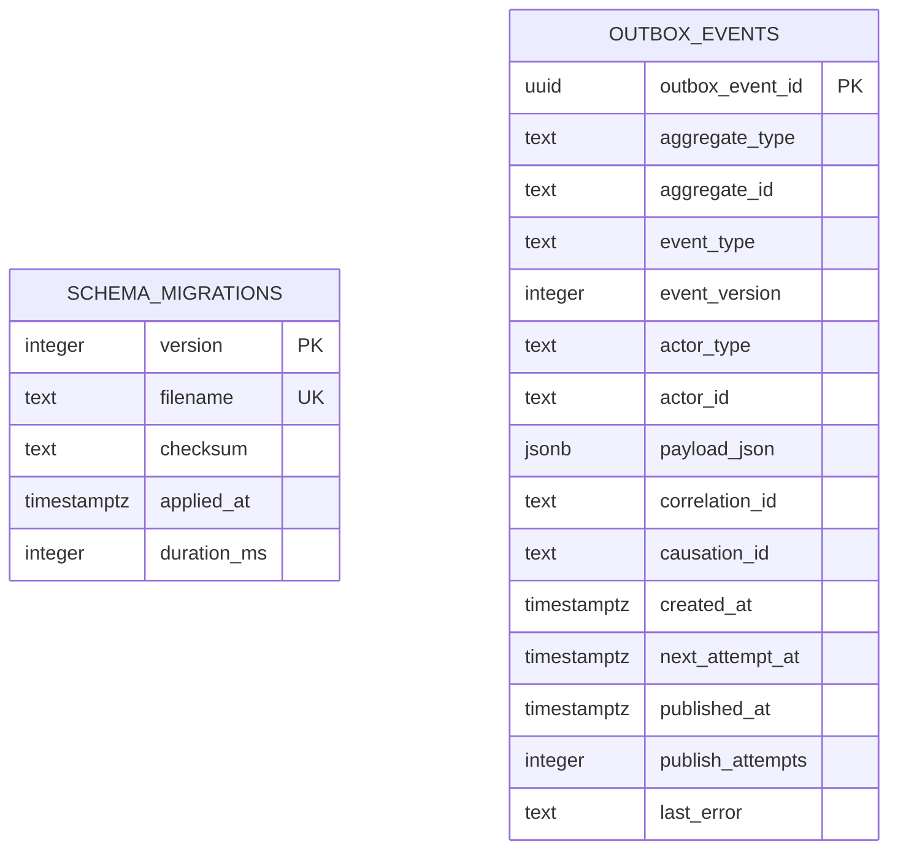

# Entity Relationship Diagram

Application-owned tables only. Update this file in any checkpoint that adds, removes or changes a table or foreign key (`pnpm data-model:check` additionally requires it when a foreign key in the schema snapshot changes).

Neither table has relationships. `public.schema_migrations` is migration infrastructure. `integration.outbox_events` is intentionally domain-agnostic: `aggregate_type` and `aggregate_id` point at future domain tables by value, never by foreign key, so the outbox can serve every domain without coupling to them. Third-party schemas (`pgboss`, PostGIS) are omitted. Planned domain schemas appear here as their tables are created.
