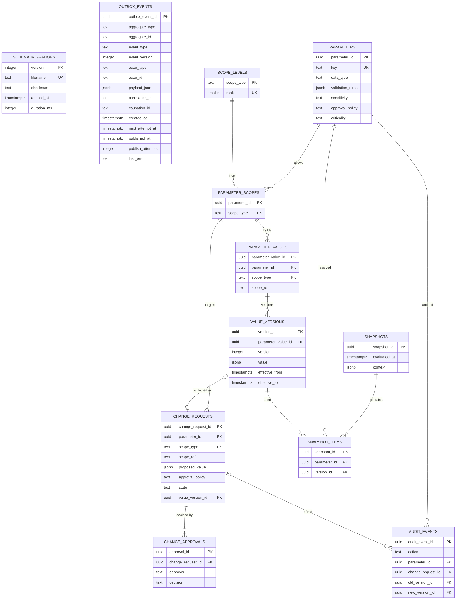
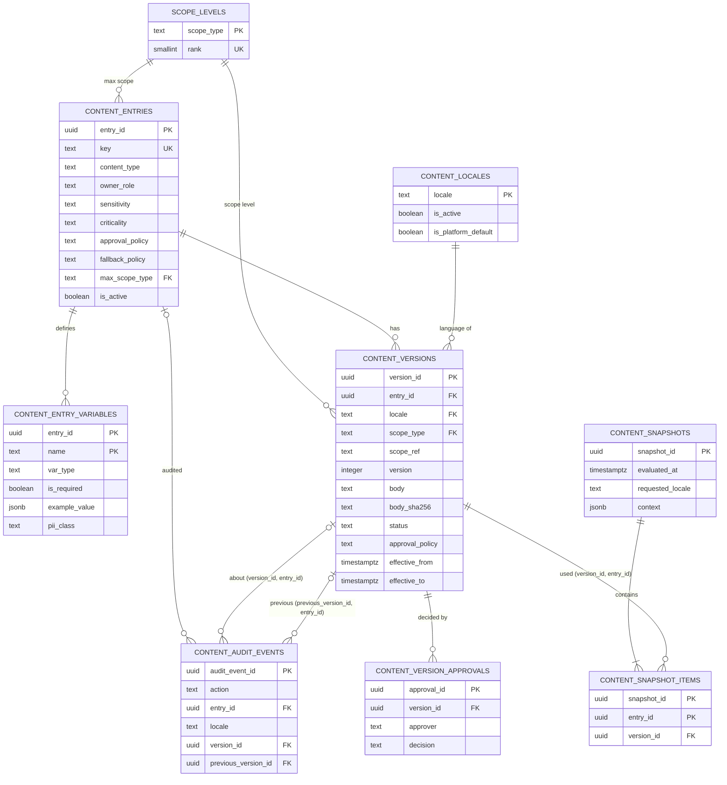

# Entity Relationship Diagram

Application-owned tables only. Update this file in any checkpoint that adds, removes or changes a table or foreign key (`pnpm data-model:check` additionally requires it when a foreign key in the schema snapshot changes).

`public.schema_migrations` and `integration.outbox_events` have no relationships. `schema_migrations` is migration infrastructure. `outbox_events` is intentionally domain-agnostic: `aggregate_type` and `aggregate_id` point at domain tables by value, never by foreign key.

The `configuration` schema (CFG-001) is a self-contained cluster (its `scope_levels` is also referenced read-only by the `content` schema, see below). `parameter_values.scope_ref` and `change_requests.scope_ref` reference future domain entities (market, category, provider, ...) by opaque value with no foreign key, so the registry does not depend on tables that do not exist yet; the level itself is enforced through `parameter_scopes -> scope_levels`. `audit_events.change_request_id` is nullable (parameter creation has no request). Third-party schemas (`pgboss`, PostGIS) are omitted. Planned domain schemas appear here as their tables are created.

## content schema (CFG-002)

The `content` schema is a second cluster. It shares exactly one table with `configuration`: `configuration.scope_levels` (the single scope hierarchy). Entity names are prefixed `CONTENT_` where they would collide with `configuration` entities in the diagram above.

`content.versions.scope_ref` references future domain entities (country, market) by opaque value with no foreign key, as in `configuration`; the level is enforced through `versions.scope_type -> configuration.scope_levels` and bounded by `entries.max_scope_type`. `content.snapshot_items` references versions through the composite key `(version_id, entry_id)`, which is why `entry_id` is repeated there. `content.audit_events.entry_id` is NULL for locale actions and `version_id` is NULL for entry and locale actions; `audit_events` references versions through the composite keys `(version_id, entry_id)` and `(previous_version_id, entry_id)` (so a version can only be named together with its own entry); `audit_events.locale` is a plain value (no foreign key) stored only for locale actions. Legal documents are `LEGAL` entries in this same cluster; future acceptance records (ID-005) will reference `content.versions.version_id`.
