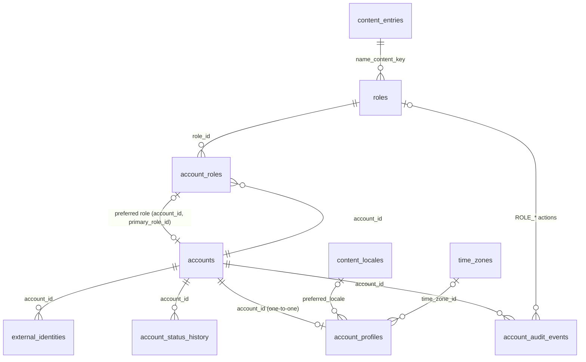
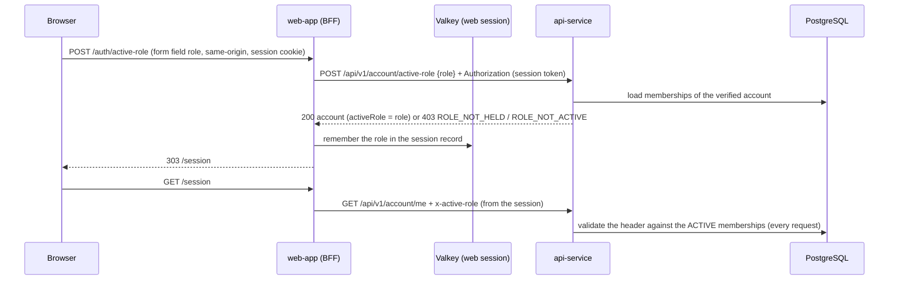
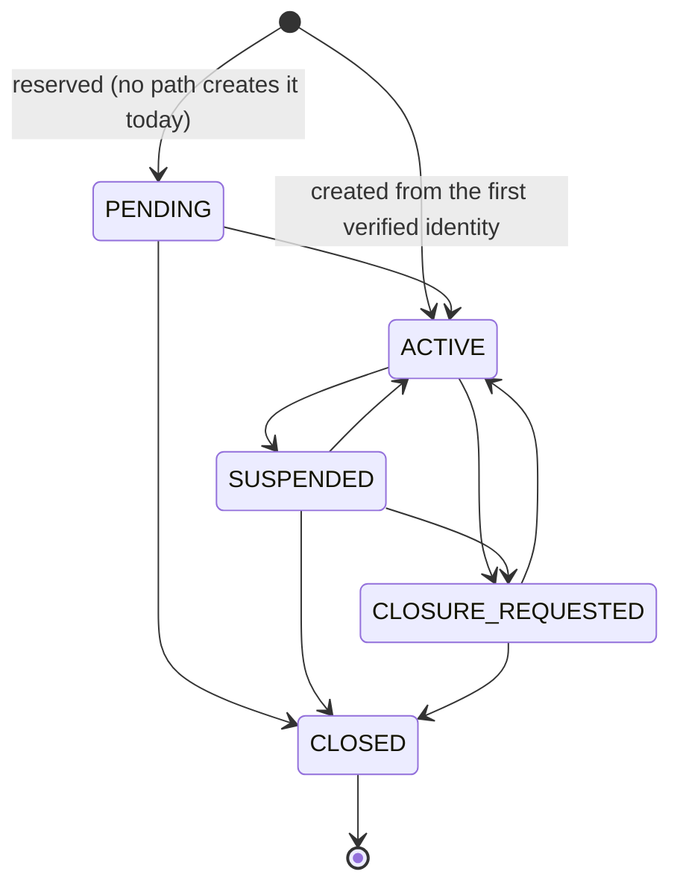

# Application Accounts

The application account (ID-001) is the BananaGig account of a person: the record that every later domain (addresses, bookings, balances, consents, provider data) hangs on. Keycloak authenticates the person; PostgreSQL knows the account. This document describes how a verified Keycloak identity is mapped to an account, how application roles and the active role work, the account status machine, the core profile, and the privacy and concurrency rules. Decisions: ADR-0025 (application account versus Keycloak identity) and ADR-0026 (role membership and the active role context); the baseline they build on is ADR-0013 (Keycloak owns authentication only), ADR-0014 (server-side web session) and ADR-0015 (admin separation). The authentication side is described in `docs/engineering/IDENTITY.md`.

Requirements served: CU-03.01 and CU-03.02 (a person who signs in or signs up needs an account), CU-03.03 and CU-09.23 (one login holds customer and provider roles and switches role without signing out), PR-01.04 (an existing customer login adds the provider role), SV-11.02 (first and last name, the public display rule), SV-11.08 (roles section; admin accounts are separate logins and hold no customer or provider role) and SV-11.09 (a status machine for closing an account; the closure rules are not in this checkpoint).

The account holds personal data (the profile names) and is linked to a personal identifier (the Keycloak subject). Nothing in this model logs a token, the subject of an account's login or a name, returns another person's data, or accepts an account id or a role from the client (an actor string such as `admin:<subject>` names who acted, never the account being changed). See Privacy and security.

## Purpose and scope

In scope:

- The application account in PostgreSQL, created lazily from the first authenticated request of a verified Keycloak identity of the normal web context.
- The mapping of a login to its account (`identity.external_identities`: provider type, issuer, subject), unique and immutable.
- Application roles as reference data (`CUSTOMER`, `PROVIDER`), role memberships (one row per account and role), the persisted preferred (primary) role, and the request-scoped active role validated on every request.
- The account status machine (`PENDING`, `ACTIVE`, `SUSPENDED`, `CLOSURE_REQUESTED`, `CLOSED`) with an immutable status history and two deferred database checks that keep the two consistent in both directions.
- The core profile (first and last name, preferred locale, time zone override) and the public display rule.
- An audit trail, five outbox events and three API operations (`GET /account/me`, `POST /account/active-role`, `PUT /account/profile`).

Not in scope (no table, column or route exists for any of them):

| Not here | Where it belongs |
|---|---|
| Onboarding screens, sign-up and sign-in forms, carousels, the role switcher UI | web checkpoints (CU-03 and later); the account area (CU-09, PR-09) |
| Phone storage and verification | ID-003 (phone); CU-03.04 to CU-03.06, SV-03 |
| Email recovery of access, the account email screens and the step-up before an email change | DEBT-0017, DEBT-0050 (the email contact and its verification are IMPLEMENTED in ID-002: `docs/engineering/EMAIL_VERIFICATION.md`) |
| Password recovery and reset, notifications | DEBT-0017 |
| Consent and legal acceptance records | ID-005 |
| Billing, payment methods, balances, subscriptions | finance checkpoints |
| Photos, bio, public profile, provider business details | profile and provider checkpoints (SV-11.02, PR-09, PB-03) |
| Provider sign-up and the endpoint or flow that adds the provider role | PR-01 (the service method `grantRole` exists; there is deliberately no endpoint) |
| Admin invitation, an admin application identity, application RBAC | AD-07 and the RBAC checkpoint (DEBT-0046, DEBT-0021) |
| Saved addresses and address ownership | the first checkpoint with an address use case (CU-09); `geography.addresses` stays ownerless |
| Closure rules (open bookings, money, payouts), deletion, data export, erasure | DEBT-0045 (the status machine exists; no rule does) |
| An endpoint or screen to change the preferred (primary) role | DEBT-0048 |
| Fine-grained permissions | later, with the features that need them |

## Keycloak versus BananaGig: who owns what

| Concern | Owner | Where it lives |
|---|---|---|
| Credentials, passwords, password policy, brute-force protection | Keycloak | the `keycloak` database |
| Authentication flows, MFA factors, step-up | Keycloak | the `keycloak` database and realm file |
| Protocol sessions and token issuance (access, refresh, ID tokens) | Keycloak | issued by Keycloak; the web server keeps the tokens in its Valkey session record, never in the browser |
| Login identifier (username, login email) | Keycloak | the `keycloak` database; not mirrored |
| The immutable subject (`sub`) and the issuer | Keycloak issues them; BananaGig stores the pair only as the link | `identity.external_identities` |
| Account existence, account id, status and status history | BananaGig | `identity.accounts`, `identity.account_status_history` |
| Application roles, memberships, preferred (primary) role | BananaGig | `identity.roles`, `identity.account_roles`, `identity.accounts.primary_role_id` |
| The active role of a request | BananaGig (web server session plus API validation) | NOT persisted anywhere in PostgreSQL |
| Core profile (names, locale, time zone) | BananaGig | `identity.account_profiles` |
| Email contact and its verification | BananaGig (ID-002) | `identity.email_contacts`, `identity.email_verification_challenges`; the Keycloak email claim is never trusted or copied (ADR-0027) |
| Phone contact and verification | not yet (ID-003) | nothing stored |
| Realm roles `customer`, `provider` | Keycloak (identity claims); used ONCE as a bootstrap hint | the token; never copied |
| Admin identity and `admin-console-access` | Keycloak admin client; no BananaGig account | the `keycloak` database |
| Fine-grained permissions | later (the admin client roles are temporary, DEBT-0021) | not modelled |

## Architecture

| Layer | File | Responsibility |
|---|---|---|
| Contracts | `packages/contracts/src/account.ts` | Vocabularies, the status machine (`ACCOUNT_STATUS_TRANSITIONS`, `isAccountStatusTransitionAllowed`, `isAccountUsable`), `BOOTSTRAP_ROLE_BY_IDENTITY_ROLE`, `ACTIVE_ROLE_HEADER`, the name rules (`normalizeProfileName`, `validateProfileName`, `publicDisplayName`), `AccountDto`, the strict requests, `IDENTITY_EVENTS` and payloads, `ACCOUNT_ERROR_CODES`. Imports nothing from the workspace except sibling contract files |
| Pure helpers | `packages/accounts/src/identity.ts` | `parseVerifiedIdentity`, `externalIdentityKey`, `bootstrapRoleCodes`, `resolveActiveRole`. No I/O, no clock |
| Errors | `packages/accounts/src/errors.ts` | `AccountError` (code, fixed message, identifiers-only details) and `isDatabaseOutage` |
| Service | `packages/accounts/src/service.ts` | `AccountService`: `ensureAccountForIdentity`, `getAccountContext`, `grantRole`, `deactivateRole`, `setPrimaryRole`, `selectActiveRole`, `changeStatus`, `upsertProfile`; transactions, locking, audit, outbox events; `mapDbError`, `assertUsable`, `ruleOf` |
| API guard | `apps/api/src/plugins/account.ts` | `accountPlugin` (decorates `app.accounts` and `request.account`) and `requireAccount({ includeProfile, honorActiveRoleHeader })` |
| API strict bodies | `apps/api/src/plugins/strict-body.ts` | `parseBody` and `strictBody`, shared by the account, content, geography and address routes |
| API routes | `apps/api/src/modules/account/routes.ts`, `dto.ts` | The three operations, `accountDto`, `toAppError` |
| Wiring | `apps/api/src/app.ts`, `apps/api/src/index.ts` | `accounts` is an optional dependency of the app; `index.ts` builds `AccountService({ database, lastSeenTouchSeconds })` |
| Database | `db/migrations/0009_identity_accounts.sql` | Seven tables, guard triggers, the two deferred consistency triggers, seeds |
| Configuration | `packages/config/src/index.ts` | `IDENTITY_LAST_SEEN_TOUCH_SECONDS` (default 300) |

`@bananagig/accounts` is a server-side package (API only): the web app never imports it and calls the API instead (`pnpm deps:check`). The pure helpers and the service are separate so the bootstrap mapping and the active-role resolution are tested without a database. `AccountService` is built once in `apps/api/src/index.ts`.

## Data model

Schema `identity` (migration `db/migrations/0009_identity_accounts.sql`; columns in `docs/data/DATA_DICTIONARY.md`, relationships in `docs/data/ERD.md`, normalization review in `docs/data/NORMALIZATION_LOG.md`).

| Table | Role |
|---|---|
| `roles` | Application roles as reference data, `code` immutable, display name a content key, never deleted |
| `accounts` | The account: `status` (current state), `primary_role_id` (preferred role, composite foreign key to the account's own membership), `closed_at`. No subject, no name, no contact data, no address |
| `account_roles` | One membership row per (account, role) with `PENDING`, `ACTIVE`, `INACTIVE` and the latest grant (`granted_by`, `grant_source`) |
| `external_identities` | `(provider_type, issuer, provider_subject)` to account, unique, immutable except `last_seen_at` |
| `account_status_history` | Immutable status history with a total order (`history_seq`) |
| `account_profiles` | One-to-one core profile: names, preferred locale, time zone override |
| `account_audit_events` | Immutable audit of every other account mutation |

What the database guarantees, in addition to the usual keys and CHECKs (all guard failures are SQLSTATE `23000` with DETAIL `identity_rule:<KEY>`, and the service classifies on the key, never on message text):

- One subject links at most one account (the unique key). An account holds a role at most once (the membership primary key). The preferred role can only be an ACTIVE membership of the same account (composite foreign key plus triggers).
- The status machine is enforced by trigger, `CLOSED` is terminal, a closed account cannot receive a role, an identity link or a profile change, and it cannot be closed while it holds a PENDING or ACTIVE role or a primary role.
- At commit, the status history and the account agree in both directions (two deferred constraint triggers, `STATUS_HISTORY_MISMATCH`): the newest history row equals the CURRENT `accounts.status` read at commit (so a transaction that passes through a transient status, suspend then reactivate, is fine), and every history row continues the previous one (`from_status` equals the previous `to_status`, NULL for the first row), so a stray history row is refused too.
- No row is ever deleted; history and audit rows are immutable; identity columns are immutable.

There is no `users` table, no `display_name`, no `active_role` column, no `sessions` table, no contact table, no address column and no table of Keycloak data.

## Account bootstrap policy

An account is created lazily, in the API, at the first authenticated request of a verified identity of the normal web context. The rules (ADR-0025):

1. The identity is the verified access token only: `iss` and `sub` (plus the realm roles for the one-time hint). The client never supplies an account id, subject or role.
2. Only the normal web identity context (`azp` = `bananagig-web`) bootstraps. The admin context and any other client are refused with 403 `ACCOUNT_CONTEXT_NOT_SUPPORTED` before anything is read or written (admin logins have no account).
3. One transaction creates everything: the account (status `ACTIVE`, no primary role), the creation row of the status history (`from_status` NULL, actor `system:account-bootstrap`), the external identity link, the audit rows `ACCOUNT_CREATED` and `EXTERNAL_IDENTITY_LINKED`, the outbox events `account-created` and `external-identity-linked`, and the bootstrap roles (below). A failure rolls the whole account back.
4. The status is `ACTIVE`, not `PENDING`. Email and phone verification (CU-03.04 to CU-03.06) is a separate state that gates actions (the "Verify your email and phone to book" banner), not the existence of the account; a person who has signed in must be able to hold an account and browse. `PENDING` exists in the machine for a later flow but no path creates it.
5. The first `customer` or `provider` realm role seen seeds the initial application roles ONCE (`BOOTSTRAP_ROLE_BY_IDENTITY_ROLE`): `customer` gives `CUSTOMER`, `provider` gives `PROVIDER`, a token with both gives both, a token with neither creates an account with no role (the active role is then null). The PRD creates the account and role at sign-up, and a provider-first sign-up must not also become a customer, so "grant CUSTOMER to everybody" was rejected. After the account exists, realm roles are NEVER read again; PostgreSQL is the only authority for application roles. This coupling to how Keycloak users are provisioned is a recorded debt (DEBT-0044) that ends when the sign-up flows grant the role explicitly.
6. Every later request finds the link by its unique key and loads the account; `created` is true only on the request that created it.

Why lazy and in the API: the PRD gives a first-time visitor two paths, "Get Started" (sign-up, CU-03.02) and "Already have an account? Sign in" (CU-03.01), and both end in Keycloak; whichever path a person takes, BananaGig needs the account the first time that person is authenticated. Keycloak is the only place a person signs in or up today (public registration is off in the realm, the dev users exist in the realm file). Creating the account on the first request needs no Keycloak event listener, webhook or synchronization job (a second moving part that can fail or lag behind a login), works for every entry path (email now, Apple and Google through Keycloak later), cannot create an account for someone who never reaches BananaGig, and is race-safe and idempotent through the unique key. A request whose body or query is rejected with 400 still resolves, and on the first request creates, the account, because the guard runs before body and query validation: authentication proves the identity, and the account is created by the first authenticated request, whatever it asks.

## External identity mapping and its uniqueness

`identity.external_identities` maps `(provider_type, issuer, provider_subject)` to ONE account:

- `provider_type` is `KEYCLOAK` (a closed vocabulary). `issuer` is the realm issuer (the public realm URL) and `provider_subject` the immutable `sub`. Both are used verbatim: a token whose issuer or subject differs by one character is a different identity. `parseVerifiedIdentity` applies the same limits as the CHECKs (issuer 1 to 512 characters, subject 1 to 255, no control characters).
- The unique key is the lookup of every authenticated request and the rule that one login links at most one account. There is no unique key on `account_id`: an account may have several links later (another provider type, a replaced login). Social sign-in (Google, Apple) arrives through the same Keycloak subject, so it needs no new row type.
- The link is immutable and never deleted; only `last_seen_at` changes. A subject is a personal identifier: the subject of an account's login is never put in a log line, an audit change, an event, an error or an API response, and the `AccountDto` carries the opaque `accountId` only. (An actor string such as `admin:<subject>` names who acted, not the account being changed; see Roles and memberships.)
- A person is never matched to an account by email or username (both can change, and matching by email would let a new login take over an account): a re-created Keycloak user gets a new subject and therefore a new account until an explicit merge or link flow exists.
- Because the issuer is part of the key, changing the public realm URL (`KEYCLOAK_PUBLIC_URL`) makes every login a new identity; moving the realm needs a reviewed data migration of the link rows (the immutability trigger refuses an ordinary UPDATE).

## Roles and memberships

`identity.roles` holds the two application roles (`CUSTOMER`, `PROVIDER`); they are marketplace roles of an account, not Keycloak roles and not permissions. `identity.account_roles` holds one membership row per (account, role): an account can hold `CUSTOMER` and `PROVIDER` at the same time (CU-03.03) but never the same role twice.

| Membership status | Meaning |
|---|---|
| `PENDING` | granted but not yet active (no activation or deactivation time); not part of the account's roles |
| `ACTIVE` | held; counted in `request.account.roles` and accepted as an active role |
| `INACTIVE` | deactivated; stays as a row and is reactivated by a new grant |

Service operations (server side only; no endpoint grants, changes or removes a role):

- `grantRole(accountId, roleCode, { actor, source, reason?, pending? })`: idempotent (an ACTIVE membership is left alone, nothing is written), reactivates an INACTIVE membership in place (overwriting the latest-grant columns), writes `ROLE_GRANTED` or `ROLE_ACTIVATED`, emits `account-role-granted` when the membership becomes ACTIVE, and makes the first active role the primary role. An unknown role is `ROLE_NOT_FOUND`, an INACTIVE role `ROLE_NOT_ACTIVE`. Provider sign-up (PR-01.04: an email already used by a customer login adds the provider role to the same login) will call it from the server with source `SIGNUP`.
- `deactivateRole(accountId, roleCode, { actor, reason? })`: idempotent; moves the primary role to another ACTIVE role (oldest activation, then code) or clears it first, then deactivates and writes `ROLE_DEACTIVATED`. It emits `account-role-deactivated` only when the membership was ACTIVE: a PENDING membership was never announced by `account-role-granted`, so its deactivation is audited but not announced. A role the account never held is `ROLE_NOT_HELD`.
- Closing the account deactivates every PENDING or ACTIVE membership and clears the primary role in the same transaction: one `ROLE_DEACTIVATED` audit row per membership (and its event only for a membership that was ACTIVE) and, when a primary role is cleared, one `PRIMARY_ROLE_CHANGED` audit row (`{primaryRole: [<code>, null]}`) with the same actor, reason and correlation id.
- `grant_source` is `BOOTSTRAP` (the one-time seeding), `SIGNUP`, `ADMIN` or `SYSTEM`; `granted_by` is an actor string: `account:<id>`, `system:<name>`, or `admin:<subject>` once admin actions exist (AD-07, DEBT-0046). An actor names WHO acted, for accountability, and is stored in `granted_by`, the audit actor, the history actor and the event `actor_id`; it is NOT the subject of the account being changed: that Keycloak subject never appears in audit `changes`, events, errors, logs or responses. Never a token. The membership row describes only the latest grant; the history of grants and deactivations is in `account_audit_events`.

## Primary role

`accounts.primary_role_id` is the persisted PREFERRED role: the role used as the active role when a request names none. It is a composite foreign key `(account_id, primary_role_id)` to the account's own membership, so it can only name a role the account holds, and triggers require the membership to be ACTIVE (`PRIMARY_ROLE_NOT_ACTIVE`) and refuse deactivating it while it is the primary role (`PRIMARY_ROLE_IN_USE`). The first role that becomes ACTIVE becomes the account's primary role; `deactivateRole` moves or clears it before deactivating; `setPrimaryRole(accountId, roleCode | null, { actor })` sets or clears it (service only; DEBT-0048) and writes `PRIMARY_ROLE_CHANGED` with the role codes. The primary role is a preference, never a permission.

## Active role design

The active role is the application role a request acts as. It is request-scoped context and is NOT persisted (ADR-0026).

- The web server keeps the chosen role in its server session record (`SessionRecord.activeRole` in Valkey, never in the browser) and sends it as `x-active-role` on its calls to the API. The browser holds only the two opaque cookies as before. The role is not a token and not authority; a session without one sends no header.
- The switch is a BFF route in the web app, `POST /auth/active-role` (`handleActiveRole` in `apps/web/src/lib/auth/handlers.ts`): POST only and same-origin only (the `Origin` must equal the web origin, like logout), the role arrives as a form field, the server calls the API's `POST /account/active-role` with the session's access token, and only when the API confirms the role does it write it into the session record (re-reading the record first so a token refresh in between is not overwritten) and answer `303` to `/session`. A refused or failed switch changes nothing and redirects to `/session?error=role`. The `/session` page shows the account id, status, application roles and the active role (labels and role names are managed content keys: `session.account.*`, `account.status.*`, `identity.role.*.name`), a switch button for each other held role when the account holds more than one, and the message `session.account.unavailable` when the account could not be loaded. The page also keeps its pre-existing INF-004 diagnostic rows (see Privacy and security). A role remembered by the session that the API now refuses (`ACCOUNT_ROLE_NOT_HELD`, `ACCOUNT_ROLE_NOT_ACTIVE`) is forgotten and the account is read with its default role.
- The API validates the header against the ACTIVE memberships PostgreSQL holds on EVERY request: a role the account does not hold is 403 `ACCOUNT_ROLE_NOT_HELD`, one it holds without being active is 403 `ACCOUNT_ROLE_NOT_ACTIVE`, a malformed code is `ACCOUNT_ROLE_NOT_HELD`, and so is an EMPTY header (the web server omits the header instead of sending it empty). A header can only select among held ACTIVE roles, so a tampered header cannot elevate. A first request that names a role the new account lacks creates and commits the account (the guard has already linked it) and then answers 403 `ACCOUNT_ROLE_NOT_HELD`; the next request finds the account.
- Without a header the role is resolved from PostgreSQL: the primary role if it is still active, else the only ACTIVE role, else null (the client must choose). A role deactivated in the middle of a session therefore turns the next request with its header into a 403 until the web server switches.
- `POST /account/active-role` is pure validation: it returns the account with that role resolved and writes nothing. Switching role does NOT create a Keycloak login or session and does not call Keycloak (CU-03.03: the web app switches role without signing out).
- Why not persisted: a stored active role would be a second source of truth beside the web session, two browsers of one account would overwrite each other, it needs its own consistency rule against deactivation, a click would write the hottest row, and it goes stale across logout. The persisted PREFERENCE (primary role) is the rare, explicit choice that only decides the default. Why not in the token: the token is issued by Keycloak, lives for minutes, and role changes must apply immediately. Why not the Keycloak roles: they are identity claims, not application memberships (ADR-0015, ADR-0025).
- A feature that behaves differently per role reads `request.account.activeRole` (and the ACTIVE roles in `request.account.roles`), never `request.principal.realmRoles`.

## API

Base `/api/v1/account`; standard envelope `{ data, meta: { correlationId } }`; every operation requires `Authorization: Bearer` of the normal web context. Spec: `docs/api/openapi.yaml` (generated; never hand-edit). The guard runs in `preValidation` first, so 401 and 403 precede 400.

| Operation | Method and path | Request | Success | Notes |
|---|---|---|---|---|
| `getAccountMe` | GET `/account/me` | no body; no query parameters (`?accountId=` is a 400); optional `x-active-role` | 200 `AccountDto` with the caller's own profile | creates the account on the first call |
| `setAccountActiveRole` | POST `/account/active-role` | `{ role }` (strict; a role code) | 200 `AccountDto` with `activeRole` = the role | validation only, persists nothing; ignores the `x-active-role` header (the body is validated instead) |
| `updateAccountProfile` | PUT `/account/profile` | `{ firstName, lastName, preferredLocale?, timeZone? }` (strict; omitted or null clears the optional two) | 200 `AccountDto` with the updated profile | replace semantics; idempotent; honors `x-active-role` |

`AccountDto`: `accountId` (opaque uuid), `status`, `roles` (the ACTIVE roles: `code` and `nameContentKey`, resolved through the content API), `primaryRole` (code or null), `activeRole` (code or null), `profile` (`firstName`, `lastName`, `preferredLocale`, `timeZone`, or null before the person gave a name) and `createdAt`. It never carries a token, a subject, an issuer, an email or a phone number.

Errors use the standard model with code `ACCOUNT_<code>` (the `constraint` and driver `cause` are stripped from `details`; messages are fixed text):

| Situation | HTTP | Code |
|---|---|---|
| No token | 401 | `AUTHENTICATION_REQUIRED` (with `WWW-Authenticate`) |
| Invalid, expired, wrong audience or type token | 401 | `INVALID_TOKEN` |
| Key set of the identity provider unreachable | 503 | `AUTH_PROVIDER_UNAVAILABLE` (category DEPENDENCY) |
| Admin context or any client other than `bananagig-web` | 403 | `ACCOUNT_CONTEXT_NOT_SUPPORTED` (category AUTHORIZATION) |
| Account `SUSPENDED` or `CLOSED` | 403 | `ACCOUNT_SUSPENDED`, `ACCOUNT_CLOSED` (`details.status`) |
| Role not held, or held but not ACTIVE (header or body) | 403 | `ACCOUNT_ROLE_NOT_HELD`, `ACCOUNT_ROLE_NOT_ACTIVE` |
| Strict body or query rejected (wrong type, unknown field, `accountId`) | 400 | `VALIDATION_FAILED` (paths and fixed messages only, never the value) |
| Name or locale or time zone not acceptable | 400 | `ACCOUNT_VALIDATION_FAILED` (`details.reason` `INVALID_PROFILE` with `details.issues`: `field`, `code`, `messageKey`; or `INVALID_FIELD`, `UNKNOWN_LOCALE`, `UNKNOWN_TIME_ZONE`, `FORBIDDEN_CHARACTER`) |
| Concurrent change (deadlock or serialization) | 409 | `ACCOUNT_CONFLICT` (`details.reason` `CONCURRENT_UPDATE`, `retryable: true`: repeat the request) |
| A state rule refused the operation | 409 | `ACCOUNT_INVALID_STATE` |
| Account or role not found | 404 | `ACCOUNT_NOT_FOUND`, `ACCOUNT_ROLE_NOT_FOUND` |
| Database unreachable | 503 | `ACCOUNT_UNAVAILABLE` (category DEPENDENCY, generic message) |

Every response of a matched account route, errors included, carries `Cache-Control: no-store` (an unmatched `/account/*` path is the generic route-not-found answer and carries none). The header `x-correlation-id` is accepted and echoed as on every route. There is no route that creates an account explicitly, grants or removes a role, changes the status, sets the preferred role, or reads another person's account or a public profile.

## Auth context

`requireAccount({ includeProfile?, honorActiveRoleHeader? })` (`apps/api/src/plugins/account.ts`) is the guard of every account-aware route. It authenticates (401), requires the normal web context (403 otherwise), maps the verified identity to its account, creating it on the first request, refuses `SUSPENDED` and `CLOSED` accounts (403) and sets `request.account`; list it first in `preValidation`.

`request.account` (`AccountContext`) holds:

| Field | Meaning |
|---|---|
| `accountId` | the account id (from the verified identity, never from the client) |
| `status` | the account status (always usable here: `PENDING`, `ACTIVE` or `CLOSURE_REQUESTED`) |
| `roles` | the ACTIVE application roles (`code`, `nameContentKey`) |
| `memberships` | every membership with its status (`code`, `status`), for callers that must tell "not held" from "not active" |
| `primaryRole` | the preferred role code, or null |
| `activeRole` | the role this request acts as (resolved and validated as above), or null |
| `profile` | the caller's own profile, only when `includeProfile` was requested |
| `createdAt`, `created` | the account creation time; `created` is true only on the request that created it |

It never holds a token, the Keycloak subject or the issuer (the token's own claims stay on `request.principal`).

Keycloak roles versus application roles: `request.principal.realmRoles` (`customer`, `provider`) are identity claims, used only once at account creation. Application authorization uses `request.account.roles` and `request.account.activeRole`. The two can legitimately differ after creation (a provider role added server-side to a customer account does not change the token). Admin separation: admin routes keep using the existing guards (`requireAuthContext('admin')`, `requireClientRole`) and never `requireAccount`; an admin token on an account route is 403 `ACCOUNT_CONTEXT_NOT_SUPPORTED`, and admin logins hold no account and no customer or provider role (SV-11.08, ADR-0015, DEBT-0046).

## Account status

| Status | Usable by the API | Behavior |
|---|---|---|
| `PENDING` | yes | reserved for a later flow (no bootstrap path creates it) |
| `ACTIVE` | yes | normal |
| `SUSPENDED` | no | every account route answers 403 `ACCOUNT_SUSPENDED`; roles are kept; `SUSPENDED -> ACTIVE` restores use |
| `CLOSURE_REQUESTED` | yes | still usable while the closure is pending; can return to `ACTIVE` |
| `CLOSED` | no | terminal: every account route answers 403 `ACCOUNT_CLOSED`; the account, its roles, identity link and profile can never change again |

`isAccountStatusTransitionAllowed` (contracts) and the database trigger enforce the same table; any other transition is `ACCOUNT_INVALID_STATE` (`ACCOUNT_STATUS_TRANSITION`). `AccountService.changeStatus(accountId, to, { actor, reason? })` is the only way to change a status (there is no endpoint): idempotent for the current status, it locks the account row, and for `CLOSED` first clears the primary role (audit row `PRIMARY_ROLE_CHANGED`, `{primaryRole: [<code>, null]}`, when there was one) and deactivates every PENDING or ACTIVE membership (audit rows `ROLE_DEACTIVATED`; the event `account-role-deactivated` only for a membership that was ACTIVE), all with the same actor, reason (`account closed` in the audit rows when none was given) and correlation id, then updates the status and `closed_at`, writes the immutable history row (from, to, reason, actor, correlation id) and emits `account-status-changed` once. Two deferred triggers check at commit that the history and the status agree in both directions: the newest history row equals the CURRENT status (read at commit, so a transaction that suspends and reactivates an account passes) and every history row continues the previous one (`from_status` equals the previous `to_status`; a stray row is refused). History rows carry `history_seq`, a total order.

Because the link to the Keycloak login is permanent, a person whose account is `CLOSED` cannot sign up again with the same login: every request answers 403 `ACCOUNT_CLOSED`. This is a deliberate consequence until the closure and reopening policy exists. The machine only: no closure rule (open bookings, money, payouts, SV-11.09), deletion, export or erasure exists (DEBT-0045). A suspended or closed account's last-seen time is still touched (it is an operational hint written before the account is loaded).

## Profile and name rules

`PUT /account/profile` replaces the caller's core profile; the caller can only edit their own (the account comes from the token).

- `firstName` and `lastName` are required, 1 to 50 characters each after normalization (PRD CU-03 sign-up field table: required, 1-50 characters, trimmed). The bounds are structural (contract constants `PROFILE_NAME_MIN` and `PROFILE_NAME_MAX` and CHECK constraints), not configurable policy.
- Normalization (`normalizeProfileName`): tabs and line breaks become spaces, Unicode NFC, invisible characters (U+200B, U+2060, U+180E, U+FEFF) removed, whitespace collapsed and trimmed. Length counts Unicode code points.
- Rejection (`validateProfileName`), reported as issue codes only, never the value: `REQUIRED` (not a string, or empty once normalized), `TOO_LONG` (more than 50 code points), `INVALID_CHARACTERS` (a control character, a bidirectional embedding, override or isolate character, or an unpaired surrogate). The message of an issue is a content key derived from the code (`account.error.name_required`, `account.error.name_too_long`, `account.error.name_invalid_characters`), so the form and the server show the same managed copy; no message text is hardcoded.
- `preferredLocale` (optional) must be a canonical locale that is an ACTIVE row of `content.locales` (`UNKNOWN_LOCALE`); `timeZone` (optional) must be a registered ACTIVE IANA zone of `geography.time_zones` (`UNKNOWN_TIME_ZONE`). Omitted or null clears them (follow the market defaults, which are never copied into the profile). `upsertProfile` reads the locale and the zone `FOR SHARE` inside its transaction, so a concurrent deactivation serializes with the profile write. There is no trigger on `account_profiles`: a deactivation committed AFTER the write is allowed and the profile keeps referencing the now-inactive locale or zone by design (a historical reference, as addresses keep their time zone); readers fall back to the content chain and the market default.
- Idempotent: an unchanged profile writes nothing (no audit row). A change writes `PROFILE_UPDATED` with the NAMES of the changed fields only (`firstName`, `lastName`, `preferredLocale`, `timeZone`), never their values.
- Public display rule (PRD SV-11.02): other people see the first name and the last initial, for example `Ana M.` (`publicDisplayName`, derived on read; there is no stored display name). The initial is ONE character (a letter whose upper-casing expands, such as the German sharp s, is kept as it is), and the display never starts with a space (without a first name only the initial and the dot show). The full name appears only in the caller's own `GET /account/me` profile. No public profile API exists.
- Not collected here: photo, bio, phone, email, address, consent.

## Privacy and security

- **No client-supplied identity.** No route accepts an account id, a subject or a role claim: the account comes from the verified token; the strict request schemas reject an `accountId` (or any unknown property) in a body; `GET /account/me` rejects any query parameter. The role in `x-active-role` or in the switch body is only validated against the memberships PostgreSQL holds.
- **Admin separation.** The admin context and every client other than the web client get 403 on account routes; admin identities have no account.
- **No secrets or identifiers in output.** No token, authorization code, issuer or subject of the account's login appears in a log line, audit `changes`, an event payload, an error or a response. An actor (`account:<id>`, `system:<name>` or `admin:<subject>`) names WHO acted and is stored in `granted_by`, the audit actor, the history actor and the event `actor_id`; it is not the subject of the account being changed. Errors carry fixed messages and identifiers only (`AccountError.details`); `toAppError` also drops `constraint` and `cause`; database outages are generic, and `mapDbError` logs only the SQLSTATE (or the error class), never the driver message, which can echo statement text. Names are never logged, audited by value or sent in events. The log redaction by key name (`packages/observability/src/index.ts`) covers secrets, not `subject` or `name`, so the guarantee is that account code never passes them to the logger (the only account log lines are `account database unavailable`, with the SQLSTATE or error class only, and `account last_seen_at could not be updated`), proved by tests that capture the log output.
- **Strict bodies.** The request bodies are validated raw and strictly (`strictBody`, zod) before Fastify's Ajv can coerce them, after the authorization hook so 401 and 403 win over 400; issues list paths and fixed messages, never the rejected value.
- **Personal data.** The profile names and the Keycloak subject are personal data with no erasure or export procedure yet (DEBT-0045, with DEBT-0036); rows are never deleted.
- **Responses carry the caller's own personal data** (the names in `GET /account/me` and `PUT /account/profile`), so every response of a matched account route, errors included, is sent with `Cache-Control: no-store` (a route-level `onRequest` hook), and the API is called server-side by the web server with a bearer token.
- **Authorization stays on the server.** A hidden role switcher is not security: the role of every request is validated against PostgreSQL.
- **The web session page keeps its INF-004 diagnostic rows** (`subject`, `roles` = the Keycloak realm roles, `api sees`) next to the account rows. The subject shown there is the signed-in user's OWN diagnostic, rendered only to that user from the server session, and not account data; removing the diagnostic rows is a candidate for the account area checkpoints (DEBT-0048 covers the account screens).

## Events

Through the transactional outbox (ADR-0012) in the same transaction as the change; payloads carry identifiers only, never a name, subject or token. Aggregate type `identity_account`, `aggregate_id` the account id, actor (`actor_id`) `system:<name>`, `account:<id>` or, once admin actions exist (AD-07, DEBT-0046), `admin:<subject>`: it names who acted, not the account being changed. Subjects live under `bananagig.identity.*`, already covered by the `bananagig.>` stream. Spec: `docs/events/asyncapi.yaml` (generated).

| Event type | Emitted when | Payload |
|---|---|---|
| `bananagig.identity.account-created.v1` | an account is created (first authenticated request) | `accountId`, `status` |
| `bananagig.identity.external-identity-linked.v1` | an external identity is linked (at creation) | `accountId`, `providerType` |
| `bananagig.identity.account-role-granted.v1` | a membership becomes ACTIVE (granted or reactivated; a PENDING grant and an idempotent repeat emit nothing) | `accountId`, `roleCode`, `source` |
| `bananagig.identity.account-role-deactivated.v1` | an ACTIVE membership is deactivated (including by closure); a PENDING membership was never announced by `account-role-granted`, so its deactivation is audited but not announced | `accountId`, `roleCode` |
| `bananagig.identity.account-status-changed.v1` | `changeStatus` changes the status (once, also for a closure, which additionally emits one `account-role-deactivated` per ACTIVE membership) | `accountId`, `fromStatus`, `toStatus` |

Account creation emits `account-created`, `external-identity-linked` and one `account-role-granted` per bootstrap role, and NOT `account-status-changed`. Profile updates and primary role changes are audited but emit no event. Audit: every mutation other than a status change writes its `identity.account_audit_events` row or rows (a first grant also records the primary role it sets); a status change is recorded by `identity.account_status_history` and the event (a closure additionally writes the `ROLE_DEACTIVATED` and, for a cleared primary role, `PRIMARY_ROLE_CHANGED` rows described under Account status).

## Concurrency and idempotency

- **The unique key decides.** The first requests of one person may arrive in parallel. Each looks the link up; those that find none run the creation transaction, whose insert of `(provider_type, issuer, provider_subject)` admits one winner. The losers get a unique violation (`uq_external_identities__provider_issuer_subject`), their transaction (including the half-created account, history, audit and events) rolls back, and they re-read the winner's account (up to three attempts, then a retryable `CONFLICT`). Result: one account per login whatever the interleaving.
- **One lock order everywhere.** The ACCOUNT row first (`FOR UPDATE` in every mutation), then the ROLE row (`FOR SHARE`), then the membership, identity and profile rows of that account (the service's `grantInTx` takes the role share lock before the membership row lock; there is no lock cycle). Rules that read sibling rows lock the owning account row first. A concurrent role deactivation or account closure serializes with a grant: exactly one wins. One inversion is inherent (a raw SQL membership deactivation locks the membership before its trigger can lock the account) and surfaces as a retryable `CONFLICT` (`CONCURRENT_UPDATE`).
- **Operations are idempotent by natural keys.** `grantRole` on an ACTIVE membership, `deactivateRole` on an INACTIVE one, `changeStatus` to the current status, an unchanged profile and `setPrimaryRole` to the current value all write nothing and emit nothing. The membership primary key makes a duplicate membership structurally impossible; retries are safe.
- **DEBT-0013 (idempotency records) was evaluated and not built.** Bootstrap and role grant are idempotent through natural uniqueness (the external identity key, the membership primary key) plus transactional retry; `PUT /account/profile` is a replace and `POST /account/active-role` writes nothing, so no externally triggered write needs a request-level idempotency key yet. DEBT-0013 stays OPEN: the first write whose repetition has a side effect without a natural key (payments, bookings, webhooks) adds `integration.idempotency_records`.

## The request body coercion decision (DEBT-0043, option B)

Fastify's Ajv runs with type coercion on (query strings need it), so a JSON body value is coerced BEFORE a route's own schema sees it: `{"firstName": 123}` would arrive as the string `"123"` and pass as a name, `{"role": true}` as `"true"`. DEBT-0043 recorded this for the configuration and content routes. For ID-001 the options were to leave coercion on because the values are validated afterwards, to validate the raw body strictly first for the new bodies only (option B), or to retrofit every configuration and content route in this checkpoint. Option B was chosen: the account bodies use the shared `strictBody` (`apps/api/src/plugins/strict-body.ts`, zod `.strict()` on the RAW body in `preValidation`, after the authorization hook), and `GET /account/me` declares `additionalProperties: false` on its query. A coerced value cannot be accepted for these routes because the strict parse runs on the original value and rejects a number, a boolean, `null` in the wrong place, an extra property and an `accountId` with the standard `VALIDATION_FAILED` envelope; no ID-001 body has an integer or a boolean field, so there is nothing legitimate to coerce. Regression tests assert that `{"role":1}`, `{"role":true}`, wrong types in the profile body (a numeric `firstName`), unknown properties and an `accountId` in the body or the query are rejected, that nothing is written and, in the unit tests, that the service is never called. Retrofitting every configuration and content body is outside this checkpoint, so DEBT-0043 stays OPEN for the routes that do not yet validate the raw body, with this note.

## Caching and `last_seen_at`

There is no cache of the account, its roles or its status (DEBT-0047): every authenticated account request reads PostgreSQL (the identity by its unique key, the account with its primary role, the memberships and, for `/account/me`, the profile). These are primary-key and unique-key lookups; a Valkey cache is a future optimization that needs an invalidation design (role grants, status changes) and must never serve a `SUSPENDED` or `CLOSED` account. The web session record in Valkey holds the tokens and the chosen active role; it is session state, not a cache of the account, and losing it signs the user out.

`external_identities.last_seen_at` is touched by one conditional UPDATE at most once per `IDENTITY_LAST_SEEN_TOUCH_SECONDS` (default 300, `0` = every request), outside any larger transaction, so authenticated reads do not write on every request. A failed touch is logged (`account last_seen_at could not be updated`) and never fails the request.

## Testing

Test files (counts change with every test; run them rather than quoting numbers):

- Contracts (`packages/contracts/src/account.test.ts`): the status machine table, `isAccountUsable`, the label and message keys, `RoleCode`, the bootstrap mapping constants, the active role header, the name rules (accepted names, `REQUIRED`, `INVALID_CHARACTERS`, the rejected value never returned, normalization), `publicDisplayName`, `AccountDto`, the strict `SetActiveRoleRequest` and `UpdateProfileRequest`, the event types and payloads and `ACCOUNT_ERROR_CODES`.
- Pure helpers and service units (`packages/accounts/src/identity.test.ts`, `packages/accounts/src/service.test.ts`): `parseVerifiedIdentity` limits and rejections, `externalIdentityKey`, `bootstrapRoleCodes`, `resolveActiveRole` (requested, primary, only role, none; not held versus not active), `mapDbError` and `ruleOf` (classification by the `identity_rule` key, never by message text, outages), `assertUsable`, input checks that run before the database is touched, no subject or issuer in any error, and the service paths against a scripted connection (an existing account, the first request, concurrent first requests, `changeStatus`, database failures).
- Database tests (`packages/testing/src/identity-model.itest.ts`, real PostgreSQL in an isolated database): the seeds from zero, every constraint by name, every guard key, the account, membership, identity and profile guards, append-only tables, the deferred status-history checks at COMMIT (both triggers: a missing history row, a stray row, a gap in the `from_status` chain, a newest row against the status, and a transient status that passes), the race pairs with two real transactions in both orders, and the shape of the schema (no credentials, contact data, address or country-specific columns).
- API unit tests (`apps/api/src/account.test.ts`, with a fake service, and `apps/api/src/strict-body.test.ts`): authentication and the admin context (401 before 403 before 400), the `x-active-role` header handed to the service, a client-supplied account id selecting nothing, strict bodies, the error mapping of every `AccountError` code, the OpenAPI document (exactly the three operations), and no route that grants or edits roles.
- API integration tests (`apps/api/src/account.itest.ts`, real PostgreSQL, real content registry): the first-request bootstrap with real tokens, the realm roles used once, 20 parallel first requests producing exactly one account, link, history row and creation event, the active role header on every request, suspended and closed accounts, the profile (accepted and rejected names, locale and time zone, no echo), the coerced-body regression table (`{"role":1}`, `{"role":true}`, wrong types, extra keys, an `accountId` in body or query), managed copy through the content registry, and privacy (the log output, responses, audit and events hold no token, subject or typed name).
- Run with `pnpm --filter @bananagig/accounts test`, `pnpm --filter @bananagig/api test`, `pnpm test:integration` and `pnpm smoke`.

## How to add a role later

1. A migration inserts the row into `identity.roles` (an upper-case code, status `ACTIVE`) and the content entry of its display name through the real content lifecycle (copy the pattern of `0009_identity_accounts.sql`); never insert PUBLISHED content rows directly. Run the Data Model Review Gate (the seeded data is part of `DATA_MODEL.md`).
2. Add the code to `APPLICATION_ROLE_CODES` in `packages/contracts/src/account.ts`. Add a `BOOTSTRAP_ROLE_BY_IDENTITY_ROLE` entry only if a Keycloak realm role should seed it at account creation (prefer explicit sign-up grants, DEBT-0044).
3. Grant it server-side with `AccountService.grantRole` from the flow that owns it; do not add an endpoint that lets a client choose a role. The header validation, the role switch and `request.account.roles` work for any code in the `roles` table without further change.
4. Authorize role-specific features with `request.account.activeRole` and `request.account.roles`, never with a Keycloak realm role, and add tests for the new role (granted, not granted, deactivated).
5. Write an ADR only if the change alters the model (for example roles that are scoped to a business).

## Debt and cross references

| Debt | Subject |
|---|---|
| DEBT-0013 | idempotency records: evaluated for ID-001 and not built (natural uniqueness suffices); stays OPEN |
| DEBT-0017 | SMS notifications and recovery flows not built (email verification is built, ID-002) |
| DEBT-0021 | temporary admin permissions as Keycloak client roles |
| DEBT-0036 | address retention, erasure and exact-location access policy (also applies to saved addresses later) |
| DEBT-0038 | phone numbering rules not modelled |
| DEBT-0043 | Ajv coercion of bodies: option B for the account routes, stays OPEN for configuration and content |
| DEBT-0044 | initial application roles seeded from the Keycloak realm roles of the first token (MEDIUM) |
| DEBT-0045 | account closure rules, deletion, data export and erasure not implemented (the status machine only) |
| DEBT-0046 | admin identities have no application identity (AD-07) |
| DEBT-0047 | no cache for the account lookup on the authenticated path |
| DEBT-0048 | no endpoint or screen for the preferred role; account screens are infrastructure only |
| DEBT-0049 to DEBT-0058 | email verification debts: production provider, change-email step-up and screens, contested addresses, branded layout, brokered social login, bot protection and re-verification, trusted proxy address, admin timeline, retention, unconfirmed abuse limits |

## Email contact (ID-002)

The account's email address, its verification by one-time code or magic link, the replacement of a verified address and the rules for a trusted identity provider's verified email are specified in `docs/engineering/EMAIL_VERIFICATION.md` (ADR-0027, ADR-0028, ADR-0029). `AccountContext` and `GET /account/me` carry `email: { emailVerificationStatus, primary, pending }` (status `NONE`, `PENDING`, `VERIFIED`; addresses MASKED); nothing gates on it yet (booking gating is CU-03/CU-04). Five operations live under `/api/v1/account/email` (`getAccountEmail`, `setAccountEmail`, `sendAccountEmailVerification`, `confirmAccountEmailCode`, `confirmAccountEmailLink`) with the same guard, strict bodies and `no-store` as the three above. Seven audit actions and five outbox events are added; the error codes are `ACCOUNT_EMAIL_*` (400, 409, 429 with `Retry-After`, 503). Rate limiting uses the reusable limiter (`docs/engineering/RATE_LIMITING.md`).

## Operations and troubleshooting

| Symptom | Likely cause |
|---|---|
| 403 `ACCOUNT_CONTEXT_NOT_SUPPORTED` | the token is an admin token or belongs to a client other than `bananagig-web`; account routes serve the normal web identity only |
| 403 `ACCOUNT_SUSPENDED` or `ACCOUNT_CLOSED` on every request | the account status; `changeStatus` (service) is the only way to change it, and `CLOSED` is terminal |
| 403 `ACCOUNT_ROLE_NOT_HELD` with a role the person used before | the web session remembers a role that was deactivated, or the header holds an unknown code; switch role again |
| 403 `ACCOUNT_ROLE_NOT_ACTIVE` | the account holds the role as `PENDING` or `INACTIVE` |
| `activeRole` is null although the account has roles | no header, no active primary role and more than one ACTIVE role: the client must choose (`POST /account/active-role`) |
| an account with no roles and `activeRole` null | the first token carried neither `customer` nor `provider`; grant a role server-side (`grantRole`) |
| a person suddenly has a new empty account | the issuer or the Keycloak user changed (a re-created user has a new subject; a changed `KEYCLOAK_PUBLIC_URL` is a new issuer); the link rows are immutable, so a reviewed migration is needed to re-point them |
| 409 `ACCOUNT_CONFLICT` with `retryable: true` | a deadlock or serialization failure; nothing was written, repeat the request |
| 409 `ACCOUNT_INVALID_STATE` (`ACCOUNT_STATUS_TRANSITION`, `ACCOUNT_HAS_ACTIVE_ROLES`, `ROLE_IN_USE`) | a state rule refused it (for example closing a `CLOSED` account, or deactivating a role that an account still holds) |
| a write fails at COMMIT with `STATUS_HISTORY_MISMATCH` | raw SQL changed `accounts.status` without a matching newest history row, or inserted a history row that is stray, does not continue the previous row (`from_status` is not the previous `to_status`) or differs from the current status; use `changeStatus` |
| 503 `ACCOUNT_UNAVAILABLE` | PostgreSQL could not answer; public routes keep working, authenticated account routes do not |
| `last_seen_at` looks stale | by design: it is touched at most once per `IDENTITY_LAST_SEEN_TOUCH_SECONDS` |
