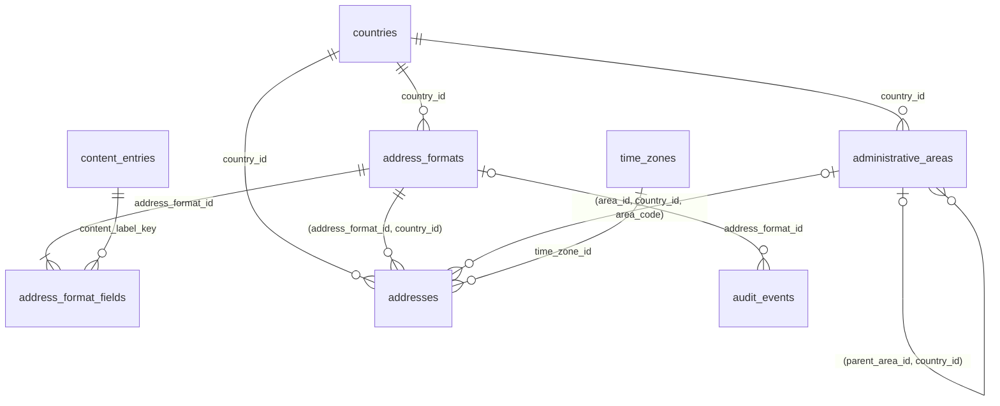
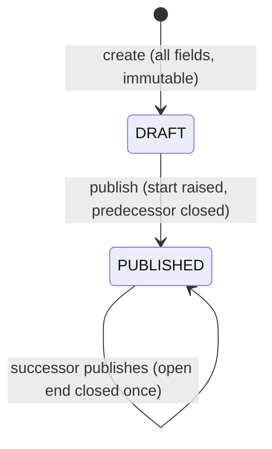

# Address Model

The address model (GEO-002) is the part of the geography registry that says what an address looks like in a country and stores ONE canonical, immutable structured address for every domain. A country address format is data (versioned, effective-dated rows: fields, order, labels, lengths, patterns, normalization, display template); the server validator, the central formatter and every client form read the same definition, so adding a country needs no deployment. Decisions: ADR-0023 (canonical immutable address and data-driven format) and ADR-0024 (provider-neutral boundary and privacy). The registry it extends is described in `docs/engineering/GEOGRAPHY.md`.

Addresses are personal data. Nothing in this model logs an address, returns a persisted address through a public API, or echoes a rejected value in an error. See Privacy.

## Purpose and scope

In scope:

- Administrative areas (states, provinces, regions) of a country, hierarchical, with a lookup entry mode.
- Versioned, effective-dated address formats per country with ordered field definitions and a display template, published once and then immutable.
- Stateless validation, normalization and formatting of a structured address (the same rules the form shows), exposed by the API.
- One canonical, immutable persisted address (`geography.addresses`) with a validation status and source, an optional single PostGIS point, an optional time zone reference and the raw input.
- A provider-neutral adapter boundary (autocomplete, geocoding, verification) with in-memory mocks and a manual-entry fallback that always works.
- Management of formats and areas through audited, protected API operations, outbox events and a readiness check.

Not in scope (no table, column or route exists for any of them):

| Not here | Where it belongs |
|---|---|
| Provider service areas, postal-code coverage lists, geofences | the service-area checkpoint (it will validate postal codes with `AddressService.validatePostalCode` and add the GiST index on `location`) |
| Customer or provider profile screens and saved addresses (labels, defaults) | identity and provider domains (ID-001 and later); they hold their own `address_id` reference |
| Geospatial search and distance queries | the search and discovery checkpoints (the spatial index arrives with the first spatial query) |
| Booking, scheduling, tax, payment | later checkpoints; a booking stores `address_id` |
| Map UI, autocomplete widgets | web and mobile checkpoints (they render from the address-format read model) |
| Vendor selection and production provider adapters, per-country provider configuration | DEBT-0037 |
| Admin UI, draft discard, area bulk import | DEBT-0039 |
| Retention, erasure and exact-location access policy for stored addresses | DEBT-0036 |
| Phone numbering rules | DEBT-0038 |

## Architecture

| Layer | File | Responsibility |
|---|---|---|
| Contracts | `packages/contracts/src/address.ts` | Vocabularies, `AddressInput`, `NormalizedAddressDto`, issue codes and `addressIssueMessageKey`, read models, requests, event payloads. Imports nothing from the workspace except sibling contract files |
| Engine (pure) | `packages/geography/src/address-engine.ts` | `normalizeText`, `applyNormalizationRule`, `patternProblem`, `validateAddressAgainstFormat`, `validateFieldValue`, `formatAddressWithFormat`, `templateProblem`, `administrativeAreaMode`, `redactAddress`. No database, no I/O, no clock, no country branch |
| Provider boundary | `packages/geography/src/address-providers.ts` | Ports `AddressAutocompleteProvider`, `GeocoderProvider`, `AddressValidationProvider`, the mocks, `ProviderUnavailableError`, `isValidCoordinate` |
| Service | `packages/geography/src/address-service.ts` | `AddressService`: loads formats and areas (cached public view, uncached management view), validates and formats, creates addresses, manages formats and areas, `createAddressFormatReadinessCheck` |
| API | `apps/api/src/modules/geography/address-routes.ts` | The eight operations under `/api/v1/geography` |
| Database | `db/migrations/0008_address_model.sql` | Four tables, guard triggers, seeds |

The pure engine and the service are separate on purpose: the engine is exercised without a database (every rule, every issue code), and the service adds loading, caching, persistence, audit and events. Web code calls the API and never imports the package. `AddressService` is built once in `apps/api/src/index.ts` (the country name for a formatted address comes from the content registry through the `countryNames` port, so geography never imports content) and registers the readiness check there.

## Data model

Schema `geography` (migration `db/migrations/0008_address_model.sql`; columns in `docs/data/DATA_DICTIONARY.md`, relationships in `docs/data/ERD.md`, normalization review in `docs/data/NORMALIZATION_LOG.md`).



| Table | Role |
|---|---|
| `administrative_areas` | Areas of a country: unique `(country_id, code)`, `area_type`, status `ACTIVE` or `INACTIVE`, optional same-country parent. Identity immutable, never deleted |
| `address_formats` | One row per country VERSION: `DRAFT` or `PUBLISHED`, template, half-open period. The exclusion constraint `ex_address_formats__no_overlap` allows one published format in force at any instant |
| `address_format_fields` | One row per (format version, field type): order, label content key, required, maximum length, input type, pattern, example, autocomplete hint, normalization. Insert-only, only while the format is `DRAFT` |
| `addresses` | The canonical address. Immutable; references the exact format version used; composite foreign keys keep the format and the area in the address country |

What the database guarantees, in addition to the usual keys and CHECKs:

- A format is created as `DRAFT` and published once; a draft is immutable; a published format changes only by the one-time closure of its open end by the successor. Publication requires fields including a required `ADDRESS_LINE_1`, a template that names every field and only fields of the format, and at least one ACTIVE area when a field is a lookup.
- An address row is never updated. An insert requires a PUBLISHED format, an ACTIVE area (when set) and an ACTIVE time zone (when set). Cross-column CHECKs bind status, source, provider and location (see the matrix).
- Guard failures carry `geography_rule:<KEY>` (nine new keys in GEO-002, 24 in total) and the service classifies on the key.

There is no `postal_code_rules` table (the postal rule is the pattern on the `POSTAL_CODE` field of the format version), no `address_snapshots` table (the immutable address row is the snapshot), no latitude or longitude columns (one `geography(Point,4326)`), and no owner column.

## Format fields and the template language

A field row defines one part of the form for one country version.

| Attribute | Meaning |
|---|---|
| `fieldType` | `ORGANIZATION`, `ADDRESS_LINE_1`, `ADDRESS_LINE_2`, `DEPENDENT_LOCALITY`, `LOCALITY`, `ADMINISTRATIVE_AREA`, `POSTAL_CODE`, `SORTING_CODE`. Each at most once. A type that is absent means the country does not use it. The API property of each type is fixed by `ADDRESS_FIELD_PROPERTIES` (`addressLine1`, `administrativeArea`, `postalCode`, ...) |
| display order | The position in forms (the array order of the request, 1 to 20) |
| `contentLabelKey` | Content key of the label (for example `address.field.postal_code`); clients resolve it with the content API and the country as context, so a country can word it its own way (the US copy says "ZIP code" and "State") |
| `required`, `maxLength` | Presence and the maximum length of the normalized value in characters (1 to 200) |
| `inputType` | `TEXT`, or `LOOKUP` (only `ADMINISTRATIVE_AREA`): the value must be the code or the name of an ACTIVE area of the country; no pattern or normalization |
| `validationPattern` | Optional JavaScript regular expression the NORMALIZED value must match in full (1 to 200 characters) |
| `example`, `autocomplete` | Example shown in the form (must match the pattern and fit the length), HTML autocomplete token |
| `normalization` | Optional `UPPERCASE`, `REMOVE_SPACES` or `UPPERCASE_REMOVE_SPACES` |

The read model `GET /countries/:code/address-format` returns exactly these (plus `administrativeAreaMode` `LOOKUP`, `FREE_TEXT` or `NONE` and `postalCodeExample`); clients render the form and may run the pattern locally with the `u` flag, but the server always applies the same definition.

### Display template

`display_template` is the ordered lines of the formatted address, separated by a newline, with `{FIELD_TYPE}` tokens (upper case, for example `{LOCALITY}`). The US template is:

```
{ADDRESS_LINE_1}
{ADDRESS_LINE_2}
{LOCALITY}, {ADMINISTRATIVE_AREA} {POSTAL_CODE}
```

Rules at draft time (`templateProblem`; the database repeats the essential ones at publication): 1 to 500 characters, no control character except the newline, every token names a field of the format, no field twice, EVERY field of the format appears, no stray brace, and every round or square bracket wraps exactly one field. A line with no token is a literal line and is kept (trimmed).

The grammar is deliberately tiny and not executable: literal text, `{FIELD}` tokens, and one decoration. A token may be wrapped in brackets written directly around it, `({FIELD})` or `[{FIELD}]`; the brackets then belong to that field. There are no conditionals, expressions, escapes, nesting, or brackets around several fields or around text (those are refused when a draft is created: `has a bracket that does not wrap exactly one field`). A template stored before this rule (none exists) with such brackets renders them as plain text, as it always did.

How a line is rendered (`renderLine`, the exact rule; punctuation travels with the field it belongs to):

1. The literal text in front of a token belongs to that token. It is written only when the token has a value AND an earlier token of the same line has a value; the first token of a line owns the text before it and writes it whenever that token has a value. The text after the last token is written only when that last token has a value.
2. The brackets around a token belong to it and qualify what precedes it: they are written when the token has a value and either it is the first token of the line or an earlier token of the line has a value. When it has a value but nothing precedes it, the value is written bare.
3. A token without a value writes nothing, and a line without any value is dropped. So a missing field removes its own separator and its own brackets, and never leaves ", ," or a dangling space or bracket. Brackets that are part of a VALUE (`Springfield (East)`) are never touched.

| Template line | Values present | Rendered |
|---|---|---|
| `{LOCALITY}, {ADMINISTRATIVE_AREA} {POSTAL_CODE}` (US) | locality, area, postal code | `Los Angeles, CA 90001` |
| same | area, postal code (no locality) | `CA 90001` (the ", " belongs to the area and is dropped because no earlier token is present) |
| same | locality, postal code (no area) | `Los Angeles 90001` |
| same | locality only | `Los Angeles` |
| `{LOCALITY} ({ADMINISTRATIVE_AREA})` | locality, area | `Los Angeles (CA)` |
| same | locality only | `Los Angeles` |
| same | area only | `CA` (the brackets qualify the locality, so there is nothing to qualify) |
| same | neither | the line is dropped |
| `({LOCALITY}) {POSTAL_CODE}` | locality, postal code | `(Los Angeles) 90001` |
| same | locality only / postal code only | `(Los Angeles)` / `90001` |
| `{LOCALITY} ({ADMINISTRATIVE_AREA}) ({POSTAL_CODE})` | locality, postal code | `Los Angeles (90001)` |

Before GEO-002A the closing bracket belonged to the last token while the opening one belonged to the following token, so `{LOCALITY} ({ADMINISTRATIVE_AREA})` rendered `CA)` when only the area was present. The rule for templates without brackets is unchanged (the seeded US template renders byte for byte as before; the test suite compares the old and new renderers on random bracket-free templates).

A lookup area shows its canonical code (`CA`); a free-text area shows its text. Empty lines are dropped. The formatted result is `{ lines, text, singleLine, formatVersion }` (`singleLine` joins the lines with ", "); `includeCountry` appends the country name as the last line, resolved in the requested locale (default: the country default locale) through the content registry; if the name cannot be resolved the line is simply omitted. The stored `formatted_address` never contains the country line.

## Validation engine

`validateAddressAgainstFormat(format, areas, input)` reports EVERY issue (not only the first), in format display order, each as `{ field, code, messageKey }` with the input property and a code only, never the rejected value.

Per field, in order:

1. A property supplied (non-blank) that the format does not use is `UNSUPPORTED_FIELD`.
2. Forbidden text (control characters, bidirectional overrides, unpaired surrogates) is `INVALID_CHARACTERS`. Tabs and line breaks of a pasted value are whitespace, not forbidden: step 3 collapses them.
3. The value is normalized (below); blank is `REQUIRED` when the field is required, otherwise the field is absent.
4. A value longer than `maxLength` (counted in Unicode code points) is `TOO_LONG`.
5. A lookup field: no ACTIVE area in the country is `LOOKUP_UNAVAILABLE`; a value that is not the code (case-insensitive) or the name (Unicode NFKC case-folded) of an ACTIVE area is `UNKNOWN_AREA`; otherwise the canonical code and name are taken from the area row.
6. A text field: the format normalization rule is applied, then the pattern (anchored as `^(?:pattern)$`, `u` flag); a mismatch is `INVALID_FORMAT`.

| Code | Message key (content entry) | Meaning |
|---|---|---|
| `REQUIRED` | `address.error.required` | a required field is empty |
| `TOO_LONG` | `address.error.too_long` | a value exceeds the field maximum length |
| `INVALID_FORMAT` | `address.error.invalid_format` | a value does not match the field pattern |
| `UNKNOWN_AREA` | `address.error.unknown_area` | not one of the listed areas |
| `UNSUPPORTED_FIELD` | `address.error.unsupported_field` | a field the country format does not use |
| `INVALID_CHARACTERS` | `address.error.invalid_characters` | forbidden characters |
| `LOOKUP_UNAVAILABLE` | `address.error.lookup_unavailable` | the country has no ACTIVE area to choose from |

Messages are managed content, not strings in code: `addressIssueMessageKey(code)` is `address.error.<code in lower case>`, and the form and the server show the same text (PRD SV-10.11). All seven entries are seeded with platform copy; a country or locale can override them through the content registry.

`validateFieldValue(format, fieldType, raw)` applies the same rules to one field (for example a postal code of a service-area list) and `AddressService.validatePostalCode(countryCode, value)` wraps it. `createFormatDraft` vets a pattern with `patternProblem` (1 to 200 characters, no backreferences, no lookbehind, no group that is repeated and already repeats, must compile) and checks that an example matches. The refusal of backreference-like text is an INTENTIONAL safety restriction, not a gap: a backreference (`\1`, `\k<name>`) can make a regular expression exponential, so any pattern containing a backslash immediately followed by 1 to 9, or `\k<`, is rejected. The check is lexical, so it also rejects the rare legitimate pattern text `\\1` (a literal backslash followed by the digit 1, whose second backslash precedes the digit); no address format needs it, and `[\\]1` expresses it if one ever does. The restriction is relaxed only for a demonstrated product requirement. A vetted pattern runs against input already capped by `maxLength`; the residual risk is DEBT-0042.

## Normalization rules

Applied in this order, identically on every platform (no locale-dependent functions):

1. Universal: Unicode NFC, removal of invisible characters (zero-width space, word joiner, Mongolian vowel separator, byte order mark), runs of whitespace collapsed to one space, trim.
2. The format rule, only for text fields: `UPPERCASE` (`toUpperCase`), `REMOVE_SPACES` (removes the space character), `UPPERCASE_REMOVE_SPACES` (both).
3. Lookup fields are not normalized by rule: the value is resolved to the canonical area, and the stored code is the area code.

The pattern runs on the result of steps 1 and 2, so the pattern describes the canonical form: a format that stores postal codes as `SW1A1AA` uses `UPPERCASE_REMOVE_SPACES` and a pattern for the upper-case, space-free value, and `sw1a 1aa` is accepted and stored as `SW1A1AA`.

## PostGIS convention

`geography.addresses.location` is `geography(Point,4326)`, the only spatial column in the database.

- Built as `ST_SetSRID(ST_MakePoint(lng, lat), 4326)::geography` (longitude first), only after `isValidCoordinate` accepted the pair (finite numbers, latitude -90..90, longitude -180..180). PostGIS coerces out-of-range input silently, so a CHECK cannot catch it; coordinates a provider returns that fail this check are treated as "not located" and the address is stored like a manual one.
- Latitude and longitude are derived on read with `ST_Y` and `ST_X` of the geometry cast (`getAddress` returns `latitude` and `longitude`); there are no separate columns, so they cannot drift.
- Distances and containment are in meters through `geography`. No GiST index exists until a spatial query exists; the service-area and search checkpoints add `idx_addresses__location` with that query through their own data model review (`docs/data/DATABASE_CONVENTIONS.md` section 9).
- Manual addresses never have a location (`ck_addresses__manual_is_not_located`).

## Validation status and source

`validation_status` says how far the address was validated; `validation_source` says who supplied the structured data. The database CHECKs bind them; the service produces a subset today.

| Source | Statuses the CHECKs allow | Location | `provider_code` | Produced by the service today |
|---|---|---|---|---|
| `MANUAL` | `UNVERIFIED`, `FORMAT_VALID`, `INVALID` | never | none (`ck_addresses__provider`) | `UNVERIFIED` (`createManualAddress`, and the fallback of every provider flow) |
| `AUTOCOMPLETE` | `UNVERIFIED`, `FORMAT_VALID`, `INVALID` only (`ck_addresses__autocomplete_is_not_verified`: never `GEOCODED` or `VERIFIED`) | optional | required | `FORMAT_VALID` (`createAddressFromAutocomplete`; a selection is not verification) |
| `GEOCODER` | any, including `GEOCODED` and `VERIFIED` | required for `GEOCODED` and `VERIFIED` | required | `GEOCODED` (`geocodeAndCreateAddress`) |
| `ADMIN` | any; `VERIFIED` allowed | required for `GEOCODED` and `VERIFIED` | none | none yet (operator tooling) |
| `IMPORTED` | any except `VERIFIED` (`VERIFIED` needs `GEOCODER` or `ADMIN`) | required for `GEOCODED` | free | none yet (imports) |

Statuses: `UNVERIFIED` (format-valid but no provider verified it: the manual fallback, marked for review per PRD SV-10.06, and imported rows), `FORMAT_VALID` (an autocomplete selection that passed the country format, no coordinates), `GEOCODED` (a geocoder resolved coordinates), `VERIFIED` (a verification provider or an administrator confirmed it; only source `GEOCODER` or `ADMIN`), `INVALID` (a verification provider rejected it). Autocomplete success is never verification. `VERIFIED` rows cannot be produced yet: the verification flow is DEBT-0037.

## Manual fallback and the provider boundary

No vendor is selected. `address-providers.ts` defines three ports and in-memory mocks (no network, deterministic, a `failing` flag, a call log); tests and CI use only the mocks.

| Port | Used by | Result |
|---|---|---|
| `AddressAutocompleteProvider` (`suggest`, `resolve`) | `suggestAddresses`, `createAddressFromAutocomplete` | suggestions; a selection resolved to structured fields that are validated against the country format like any other input |
| `GeocoderProvider` (`geocode`) | `geocodeAndCreateAddress` | coordinates, optional IANA time zone, provider reference |
| `AddressValidationProvider` (`validate`) | no service flow yet | fixed contract and mock only (DEBT-0037) |

`AddressServiceDeps.providers` holds one resolver per port, called with the country code (`providers.autocomplete(countryCode)`); returning `undefined` means none configured and the manual path is used. Per-country selection from configuration (the PRD's `address.autocomplete_provider` and `address.geocoder` at COUNTRY scope) is DEBT-0037.

Rules that keep entry working:

- Every provider call has a deadline (`providerTimeoutMs`, default 3000 ms). An error, a timeout or an unusable answer is treated as unavailable, logs one warning with the provider code and the operation only (never the error text, which can echo what was sent) and never fails the flow.
- `geocodeAndCreateAddress` validates first, then asks the geocoder. Located (valid coordinates): source `GEOCODER`, status `GEOCODED`, one point, and the time zone stored only when the zone is a registered ACTIVE `geography.time_zones` row (an unknown zone is dropped with a warning that names the provider only). Not located (no provider, provider down, address not found, unusable coordinates): the address is stored exactly like a manual one (`MANUAL`, `UNVERIFIED`, no coordinates). A manual or fallback address is marked for review by its status; it never pretends to be geocoded.
- `suggestAddresses` and `createAddressFromAutocomplete` answer `UNAVAILABLE` (`details.reason` `NO_AUTOCOMPLETE_PROVIDER` or `PROVIDER_UNAVAILABLE`) when there is no provider or it failed, so the caller falls back to `createManualAddress`; a suggestion that resolves to another country or to nothing is `VALIDATION_FAILED` (`UNKNOWN_SUGGESTION`).
- Adapters receive address data and must never log it, and must throw (or return null) rather than guess.

## Privacy handling

Stored and submitted addresses are personal data (the PRD reveals the exact address to a provider only from booking confirmation).

Never logged: any address part, postal code, coordinates, `raw_input`, the formatted text, a rejected value, a provider payload or provider error text. Logs about addresses carry codes only (provider code, operation, country code). Two guards back this up: `redactAddress` (engine) replaces every address key at any depth by `[REDACTED]` for any structure that might hold an address, and the observability log redaction (`packages/observability/src/index.ts`) redacts any attribute whose key contains `address`, `postal`, `zip`, `latitude`, `longitude` or `raw_input` (case-insensitive), in addition to secrets.

Never returned: validation issues carry the property and a code, never the value; errors never echo input (the strict-body failure lists paths only); no route creates or reads a persisted address (there is deliberately no `GET /addresses/:id`); `getAddress` returns `rawInput` only when asked with `includeRawInput` and is an in-process method for the owning domains.

Stateless endpoints: `POST /addresses/validate` and `POST /addresses/format` persist nothing, log nothing, accept at most 16 KiB and answer with `Cache-Control: no-store`; the normalized address in the response is the caller's own input. Public GET routes send `Vary: Authorization`.

Residual risks: (1) there is no retention period, erasure or anonymization procedure and no stage-based access policy for exact addresses (DEBT-0036); DELETE of an address is possible but only unreferenced rows can go (referencing tables will restrict); (2) the public validate and format routes are unauthenticated and have no rate limiting (DEBT-0030), so they can be used to probe formats; (3) a vendor adapter must be reviewed for what it may store and log (DEBT-0037); (4) `raw_input` and the point are stored exactly as received by design for dispute and review.

## Ownership boundary

Geography owns the structure: what an address is, how it is validated, normalized, formatted and stored, and which format version applies. It does not own who uses an address.

| Domain | Owns | Holds |
|---|---|---|
| geography | `geography.addresses` rows, formats, areas | nothing about customers, providers or bookings |
| identity (ID-001 and later) | a customer's saved addresses, labels, defaults | `address_id` references |
| provider (later) | a provider's business and service addresses, service areas | `address_id` references, postal-code lists validated with `validatePostalCode` |
| booking (later) | the service address of a booking | the `address_id` accepted at booking time |

Snapshot strategy: because an address row is immutable, `address_id` IS the snapshot. A booking stores `address_id` with a foreign key `ON DELETE RESTRICT` and always sees the address as accepted. When a customer edits a saved address, the owning domain creates a NEW address (`createManualAddress` or a provider flow) and repoints its own reference; bookings already made keep the old row. Copying address columns into a booking would put personal data in a second place with its own retention problem, so it is not done. The model has no owner column on purpose: `AddressService` is given the address only and never learns who it belongs to.

## Versioning and publication



- `createFormatDraft` (`POST /countries/:code/address-formats`, 201) validates the request (a field type once, a required `ADDRESS_LINE_1`, the template, lookup only for the area without pattern or normalization, safe patterns, examples), then, while the country row is locked, allocates `version = max + 1`, inserts the format as `DRAFT` with its fields in array order and writes `ADDRESS_FORMAT_DRAFTED`. Reasons for a refused draft: `DUPLICATE_FIELD`, `ADDRESS_LINE_1_REQUIRED`, `INVALID_TEMPLATE`, `INVALID_LOOKUP_FIELD`, `UNSAFE_PATTERN`, `EXAMPLE_DOES_NOT_MATCH`, `EXAMPLE_TOO_LONG`, and `UNKNOWN_CONTENT_KEY` when a label key is not a content entry (foreign key).
- `publishFormat` (`POST .../address-formats/:version/publication`) locks the country row, then the draft, then the format that is open-ended at that moment. The start is the latest of the draft's proposed start, the requested `effectiveFrom` and the database clock (`clock_timestamp()`); it must be strictly later than the start of the format it closes (otherwise `CONFLICT`, reason `START_NOT_AFTER_CURRENT`). The predecessor's `effective_to` is closed at the new start, the draft becomes `PUBLISHED` with that start, an `ADDRESS_FORMAT_PUBLISHED` audit row and the outbox event are written, and the geography cache generation is bumped after commit. Idempotent: publishing an already published version changes nothing. The database repeats completeness, template and lookup checks and the exclusion constraint is the final arbiter (`CONFLICT`, reason `FORMAT_PERIOD_OVERLAP`).
- A future `effectiveFrom` schedules the change: the current format keeps serving until the new start, then the successor serves (windows are evaluated in memory per call).
- There is no edit and no discard of a draft: a correction is a new version (DEBT-0039). An old address keeps the version it was validated with and is rendered with that version's template (`formatStoredAddress`).

## Administrative areas management

`POST /countries/:code/administrative-areas` (`geography-write`) takes up to 500 areas and a reason. It creates the areas that do not exist (list a parent before its children; the parent is set only at creation) and updates name, type, display order and `active` of existing ones; it never deletes. A request that changes nothing writes nothing (no audit, no event). The last ACTIVE area of a country cannot be retired while a PUBLISHED format has a lookup field (`INVALID_STATE`, reason `AREAS_IN_USE`). Other reasons: `DUPLICATE_AREA_CODE`, `UNKNOWN_PARENT_AREA`, `PARENT_IMMUTABLE`. A change writes `COUNTRY_ADMINISTRATIVE_AREAS_UPDATED` (changes `{added, updated}` code lists), emits `administrative-areas-updated` and bumps the cache. Public reads show ACTIVE areas only; an area with `status` INACTIVE stays referenced by the addresses that used it.

## Events, cache and invalidation

| Event type | Emitted when | Payload (identifiers and counts only) |
|---|---|---|
| `bananagig.geography.address-format-published.v1` | a format is published (not on an idempotent repeat) | `countryCode`, `version`, `effectiveFrom`; aggregate `geography_address_format` |
| `bananagig.geography.administrative-areas-updated.v1` | an area upsert changed something | `countryCode`, `added`, `updated`; aggregate `geography_country` |

No event carries an address. Creating a draft, creating addresses and reading emit nothing (drafts are audited). Spec: `docs/events/asyncapi.yaml` (generated).

Cache: the public view of a country's address data (ACTIVE country, PUBLISHED formats, ACTIVE areas) is cached under `bg:{env}:geo:v1:address:<CC>:<gens>` through the shared geography cache (`docs/engineering/GEOGRAPHY.md`, Cache and invalidation). Format publication, area upserts and every `GeographyService` country write bump the generation after commit; misses are never cached; management reads bypass the cache; the format window is evaluated in memory on every call. Areas that a migration seeded reach the cache within the TTL. Validation and address creation use the public view, so a just-published format can be served up to the cache bound late (a lost bump is bounded by the TTL).

## API

Base `/api/v1/geography`; standard envelope `{ data, meta: { correlationId } }`; unknown request fields are rejected; bodies are validated strictly before Fastify's ajv step; the paths use canonical country codes (`US`). Spec: `docs/api/openapi.yaml` (generated; never hand-edit).

| Operation | Method and path | Access |
|---|---|---|
| `getGeographyAddressFormat` | GET `/countries/:code/address-format` | public (ACTIVE countries only); `geography-read` or `geography-write` previews any country and also gets status, template and period; `Vary: Authorization` |
| `listGeographyAdministrativeAreas` | GET `/countries/:code/administrative-areas` | public (ACTIVE country, ACTIVE areas, picker order, with the entry mode); management also sees inactive areas and any country status; `Vary: Authorization` |
| `validateGeographyAddress` | POST `/addresses/validate` | public, stateless, `Cache-Control: no-store`, body at most 16 KiB; an invalid address is a normal 200 result (`valid: false`, issues) |
| `formatGeographyAddress` | POST `/addresses/format` | public, stateless, `no-store`, 16 KiB; invalid address is 400 `GEOGRAPHY_VALIDATION_FAILED` with `details.issues`; optional `locale` and `includeCountry` |
| `listGeographyAddressFormats` | GET `/countries/:code/address-formats` | `geography-read` (write implies read): every version, newest first, drafts included |
| `createGeographyAddressFormat` | POST `/countries/:code/address-formats` | `geography-write`: 201, creates a DRAFT |
| `publishGeographyAddressFormat` | POST `/countries/:code/address-formats/:version/publication` | `geography-write`: body `{ effectiveFrom?, reason }` |
| `upsertGeographyAdministrativeAreas` | POST `/countries/:code/administrative-areas` | `geography-write`: body `{ areas[], reason }` |

Every mutation requires a `reason` (1 to 1000 characters, the `adminText` rule). There is no route that creates or reads a persisted address. Errors use `GEOGRAPHY_<code>`: `COUNTRY_NOT_FOUND` and `ADDRESS_FORMAT_NOT_FOUND` (404; a public caller also gets 404 for a country that is not ACTIVE), `VALIDATION_FAILED` (400; `details.reason` such as the draft reasons above, or `details.issues`), `CONFLICT` and `INVALID_STATE` (409; `FORMAT_PERIOD_OVERLAP`, `START_NOT_AFTER_CURRENT`, `FORMAT_IMMUTABLE`, `AREAS_IN_USE`, `CONCURRENT_UPDATE`).

## Readiness check

`createAddressFormatReadinessCheck(service)` registers `ADDRESS_FORMAT` (required) in the process-wide readiness registry at API start-up (`apps/api/src/index.ts`): a market can be activated only when its country has a PUBLISHED address format in force at the evaluation instant (`hasEffectiveFormat`, a plain uncached database read). The check has no country-specific rule and returns facts only. This resolves the ADDRESS_FORMAT part of DEBT-0032; the country-level checklist and admin preview remain open (DEBT-0039).

## Adding a country with data only

No code, migration or deployment is involved. Everything below is an API call with a reason.

1. The country exists and is ACTIVE for public use (GEO-001: currency, locales and time zones activated by SQL or migration first, DEBT-0031; `POST /countries`, then `POST /countries/:code/activation`). Management callers can already preview a country that is not ACTIVE; the public routes show it only once it is.
2. Label copy: for every field the format will use, a content entry must exist (the label key is a foreign key to `content.entries`). Reuse the seeded keys where the wording fits (`address.field.line1`, `line2`, `city`, `state`, `postal_code`; the US scope shows "State" and "ZIP code", every other country falls back to the platform copy "State or region" and "Postal code"). For different wording, create a content entry such as `address.field.province` with `max_scope_type` COUNTRY (or lower) and publish PLATFORM or country-scoped copy through the content registry. The seven `address.error.*` messages already exist platform-wide.
3. Administrative areas, when the format uses a lookup: `POST /countries/:code/administrative-areas` with the areas (codes without the country prefix, parents first). Skip it for a country whose area is free text or absent.
4. Draft the format: `POST /countries/:code/address-formats` with the template, the fields in display order (label key, required, maximum length, input type, pattern and example for the postal code, autocomplete hint, normalization such as `UPPERCASE_REMOVE_SPACES`) and the reason. Review the returned draft (`GET .../address-formats`): it is immutable, so a mistake means a new draft.
5. Publish: `POST /countries/:code/address-formats/1/publication`. It becomes immutable and starts now (or at the `effectiveFrom` you pass).
6. Verify with the public reads: the address-format and administrative-areas routes (with an anonymous request), `POST /addresses/validate` with a known good and a known bad address, `POST /addresses/format`, and the market readiness checklist (`ADDRESS_FORMAT` passes).
7. Open the markets of that country (GEO-001 flow).

A change to an existing country is a new version (steps 2 to 5 again); addresses already stored keep the old version. The integration tests prove a second country (with provinces and a letter-digit postal code) is added this way without any code.

## Testing

Test files (counts change with every test; run them rather than quoting numbers):

- Engine unit tests (`packages/geography/src/address-engine.test.ts`): normalization, pattern vetting, every issue code, lookup resolution, template rendering and the literal-attachment rule, `redactAddress`.
- Provider unit tests (`packages/geography/src/address-providers.test.ts`): the mocks, `failing`, coordinate validation.
- Service unit tests (`packages/geography/src/address-service.test.ts`): flows with fakes, provider failure to manual fallback, mappers.
- Database tests (`packages/testing/src/address-model.itest.ts`, real PostgreSQL in an isolated database): seeds, every constraint and guard key, immutability, the exclusion constraint, the cross-column address CHECKs, composite foreign keys, the PostGIS point.
- API tests (`apps/api/src/address.test.ts` and `apps/api/src/address.itest.ts`): visibility, access control (write implies read), strict bodies, `no-store`, `Vary`, privacy of errors, publication and area management with the real services, a second country added with data only.
- Contracts: `packages/contracts/src/contracts.test.ts` covers the address schemas.
- Run with `pnpm --filter @bananagig/geography test`, `pnpm test:integration` and `pnpm smoke`; privacy checks assert that no address value reaches the log output.

## Debt and cross references

| Debt | Subject |
|---|---|
| DEBT-0030 | no rate limiting on public endpoints (covers `validate` and `format`); OPEN: the public address `validate` and `format` endpoints are NOT production-exposure-ready until the platform rate-limit checkpoint resolves it |
| DEBT-0032 | readiness checks; ADDRESS_FORMAT done, country-level checklist open |
| DEBT-0034 | per-address time zone reference exists; no geocoder supplies it, scheduling still uses the market default |
| DEBT-0036 | address retention, erasure and exact-location access policy |
| DEBT-0037 | no production autocomplete, geocoder or verification provider; no per-country provider configuration |
| DEBT-0038 | phone numbering rules not modelled |
| DEBT-0039 | no admin UI, preview, draft discard or bulk area import |
| DEBT-0040 | only the US dataset (no territories or counties; one official area name) |
| DEBT-0041 | markets do not reference an administrative area |
| DEBT-0042 | patterns run in the API process (no RE2 or worker isolation) |

## Operations and troubleshooting

| Symptom | Likely cause |
|---|---|
| 404 `GEOGRAPHY_COUNTRY_NOT_FOUND` on a public address route for a country that exists | the country is not ACTIVE (public view); use a `geography-read` token to preview it |
| 404 `GEOGRAPHY_ADDRESS_FORMAT_NOT_FOUND` | the country has no PUBLISHED format in force at that instant (none published, or a scheduled one has not started) |
| `valid: false` with `UNKNOWN_AREA` or `LOOKUP_UNAVAILABLE` | the area is not an ACTIVE area of the country; list the areas, or the country has none |
| 400 on a draft with reason `UNSAFE_PATTERN`, `EXAMPLE_DOES_NOT_MATCH`, `INVALID_TEMPLATE` | the pattern or template broke a vetting rule (see Validation engine and the template rules) |
| 400 on a draft with reason `UNKNOWN_CONTENT_KEY` | a field label key is not a content entry; create and publish it first |
| 409 `FORMAT_PERIOD_OVERLAP` or `START_NOT_AFTER_CURRENT` | another published format of the country covers that period, or the requested start is not after the format in force; omit `effectiveFrom` or choose a later one |
| 409 `AREAS_IN_USE` | retiring the last ACTIVE area while a published format has a lookup field |
| 409 `CONCURRENT_UPDATE` | a deadlock or serialization failure; nothing was written, repeat the request |
| a just-published format or area not visible to a form | the public cache bound (TTL); management reads are authoritative |
| an address was stored against a superseded version | the cache lagged a publication, or the address was created just before the successor started; the row records the version it used |
