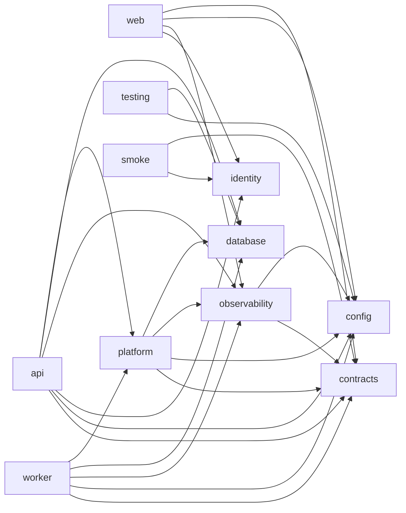
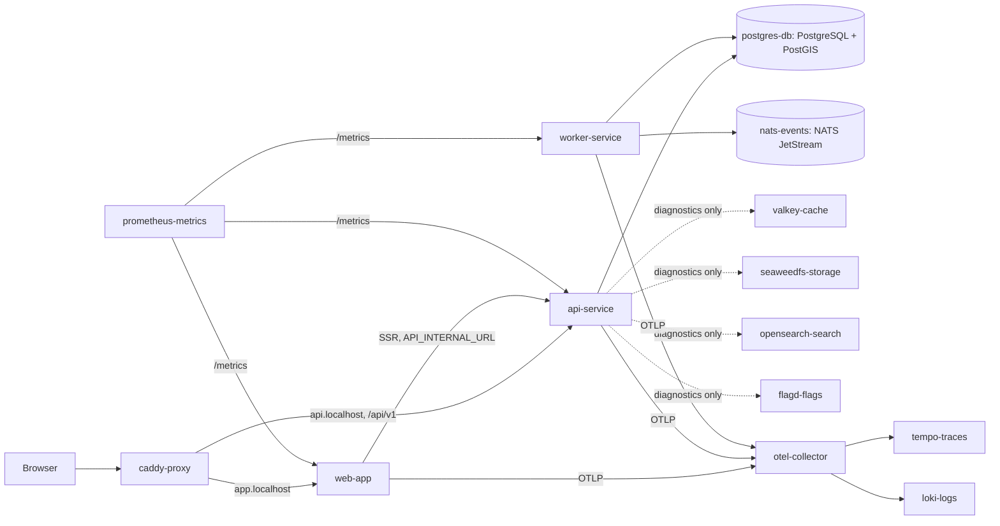

# Application Architecture

## Workspaces

```
apps/
  web/      Next.js 16 (App Router, React 19). SSR. Calls the API only over HTTP.
  api/      Fastify 5 HTTP API. Modular: apps/api/src/modules/<domain>/
  worker/   Background host: pg-boss jobs, NATS consumers, outbox publisher port, health server
  smoke/    One-shot connectivity test (runs inside the Compose network)
packages/
  contracts/       Public contracts: error model, system DTOs, event envelope, protocol constants. Depends on zod only.
  config/          Typed, validated process configuration (zod). Fails fast at startup.
  observability/   JSON logging, tracing, metrics, correlation (AsyncLocalStorage), auth telemetry
  identity/        JWT verification, OIDC/PKCE helpers; `/testing` subpath is DEV/TEST ONLY. Imports nothing from the workspace
  database/        pg pool + Kysely, transaction helper, health. No business models.
  platform/        Infrastructure adapters: Valkey, NATS, S3, OpenFeature/flagd, mail, OpenSearch, diagnostics, health server
  testing/         Test helpers (test database). Never imported by production code.
```

Packages were created only where there was real content. `contracts`, `config`, `database`, `observability`, `platform` and `testing` exist; no placeholder packages.

## Dependency rules

Enforced by `pnpm deps:check` (`scripts/check-boundaries.mjs`, fails on any violation or cycle) and by ESLint `no-restricted-imports`. `pnpm deps:graph` prints the current graph as Mermaid.



| Rule | How it is enforced |
|---|---|
| web cannot import `database` or `platform` (or pg, kysely, pg-boss) | `check-boundaries` + ESLint on `apps/web` |
| `@bananagig/identity/testing` (password grant, forged tokens) is DEV/TEST ONLY | ESLint forbids it in production code |
| `contracts` cannot import workspace packages or apps | `check-boundaries` + ESLint |
| `database` cannot import web/UI or applications | `check-boundaries` + ESLint |
| Domain modules never import UI | Modules live only under `apps/api`/`apps/worker`; web is not a dependency of anything |
| Processor/provider adapters are infrastructure boundaries | They live in `platform` (or a future adapter package); domain code depends on a port interface, never on the vendor SDK |
| No circular workspace dependencies | `check-boundaries` DFS cycle detection |

## Backend module convention

Each domain is a folder under `apps/api/src/modules/<domain>/`:

- `routes.ts`: Fastify plugins; HTTP only (parse, call service, shape response). Route `schema` is built from `@bananagig/contracts` so OpenAPI is generated from the real routes.
- `service.ts`: business logic; plain functions/classes that never import Fastify. Transactions via `database.transaction()`.
- Later: `repository.ts` (SQL via Kysely), `events.ts` (event construction), tests beside the code.

Only `system` exists. Folders for future domains (identity, catalog, booking, ...) are created by the checkpoint that implements them, not before.

## Runtime topology



## Configuration

`@bananagig/config` validates the environment at startup (`loadConfig({ service, role })`). Environments: `development`, `test`, `production`. Localhost defaults apply outside production; in production each role must set its required settings explicitly (`web`: API_INTERNAL_URL, OTLP; `api`: DATABASE_URL, OTLP; `worker`: DATABASE_URL, NATS_URL, OTLP). Secrets are masked by `redactConfig()` before logging. The web container deliberately receives no database or infrastructure credentials.

Only infrastructure settings belong in config. Product values (fees, prices, windows, durations) belong in future product configuration data, never in env or code.

## Health vs readiness

| Endpoint | Meaning |
|---|---|
| `/healthz` | The process is alive. Never checks dependencies. |
| `/readyz` | The process can accept work. Returns 503 when a critical dependency is down. |

| Service | Critical (affects `/readyz`) | Non-critical (reported by diagnostics/smoke only) |
|---|---|---|
| api | PostgreSQL | Keycloak (authenticated routes return 503 AUTH_PROVIDER_UNAVAILABLE; public routes unaffected), Valkey, NATS, S3, OpenSearch, flagd, SMTP |
| worker | PostgreSQL, job runtime (pg-boss started), NATS | Valkey, S3, OpenSearch, flagd |
| web | The process itself (pages degrade if the API is down) | API, Keycloak, Valkey (login/session only) |

A non-critical outage (search, analytics, flags) must never take request serving down. Feature code that needs an optional dependency must degrade (e.g. `flagBoolean()` falls back to its default).

## Worker runtime

- **Jobs:** pg-boss, queues named `<domain>.<action>`; handlers registered through `jobHandler()` which restores the correlation id, opens a span, and logs. Producers wrap data with `withJobMeta()`.
- **Events:** NATS subjects equal the event type `bananagig.<domain>.<event>.v<n>`; `NatsEventPublisher` validates the envelope and sets the `x-correlation-id` header; `subscribe()` restores correlation.
- **Outbox:** `integration.outbox_events` plus `PollingOutboxRelay` publish committed events to JetStream (ADR-0012). No product events exist yet; the self-test round-trips one infrastructure event through it.
- **Identity/concurrency:** `WORKER_ID` (default `<service>-<pid>`), `WORKER_CONCURRENCY` (default 2).
- **Self-test:** the infrastructure job `infra.ping` and event `bananagig.infra.ping.v1` are the only handlers. The worker diagnostics endpoint round-trips both.

## Decision: Fastify with modules, not NestJS

NestJS was the preferred option, but the INF-001 build deliberately bundles each app into one file with esbuild (small, secret-free runtime images). Nest's dependency injection needs `emitDecoratorMetadata`, which esbuild does not implement, so adopting Nest would force a different compiler (SWC) and a heavier build. Fastify gives the same HTTP performance, JSON-schema validation and first-class OpenAPI generation with no decorators, and the module convention above provides the structure. Revisit only if a concrete need for Nest's DI appears.
