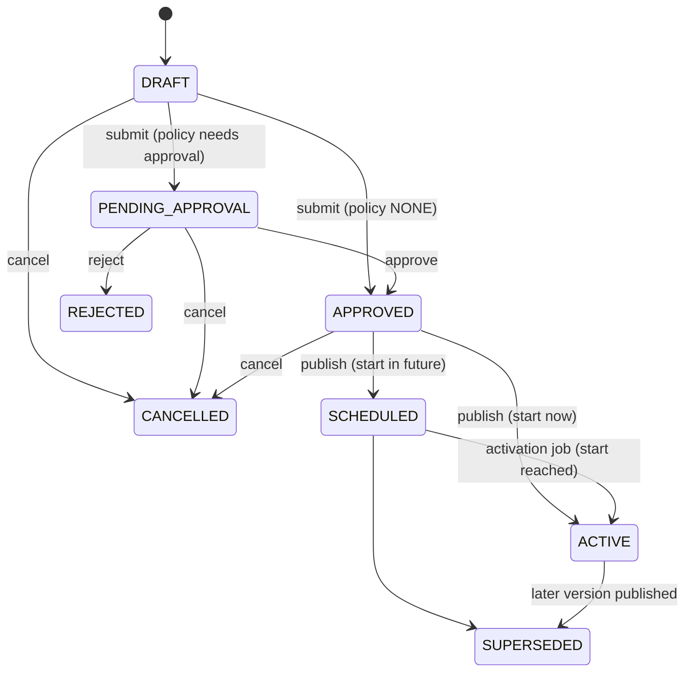

# Configuration Registry

The product configuration registry (CFG-001) holds typed, scoped, effective-dated, approved and audited business values. It is a generic engine: it contains no business parameters. Decisions: ADR-0016 (model) and ADR-0017 (cache, last-known-good, temporary permissions).

## Three kinds of configuration

| Kind | Where | Examples | Changed by |
|---|---|---|---|
| Runtime / infrastructure | environment variables, `packages/config` | database URL, ports, TTLs | deployment |
| Feature flags | flagd (`infra/flagd/flags.json`) | rollout switches | flag file |
| Product configuration | `configuration.*` tables, this registry | windows, limits, unit rules, fees | approved change request |

Never put business values in environment variables or code. Never put runtime wiring in the registry.

## Concepts

- **Parameter**: definition with a unique dotted key (`domain.name`), data type, validation rules, sensitivity, approval policy, criticality, owner. No default column: the PLATFORM value is the default.
- **Scope**: `PLATFORM < COUNTRY < MARKET < CATEGORY < PLAN < PROVIDER < GIG < DROP` (`configuration.scope_levels`). The most specific applicable scope wins. A parameter permits overrides only at levels listed in `parameter_scopes`. `scope_ref` is an opaque text reference without a foreign key.
- **Value version**: immutable, validity `[effective_from, effective_to)`. History is never rewritten; corrections are new versions.
- **Change request**: the only way to change a value. Flow:



- **Snapshot**: immutable record of a resolution (context, time, version used per parameter). Store the `snapshotId` on anything that must be reproducible later (for example a future booking).

## Value encodings (canonical JSON)

| Data type | Stored as | Notes |
|---|---|---|
| STRING | JSON string | optional `pattern`, `minLength`, `maxLength` |
| INTEGER | JSON integer | `min`, `max` |
| DECIMAL | JSON **string** (`"12.50"`) | exact comparison via `compareDecimal`; `min`, `max`; no float |
| BOOLEAN | JSON boolean | |
| ENUM | JSON string | must be in the definition's `enum` list |
| DURATION | `{ "amount": 24, "unit": "HOURS" }` | units `SECONDS, MINUTES, HOURS, DAYS`; `min`/`max` in seconds |
| MONEY | `{ "amount_minor": 1500, "currency": "USD" }` | integer minor units; currency from `currencies` |
| JSON | any JSON value | validated with `schema` (Ajv) when provided |

## Timeline rules

1. A new version must start after the latest version of the same holder (no back-dating beneath history).
2. The requested start is clamped to publish time when it has already passed.
3. Publishing closes the predecessor (`effective_to = new effective_from`) in the same transaction; the exclusion constraint is the final arbiter under concurrency.
4. A published version is never withdrawn; supersede it with a later version.

## Resolution

`ConfigurationService.resolveMany(keys, context, { at? })` returns the winning version per key or fails. It runs 3 queries per batch regardless of key count: definitions, candidate versions for the context and time, and the next effective boundary. Missing required values fail with `NO_VALUE` (authoritative). `service.value<T>(key, context)` is the typed convenience. Context is a map of lower-case scope names to references, for example `{ market: 'us-ny' }`.

### Cache and last-known-good

- Valkey entries keyed by environment, parameter key, generation and context hash; valid until the next effective boundary, capped by `CONFIG_CACHE_TTL_SECONDS` (30).
- Publishing bumps the parameter generation, invalidating old entries immediately.
- CRITICAL parameters are never cached and never served from LKG. Explicit `at` lookups bypass cache and LKG.
- LKG is served only when the database is unreachable, only for STANDARD parameters, only within `CONFIG_LKG_MAX_AGE_SECONDS` (86400), and only if every missing key has one. Otherwise `UNAVAILABLE`.
- A Valkey outage degrades to database reads.

## Approval policies

| Policy | Behavior |
|---|---|
| `NONE` | submit approves immediately |
| `OWNER_APPROVAL` | one approver with `configuration-approve` |
| `SECOND_APPROVER` | one approver who is not the requester (service check plus database trigger) |

`owner_role` is metadata in CFG-001 (DEBT-0021).

## Scheduled activation

Job `configuration.activate-due` (pg-boss, cron every minute) moves due `SCHEDULED` requests to `ACTIVE`, marks the predecessor request `SUPERSEDED` (an immediate publish does the same), emits `activated`, audits (the supersession is attributed to `system:configuration-activation`) and invalidates the cache. It is a safety net for workflow state: resolution uses timestamps, so a delayed job never yields a wrong value. Expected marker lag is up to about 60 seconds (DEBT-0022).

## API

Base `/api/v1/configuration`, all routes require an admin-context token with client roles on `bananagig-admin`: `configuration-read`, `configuration-write`, `configuration-approve`.

| Method and path | Permission |
|---|---|
| GET `/parameters`, GET `/parameters/:key` | read |
| POST `/parameters` | write |
| POST `/resolve` | read |
| POST `/snapshots`, GET `/snapshots/:id` | read |
| GET `/change-requests`, GET `/change-requests/:id` | read |
| POST `/change-requests` (create draft) | write |
| POST `/change-requests/:id/submit`, `/cancel`, `/publish` | write |
| POST `/change-requests/:id/approve`, `/reject` | approve |

Responses use the standard envelope and error model. SENSITIVE values are redacted in responses. Errors: `PARAMETER_NOT_FOUND`, `NO_VALUE`, `VALIDATION_FAILED`, `SCOPE_NOT_ALLOWED`, `CONFLICT`, `INVALID_STATE`, `FORBIDDEN_APPROVER`, `NOT_FOUND`, `UNAVAILABLE`. Unknown request fields are rejected. Spec: `docs/api/openapi.yaml`.

## Events

Through the transactional outbox (ADR-0012); payload carries identifiers and metadata only, never values: `bananagig.configuration.change-requested.v1`, `change-approved.v1`, `change-rejected.v1`, `scheduled.v1`, `activated.v1`. Spec: `docs/events/asyncapi.yaml`.

## Audit

Every mutation writes an `audit_events` row in the same transaction (actor, action, parameter, request, old/new version, reason, correlation id). Audit rows are append-only (trigger). No values are copied into audit.

## Security

Admin context only; default deny; self-approval blocked twice; sensitive values redacted in API, logs and events; `devtest.*` keys only when `allowTestKeys` (non-production); all inputs validated by schema and by the definition's rules.

## Using it from a domain

```ts
const hours = await configuration.value<DurationValue>('booking.cancellation_window', { market: marketId });
const snap = await configuration.createSnapshot({ keys: [...], context, purpose: 'booking-quote' }, actor);
```

Define the parameter through a change-controlled seed or the API in the owning checkpoint, not here. Add the parameter, its allowed scopes, validation and policy in that checkpoint's data-model review.

## Testing

Unit tests cover values, resolver selection and cache policy; integration tests run against a real database (workflow, timeline, concurrency, immutability triggers, real Valkey when reachable); API, worker and smoke tests cover the end-to-end path.
