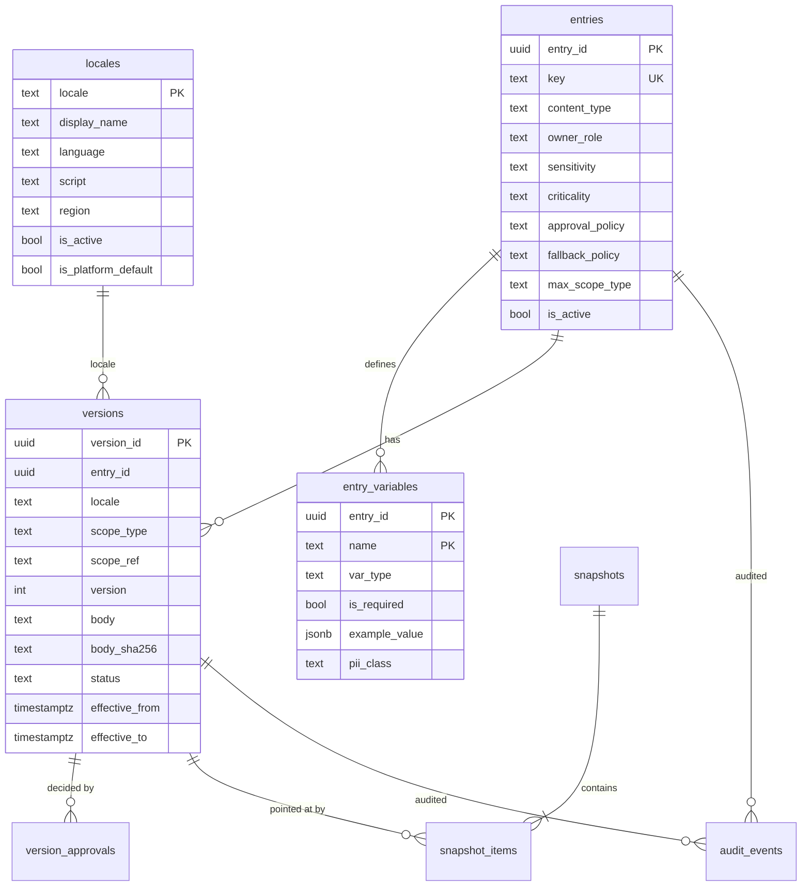
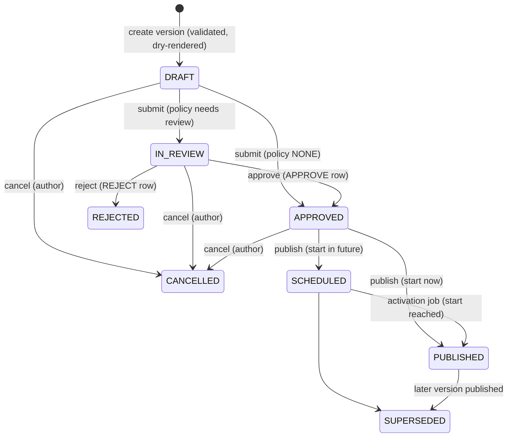

# Content and Localization Registry

The content registry (CFG-002) holds the managed product copy of BananaGig: UI labels, messages, email and push templates, help articles and legal documents. Each piece of copy is a stable key with localized, scoped, effective-dated, approved, immutable versions and an audit trail. It is a generic engine plus a small seeded shell set: it contains no marketing, marketplace or legal copy. Decisions: ADR-0018 (model), ADR-0019 (template formatter and markup renderer), ADR-0020 (locale fallback, precedence, cache, last-known-good and bootstrap policy).

The sibling of the configuration registry (`docs/engineering/CONFIGURATION.md`): configuration answers "which number or rule applies", content answers "which words are shown". They share one scope hierarchy, the cache primitives and the activation pattern, and nothing else.

## Purpose and string ownership

Every string a person reads belongs to exactly one owner:

| Kind | Owner | Where it lives | Localized | Examples |
|---|---|---|---|---|
| Managed copy | Content registry | `content.*` tables, read through `@bananagig/content` or the API | Yes | button labels, page headings, confirmation and error sentences shown to users, email subject and body, push title and body, help articles, terms of service |
| Protocol strings | Code | constants, contracts, specs | Never | error codes, enum values, event types, JSON keys, header names, URL paths, feature-flag keys |
| Developer strings | Code | source, tests | Never (English) | log messages, exception messages, diagnostics, test fixtures |
| Bootstrap | Code (tiny static set, see Bootstrap content policy) | `BOOTSTRAP_COPY` and the static error shells in the web app | Not localized yet | wordmark, `Sign in`, `Sign out`, generic failure shell |
| Domain data | The owning domain's tables | catalog, provider, gig, category tables (future) | By the owning domain | a gig title, a provider bio, a category name |

Rule of thumb: if a customer, provider or admin reads it as part of the product, it is managed copy; if a program or an operator reads it, it is not. Gig, provider and category text is domain data, not content, which is why the registry has no scope below MARKET.

The authoritative ownership map, the migration strategy for existing text and the rules for adding strings are in `docs/content/CONTENT_OWNERSHIP.md`. Registry-owned copy never falls back to a hardcoded literal (see Bootstrap policy).

## Data model

Schema `content` (migration `0005_content_registry.sql`; seed `0006_content_seed_shell_copy.sql`; `0007_geography_registry.sql` extended `content.locales` for GEO-001 and added the geography guard trigger on it). One scope hierarchy: `content.versions` and `content.entries` reference `configuration.scope_levels`.

| Table | Role | Mutability |
|---|---|---|
| `locales` | Registered locales; `is_active` controls serving; at most one `is_platform_default` (must be active), enforced by the partial unique index `uq_locales__platform_default` plus the guard trigger `content.guard_locales`, which refuses any UPDATE that unsets it, so exactly one exists from the seed onward. GEO-001 (migration `0007`) added `display_name` (NOT NULL; the tag when none is given) and the generated, stored `language`, `script` and `region`; the geography guard `trg_locales__geography_guard` also refuses deactivating a locale that is the default of an ACTIVE country or market | `is_active` and `display_name` (and the default flag, which only a migration moves); the generated columns cannot be written; never deleted |
| `entries` | Stable identity and governance policy of one piece of copy | Immutable except `is_active` (trigger) |
| `entry_variables` | The placeholder contract shared by every locale and version of the entry | Immutable; a required variable cannot be added once the entry has versions |
| `versions` | One row per (entry, locale, scope, version number) carrying its own lifecycle | Body, identity, policy, hash immutable from creation; status moves by the guarded state machine; `effective_from` raised once at publication; `effective_to` closed once |
| `version_approvals` | One review decision per approver per version | Immutable |
| `snapshots`, `snapshot_items` | Reproducible record of which exact versions applied (version pointers; the fixed text, hash, locale, scope and start are reached through the immutable version) | Immutable |
| `audit_events` | Append-only log of every management mutation. `locale` is stored only on `LOCALE_*` actions (`ck_audit_events__subject`); entry and version actions reach the locale through the immutable version, and composite foreign keys tie every named version to the entry of the same row | Immutable |

The key never encodes a locale or the displayed text: `brand.tagline`, not `brand.tagline.en`, not `local_help_done_fast`. Key format `^[a-z][a-z0-9_]*([.][a-z][a-z0-9_]*)+$`, at most 160 characters, shape `domain.area.name` (`session.error.login_failed`). `devtest.*` keys exist only when `allowTestKeys` is on (non-production).

An entry carries: `content_type` (PLAIN_TEXT, RICH_TEXT, MARKDOWN, UI_LABEL, EMAIL_SUBJECT, EMAIL_BODY, PUSH_TITLE, PUSH_BODY, HELP_ARTICLE, LEGAL), `owner_role` (CONTENT, LEGAL, SUPPORT, MARKETING), `sensitivity` (PUBLIC resolves anonymously, INTERNAL only for authorized callers), `criticality` (STANDARD, CRITICAL), `approval_policy` (NONE, OWNER_APPROVAL, SECOND_APPROVER; the service default for non-legal entries is OWNER_APPROVAL), `fallback_policy` (CHAIN, LANGUAGE_ONLY, EXACT) and `max_scope_type`. A different policy is a different entry.

### Version lifecycle

The guard trigger `content.guard_versions` enforces this machine in the database as well (a direct SQL update cannot skip a state). `SCHEDULED`, `PUBLISHED` and `SUPERSEDED` are the published states: only those rows can ever resolve, and which one applies is derived from the timestamps, never from the label. Under SECOND_APPROVER (always for legal) the author cannot approve; this is checked in the service and by a trigger. Only the author can submit or cancel a draft. A published version is never withdrawn; a correction is a new version.

## Locale model

- Locales use a canonical BCP 47 subset: `language[-Script][-REGION]`, for example `en-US`, `es`, `zh-Hant-TW`. `canonicalizeLocale` (contracts) fixes the case (language lower, Script title-case, REGION upper) and is strict: padded input, underscores (`en_US`) and extensions are rejected, never repaired. The database repeats the format as a CHECK.
- A locale must be **registered** to be authored against (foreign key from `versions`) and **active** to be served. Registration is inactive by default (`active: true` registers and activates). Activation is data, not a deploy. The platform default locale cannot be deactivated and cannot be unset: there is at most one default (unique index) and the guard trigger forbids unsetting it, so a migration that moves the default disables the guard for its own transaction and sets the new default in that same transaction (it does not create the new default first). Locale rows are never deleted. Launch seed: `en-US`, active and default; no translation was invented. If no default exists (an invariant violation) the resolver fails loudly with `UNAVAILABLE` and `details.reason` `NO_PLATFORM_DEFAULT` instead of silently dropping the last leg of every chain.
- `content.locales` is also the locale authority of the geography registry (ADR-0021): countries and markets reference it by foreign key and the content package never imports geography. GEO-001 added `display_name` and the generated `language`, `script` and `region` (the DTOs and the locale API expose them; `POST /locales` takes an optional `displayName`, otherwise the service derives an English name with `Intl.DisplayNames`, falling back to the tag). Deactivating a locale that is the default of an ACTIVE country or market is refused by a database guard (`INVALID_STATE`, 409, `details.reason` `LOCALE_IN_USE_BY_GEOGRAPHY`; content matches the key `geography_rule:LOCALE_IS_ACTIVE_DEFAULT` in the database error DETAIL, never the message text, and any other integrity failure keeps the generic immutability message); deactivating any other locale is allowed and geography's public reads then hide it.
- A registered but inactive locale can have versions authored and published, but they are invisible to resolution until the locale is activated; activation takes effect at once (locale generation bump).

### Fallback chain (exact)

`trunc(tag)` is progressive truncation: `zh-Hant-TW` gives `[zh-Hant-TW, zh-Hant, zh]`, `es-MX` gives `[es-MX, es]`, `es` gives `[es]`.

| `fallback_policy` | Chain |
|---|---|
| `CHAIN` | `dedupe(trunc(requested) ++ trunc(marketDefaultLocale?) ++ trunc(platformDefault))` |
| `LANGUAGE_ONLY` | `trunc(requested)` |
| `EXACT` | `[requested]` |

Duplicates are removed keeping the first occurrence. Only ACTIVE locales are considered; the reported chain (`fallback.chain` in the response) is the chain AFTER that filtering, so a requested locale that is inactive is simply absent. `marketDefaultLocale` is used only by CHAIN. When the context names a `market` and no `marketDefaultLocale`, the service derives it from the geography registry through the `MarketDefaultsProvider` port (ADR-0022; the default locale of an ACTIVE market in effect, memoized 60 s in process) and merges it into the effective context before hashing, cache keys, last-known-good keys, the resolver query and snapshot contexts. An explicit `marketDefaultLocale` from the caller wins and skips the provider. For PUBLIC calls (`includeInternal === false`) the context is first filtered through the provider's optional `isVisible('COUNTRY' | 'MARKET', ref)`: a `country` or `market` that the public geography API would not show (not ACTIVE, outside its effective window, unknown, or the check throws: fail closed) is dropped from the context before anything is hashed, cached or resolved, so a PLANNED, INACTIVE or unknown market behaves exactly like no market (platform scope only, no derived default) and cannot be told apart from one another. Management callers (`content-read`) and snapshots are not filtered. The provider answers from the public geography reads with a 60 s memo (negative answers included), so a visibility change reaches public content in about a minute; a provider without `isVisible` keeps the old behaviour. A missing, malformed or failing `defaultLocale` lookup means no market default (a warning with the market code only; a read is never failed), and a derived default that is not an ACTIVE locale is skipped by the chain, not cached and dropped from a snapshot. The platform default comes from the database. `fallback.applied` is true when the resolved locale differs from the requested one.

Examples (platform default `en-US`, `es` and `es-MX` active):

| Request | Policy | Chain |
|---|---|---|
| `es-MX` | CHAIN | `es-MX, es, en-US` |
| `es-MX`, market default `pt-BR` active | CHAIN | `es-MX, es, pt-BR, pt, en-US` (inactive `pt-BR` or `pt` are dropped) |
| `es-MX` | LANGUAGE_ONLY | `es-MX, es` |
| `es-MX` | EXACT | `es-MX` |

### Precedence

1. **Chain position first**: a version in an earlier chain locale beats any version in a later one, whatever its scope. An exact-locale PLATFORM version beats a fallback-locale MARKET version.
2. **Scope specificity within the same locale**: MARKET over COUNTRY over PLATFORM, but only scopes the context carries apply (`context.country`, `context.market`; PLATFORM always applies).
3. Ties are impossible within a holder (the exclusion constraint) and across levels (distinct ranks); the final tie-breakers (higher version number, then version id) exist only to keep the function deterministic.

No candidate in the chain gives `NO_CONTENT`. An unknown, inactive (or, for callers without `content-read`, INTERNAL) entry gives `ENTRY_NOT_FOUND`; the two cases are deliberately indistinguishable to the caller. This also holds for an INTERNAL entry that has no effective content: a caller without `content-read` gets `ENTRY_NOT_FOUND`, never `NO_CONTENT`, so the existence of the entry does not leak.

### Why legal never falls back

LEGAL entries are forced to `EXACT` by a CHECK constraint. A person must never be shown, and never be recorded as having accepted, a document in a language they did not ask for just because the requested translation is missing or not yet effective. The right outcome is `NO_CONTENT`, which blocks the flow until the proper translation exists. The other policies exist for ordinary copy: CHAIN suits UI labels (a Spanish page with one English label beats a blank), LANGUAGE_ONLY suits copy where a regional variant is optional but another language is not acceptable (for example a disclosure that must be in the person's language), EXACT suits anything that must not be substituted.

## Effective dating

- Validity is half-open: `[effective_from, effective_to)`. `effective_to` null means open-ended. Resolution reads `effective_from <= at AND (effective_to IS NULL OR effective_to > at)` against the database clock (`clock_timestamp()`), never an application clock.
- `effective_from` on a draft is the **proposed** start (default now; may not be more than 5 seconds in the past; `effectiveTo` must be after it). At publication it can only be **raised**: start = `max(proposed, clock_timestamp())`.
- Overlap per (entry, locale, scope type, scope ref) among published rows is forbidden by the exclusion constraint `ex_versions__no_overlap`; it is the final arbiter under concurrency.
- `effective_to` can be closed only once, only on a published version, and (guard `content.guard_versions`) never in the past: the end may not be earlier than the start of the closing transaction truncated to milliseconds, so history is not rewritten (the service closes at the successor's start, which is never earlier).
- Version numbers are assigned at draft creation as `max + 1` per holder (entry, locale, scope type, scope ref) under a lock on the entry row; `uq_versions__holder_version` is the arbiter.

### Timeline rules at publish

Everything runs in one transaction under the entry lock, then the version lock:

1. The version must be APPROVED and its entry active.
2. `head` = the published version of the same holder with the highest version number.
3. **Stale rule**: if `head.version` is higher than this version, refuse with `CONFLICT` (a newer version already won; create a new version instead).
4. If `head.effective_to` is null, `start` must be strictly after `head.effective_from` (else `CONFLICT`), and the head is closed at `start` (`effective_to = start`). If the head has an explicit end, `start` must be at or after it.
5. An explicit requested end must be after `start`.
6. Status becomes SCHEDULED (`start` in the future) or PUBLISHED (`start <= now`); `effective_from` is raised to `start` if it moved. When published immediately, any older SCHEDULED version of the holder whose start has already passed (it was already in force, the activation job simply had not run) is first activated exactly as the job would (`VERSION_ACTIVATED` audit by `system:content-activation`, plus the `version-published` and, for LEGAL, `legal-document-published` events, lowest version first); only then are the older published versions of the holder SUPERSEDED. Otherwise such a version would go SCHEDULED to SUPERSEDED without any trace of ever having been effective.
7. Audit rows and outbox events are written in the same transaction; the cache generation is bumped after commit.

Corrections never rewrite history. To fix published copy, publish a new version going forward. There is no backdating.

### The activation job

`content.activate-due` (pg-boss, cron every minute) moves SCHEDULED rows whose start has passed to PUBLISHED, supersedes the previous version, writes `VERSION_ACTIVATED` / `VERSION_SUPERSEDED` audit rows, emits `version-published` (plus `legal-document-published` for LEGAL), and bumps the entry generation. It uses `FOR UPDATE SKIP LOCKED` on the entry, is idempotent, and may run late or twice. Resolution never depends on it: a scheduled version is served from its start instant by the timestamps alone. The job only advances the workflow label, supersedes, notifies and invalidates.

## Scope model

Content scopes are `PLATFORM < COUNTRY < MARKET`, taken from `configuration.scope_levels` (rank) so there is a single scope hierarchy. `entries.max_scope_type` limits how specific an override may be (checked by the service, the trigger and a CHECK). PLATFORM versions have no `scope_ref`; COUNTRY and MARKET versions require a reference (`^[A-Za-z0-9._:-]{1,200}$`). Since GEO-001 the service validates COUNTRY and MARKET references against the geography registry through the `ScopeReferenceValidator` port (ADR-0022) at `createVersion` and again at `publish`: the reference must be canonical (COUNTRY is the upper-case ISO alpha-2 code, for example `US`; MARKET is the lower-case kebab market code, for example `la-oc`, because resolution matches references by exact string), must exist and must be PLANNED or ACTIVE. An invalid reference is `VALIDATION_FAILED` with `details.reason` `SCOPE_REFERENCE_INVALID`; a validator that fails is `UNAVAILABLE` (`SCOPE_REFERENCE_UNAVAILABLE`, a generic 503 through the API): writes fail closed. Resolution does not validate existence (public resolution does drop a context member that is not publicly visible; see Fallback chain above). Without a validator (tests, tools) references stay unvalidated; scopes other than COUNTRY and MARKET do not exist in content, and DEBT-0024 remains open for the configuration-only levels.

Why not CATEGORY, PLAN, PROVIDER, GIG or DROP: those levels exist for configuration values. Text that belongs to a gig, a provider or a category is domain data written by providers and staff and owned by the domain's tables; it is not centrally managed, approved product copy. Putting it here would turn the registry into a second store for domain data with the wrong lifecycle. The CHECK constraints keep it from happening by accident, and adding a level would need an ADR.

## Template language

Version bodies are template source in a deliberately small language, rendered by `packages/content/src/template.ts` and `format.ts`. It is not executable and has no escape into code (ADR-0019).

### Syntax

| Form | Meaning |
|---|---|
| plain text | literal |
| `{name}` | placeholder for variable `name` (`^[a-z][a-z0-9_]*$`, at most 60 characters); no whitespace inside |
| `{{` and `}}` | literal `{` and `}` |
| `{name, plural, one {...} other {...}}` | plural on a COUNT variable. Categories `zero one two few many other`; `other` is required; each category at most once; whitespace is tolerated only around the plural keywords. Inside a branch, text, `{var}` placeholders and `#` (the formatted count) are allowed; no nesting |

Nothing else exists: no select, no inline format arguments (`{n, number}`), no expressions, helpers, includes, loops or conditions. An unmatched `}` is a syntax error. A parse error reports line and column (never the text).

Limits: body at most 200000 characters (also a database CHECK), at most 200 placeholders (each variable, plural construct and `#` counts), single-line types (UI_LABEL, EMAIL_SUBJECT, PUSH_TITLE) at most 500 characters, which applies twice: to the source (`CONTENT_TYPE_RULE`) and to the RENDERED output after whitespace collapse and trim (see Rendering rules).

Rejected in source (authoring) and in variable values (render): control characters U+0000 to U+0008, U+000B, U+000C, U+000E to U+001F and U+007F to U+009F (the DEL and the C1 controls, including U+0085 NEL); U+2028 and U+2029; bidirectional controls U+202A to U+202E and U+2066 to U+2069; and the private-use sentinels U+E000 and U+E001 (used internally to delimit placeholders). TAB, LF and CR are allowed in source.

### Variables

Variables belong to the entry (`entry_variables`), not to a locale: every translation uses the same contract. Each has a type, `required` flag, description, `piiClass` and an `example` in the canonical encoding. At most 30 per entry. A PERSON_DISPLAY_NAME variable cannot have `piiClass NONE`. A required variable the body does not reference is allowed (a translation may legitimately omit one).

| Type | Canonical encoding passed in `variables` | Rendering |
|---|---|---|
| STRING | string, at most 500 characters, no forbidden characters | inserted as is |
| PERSON_DISPLAY_NAME | string, at most 200 characters after trimming | trimmed, internal whitespace collapsed |
| URL | string, http or https, at most 2048 characters, no whitespace or credentials | WHATWG-normalized `href` |
| NUMBER | finite number, or a decimal string with at most 20 decimals | `Intl.NumberFormat` on the exact decimal string |
| COUNT | non-negative safe integer | locale digit grouping; drives plural selection |
| MONEY | `{ "amount_minor": <safe integer>, "currency": "USD" }`, exactly these two keys | currency formatting from the minor units; fraction digits from Intl; the decimal string is built with BigInt, never Number division |
| DATE | `"YYYY-MM-DD"`, a real calendar date | long date, rendered in UTC so the day never shifts |
| TIME | `"HH:mm"` or `"HH:mm:ss"` | short or medium time, UTC |
| DATETIME | ISO-8601 instant with `Z` or an offset | long date and short time in the request's `timeZone` (IANA name, validated; default `UTC`; offsets are not accepted) |

Formatting uses `Intl` with the **resolved** locale (the locale of the copy that won, not the requested one) unless a render option overrides it. Plural category comes from `Intl.PluralRules`. Never pass a pre-formatted amount or a float for money.

### Rendering rules

- Unknown provided variable name: `TEMPLATE_ERROR` reason `UNKNOWN_VARIABLE`. `TEMPLATE_ERROR` `details.reason` values: `SYNTAX`, `FORBIDDEN_CHARACTER`, `LIMIT` (source too long, too many placeholders, or, at render time, single-line output over 500 characters), `UNKNOWN_VARIABLE`, `MISSING_REQUIRED_VARIABLE`, `INVALID_VARIABLE_VALUE`, `PLURAL_REQUIRES_COUNT`, `CONTENT_TYPE_RULE`, `UNSAFE_LINK`, `UNSAFE_HTML`. Referenced required variable without a value: `MISSING_REQUIRED_VARIABLE`. Wrong shape: `INVALID_VARIABLE_VALUE`. `PLURAL_REQUIRES_COUNT` for a plural on another type. An optional variable that is not provided renders as the empty string. Errors carry the variable name and a reason, never the value (values can be personal data).
- Single-line types (UI_LABEL, EMAIL_SUBJECT, PUSH_TITLE) must not contain a newline in the source. Their output collapses whitespace, the C1 controls U+0080 to U+009F and U+2028 and U+2029 (any remaining Unicode line terminator) to one space and is then trimmed, so no CR, LF or other line terminator can reach a subject line (header injection). The 500-character limit is checked again on that rendered output: values can add up to 500 characters each, so an overflow at render time is `TEMPLATE_ERROR` reason `LIMIT` with details `{ limit: 500, rendered: true }` and no copy in the details. PLAIN_TEXT and PUSH_BODY render as plain text (`format: "text"`; React escapes it).
- Markup types (RICH_TEXT, MARKDOWN, EMAIL_BODY, LEGAL, HELP_ARTICLE) render to sanitized HTML (`format: "html"`). RICH_TEXT is inline only (no blocks; a newline is ` `).
- **Authoring validation** (`validateTemplate`, run on every draft): syntax, every referenced variable defined, plural only on COUNT, content-type rules, then a dry render with each variable's `example`: HTML is verified for markup types, and the single-line limit is enforced on the rendered output of single-line types. The dry render runs in at most `max(1, largest category count of any plural construct)` full rounds, so at most 6, however many plural constructs the body has: round r forces every plural construct to its r-th available category and a construct with fewer categories reuses its last, so every branch of every construct is rendered and verified at least once (plain types are dry-rendered once per round as well). The cost is O(rounds x body size), not O(constructs x categories x body size). A failure in the dry render is wrapped with `details.phase` `DRY_RENDER`. An example that does not conform to its type is rejected when the entry is created. A draft that fails never reaches the database.

### The safe-engine decision

The formatter is restricted and internal, with zero dependencies. A general template engine (Handlebars, Mustache, Liquid) or full ICU MessageFormat would add helpers, partials, lookups or nested select/plural syntax that translators, a future admin UI and anyone with `content-write` could use to reach code, loop, read unintended data or produce unbounded output; their sanitization story would be an add-on. This registry's threat model is that authors are semi-trusted humans and variable values are untrusted data. See ADR-0019 for alternatives and consequences.

## Markup and sanitization policy

`packages/content/src/markup.ts` is a restricted Markdown subset, written in this repository with no library.

**Blocks**: paragraphs (a single newline inside is ` `), `#`, `##`, `###` headings (rendered `h2`, `h3`, `h4`), `- ` or `* ` bullet lists, `1. ` ordered lists, `> ` blockquotes. **Inline**: `**strong**`, `*em*` or `_em_`, `` `code` ``, `[text](destination)`, backslash escapes of markup characters. **Everything else is literal text and HTML-escaped**: raw `<script>`, ``, entities and HTML comments appear as visible text, never as elements. There is no raw HTML pass-through, no images, no iframes, no tables, no style.

**Output allow-list** (enforced by construction and verified): tags `p br strong em code a ul ol li blockquote h2 h3 h4`; attributes `href` and `rel` on `a` only. `target` is never emitted.

**Link policy**: allowed destinations are `https:`, `http:`, `mailto:`, `tel:` or a root-relative path starting with a single `/`. Everything else is rejected at authoring with `TEMPLATE_ERROR` reason `UNSAFE_LINK`: `javascript:`, `data:`, `vbscript:`, `file:`, protocol-relative `//host`, backslashes, whitespace, control or non-ASCII characters, and any destination that does not literally start with an allowed form (so encoded tricks such as `jav&#x61;script:` or `%6Aavascript:` cannot decode into a forbidden scheme: nothing is decoded). Absolute http(s) links get `rel="noopener noreferrer nofollow"`. A link destination built from variables is validated again at render time; failure is `INVALID_VARIABLE_VALUE`. Links do not nest.

**Variable values never enter the parser.** The renderer places private-use sentinels in the intermediate string, parses the markup, and substitutes values afterwards, as escaped text (or as a validated link destination). A value that contains `**`, `<script>` or `](javascript:...)` is therefore plain text.

**`assertSafeHtml`** tokenizes the generated HTML against the allow-list on every markup render and in authoring dry renders. It throws `UNSAFE_HTML` for a tag or attribute outside the list, a destination that fails the link policy, a wrong `rel`, unbalanced or too deeply nested tags, raw `<` or `>` in text, unescaped ampersands, control characters or leftover sentinels. It is defense in depth, not the primary mechanism, and is exported for tests.

Tests: `packages/content/src/markup.test.ts` holds the XSS vector corpus and the parser cases; `template.test.ts` covers values-as-text; `apps/web` tests cover that only `format: "html"` values are injected.

## Legal documents

Legal documents are entries of type LEGAL. There are no separate legal tables.

- **Strict by construction**: a CHECK forces `owner_role LEGAL`, `approval_policy SECOND_APPROVER`, `criticality CRITICAL`, `fallback_policy EXACT`. The service refuses weaker input; the database refuses it again.
- **Authorization**: with the temporary permission model, create-entry, create-version, submit, approve, reject, publish and entry activation or deactivation (`POST /entries/:key/activation`) on a LEGAL-owned entry additionally require client role `content-legal` (the owner is looked up from the stored entry, never the request); cancel does not. Locale activation does not (see Permissions and DEBT-0028).
- **Immutability**: a version's body, `body_sha256`, locale, scope, policy, identity and start can never change; versions can never be deleted. Even `effective_to` can only be closed once. A new wording is a new version.
- **Hash**: `body_sha256` is the SHA-256 (hex) of the UTF-8 body, computed by the insert trigger and never trusted from the caller. It binds a record to the exact text, even if someone later suspects the row.
- **Publication signal**: besides `version-published`, a LEGAL publication emits `legal-document-published` with `bodySha256`.
- **Never cached, never LKG, never falls back** (see the cache table).
- **How ID-005 will reference exact versions**: an acceptance record stores the `content.versions.version_id` (immutable, so it is equivalent to a copy of the text), the `body_sha256`, the locale shown and the time. To show what a person accepted, read the version by id. To decide what to present now, resolve the entry in the person's locale (EXACT), compare its `versionId` with the accepted one, and treat a newer `versionId` (or the event) as the trigger for a re-acceptance flow. **No consent, acceptance or re-acceptance is implemented in CFG-002**; the registry only guarantees the references are stable. Legal wording and the consent policy belong to ID-005 and legal review; the registry ships no legal text.

## Snapshots

A snapshot records the requested locale, context, evaluation time and purpose, plus one pointer per entry to the exact immutable version that applied. For the text and what identifies it the pointer is equivalent to a copy, because the body, hash, locale, scope, version number and start of a version cannot change and the version can never be deleted. It is NOT equivalent for the end of the period: `effective_to` is the live end of the version and is closed (once) when a successor is published, so snapshot items deliberately carry no `effectiveTo`, in the service, the API or the contract. Only `text` (the body), `version`, `versionId`, `bodySha256`, `effectiveFrom`, `scope` (`sourceScope`, `scopeRef`) and `locale` (`resolvedLocale`) are fixed, and a snapshot read-back is byte-stable: reading it after a later version is published returns exactly what creation returned. `createSnapshot` always reads the database (never cache or LKG), is all-or-nothing (any unknown or missing key fails the whole call and creates nothing) and may use `at`, which must not be later than the database clock plus 5 seconds (`VALIDATION_FAILED`, reason `AT_IN_FUTURE`): a snapshot records what applied, and a future instant is only a prediction that a later-published, earlier-starting successor could falsify. `getSnapshot` returns the exact versions with their template source. A snapshot stores text, not a rendering; variable values belong to the domain that recorded them.

| Snapshot | Do not snapshot |
|---|---|
| Legal text a person accepted, or the exact version shown at the moment of acceptance (a record can store `versionId` + hash instead of, or besides, a snapshot) | Routine UI labels, headings, buttons |
| Copy disclosed in a booking, quote or financial flow that must be reproducible in a dispute | Marketing and help copy shown in browsing |
| A transactional message whose text must be reproducible (the notification's `versionId` + `bodySha256` is often enough) | Anything read by the web shell on every page view |

Snapshots grow with volume; retention is undefined (DEBT-0025). Through the API, snapshot create and read need `content-read`; other domains call the service in-process.

## Cache, last-known-good and invalidation

Reuses `ConfigCache`, `ValkeyConfigCache`, `MemoryConfigCache` and `contextHash` from `@bananagig/configuration`; no new environment variables (`CONFIG_CACHE_TTL_SECONDS` = 30, `CONFIG_LKG_MAX_AGE_SECONDS` = 86400 apply). The RESOLVED, un-rendered entry is cached; rendering (variables, locale formatting) happens on every call, so cached copy never embeds personal data.

| Key | Purpose |
|---|---|
| `bg:{env}:content:v1:{entryKey}:{entryGen}:{locGen}:{requestedLocale}:{contextHash}` | cached resolution |
| `bg:{env}:content:gen:{entryKey}` | entry generation; bumped after publish, activation, entry activation or deactivation |
| `bg:{env}:content:locgen` | locale generation; bumped on any locale registration or activation change |
| `bg:{env}:content:lkg:{entryKey}:{requestedLocale}:{contextHash}` | last-known-good copy |

| Situation | Behavior |
|---|---|
| STANDARD entry, cache hit | Served from cache while valid: at least one second remains before the next boundary (the next instant any applicable published version starts or ends) and the TTL has not expired |
| TTL | `min(CONFIG_CACHE_TTL_SECONDS, seconds until the next boundary)`; not cached when 1 second or less remains |
| After publication, activation, entry (de)activation | Generation bump after commit; old keys are never read again (instant invalidation, a slow reader cannot resurrect old data) |
| After a locale change | Locale generation bump invalidates every cached entry |
| CRITICAL entry or LEGAL type | Never cached, never stored as LKG, never served from LKG |
| Request with `at` | Bypasses cache and LKG, both read and write |
| Snapshot creation | Always authoritative database read |
| Database cannot be reached (connection, pool, timeout, shutdown) | LKG for STANDARD entries only, only within `CONFIG_LKG_MAX_AGE_SECONDS`, all-or-nothing per batch (one missing or CRITICAL key fails the batch), and not after the copy's own `effective_to` |
| Database answers "no content" or "unknown entry" | Authoritative: never replaced by LKG |
| SQL or programming error | Not an outage: raised, never masked by LKG |
| No safe LKG | `UNAVAILABLE` (the API returns 503 `CONTENT_UNAVAILABLE`); there is no hardcoded fallback |
| Request with an inactive locale or marketDefaultLocale, or a context reference matching no published version of the requested entries | Not cached, not written to LKG; served from the database every time |
| Valkey down, slow or hung | Reads degrade to the database and the result never changes; writes and generation bumps are no-ops; every command is bounded (100 ms, 5 s breaker, plus the 250 ms content deadline) |
| Batch resolution | 3 queries regardless of key count (entries, published candidates, next boundary), 0 when all keys hit the cache |

**Which requests are cached.** The cache key space must be bounded by data operators control, because resolve is public. A request is cached (resolution entry and last-known-good) only when the requested locale is ACTIVE, the `marketDefaultLocale` (if sent) is ACTIVE, and every context scope reference (`context.country`, `context.market`) matches a published version (SCHEDULED, PUBLISHED or SUPERSEDED) of at least one of the requested entries. A request with an inactive requested locale, an inactive `marketDefaultLocale` or a context reference that matches no published version of the requested entries is never cached and never written to LKG: it is served from the database every time, so an anonymous caller cannot grow the key space by varying the locale or context. For public calls a `country` or `market` that is not publicly visible is removed before the key is built, so such references never reach the cache at all.

**Bounded cache I/O.** A cache outage can neither change a result nor hold a request, for both registries (configuration and content):

- `ValkeyConfigCache` takes `(client, { commandTimeoutMs, breakerCooldownMs, now })`. Every command is raced against a 100 ms timeout (default `commandTimeoutMs`); a command that fails or times out degrades to a miss or a no-op and opens a circuit breaker for 5 s (default `breakerCooldownMs`), during which every command returns the degraded result immediately without I/O; then exactly one probe command is let through (its success closes the breaker, its failure re-opens it, concurrent commands during the probe short-circuit).
- The breaker is per `ValkeyConfigCache` instance. The API and the worker each create two instances over one Valkey client (one for configuration, one for content), so each registry has its own breaker state.
- The content cache adds its own 250 ms deadline (`CACHE_CALL_DEADLINE_MS`) around every call it makes (reads, writes and generation bumps, which never throw) and issues the independent writes of one batch in parallel, so a degraded cache costs at most a few deadlines per batch, never one per key, even with a cache implementation that lacks the adapter's bounds.

**Eviction caveat.** The per-entry and locale generation counters are ordinary Valkey keys without a TTL. Under `allkeys-lru` memory pressure Valkey may evict one; it then reads as generation 0 again, so a stale entry stored under generation 0 can be served after a publish. Staleness is bounded by the 30 s cache TTL (`CONFIG_CACHE_TTL_SECONDS`) and by the next effective boundary. A generation bump lost during a Valkey outage (the bump is a no-op while the cache is unreachable) is bounded the same way. Use `at` for an authoritative read.

Cross-instance invalidation relies on the shared generation counters in Valkey (same limits as DEBT-0022).

## Bootstrap content policy and the emergency static exception

Registry-owned copy **never** falls back to a developer-hardcoded string. When the registry cannot serve a key (API down, key unknown, locale without content, database outage without safe LKG), the caller **omits** the copy. A page without its tagline is acceptable; a hardcoded stand-in would be copy nobody approved, never localized and invisible to the registry.

The only static copy allowed is the bootstrap set:

- the BananaGig wordmark (a brand name, a proper noun) and the two authentication-control labels `Sign in` and `Sign out`, exported as `BOOTSTRAP_COPY` from `apps/web/src/lib/content.ts`, so a signed-out user can still start a login and a signed-in user can log out while the registry is down (operators recover through them);
- the generic fatal-error and loading shells (`apps/web/src/app/error.tsx`, `not-found.tsx`, `loading.tsx`): client components and error boundaries cannot call the API;
- accessibility-required labels that must exist before any request.

Adding anything to the bootstrap set requires updating this file and `docs/content/CONTENT_OWNERSHIP.md`. The seeded shell copy (8 keys: `brand.name`, `brand.tagline`, `common.action.sign_in`, `common.action.sign_out`, `system.home.initialized`, `session.status.signed_in`, `session.status.signed_out`, `session.error.login_failed`, all `en-US`, PLATFORM scope) was inserted by migration `0006` through the real lifecycle (draft, approve, publish, audit rows; no trigger disabled). A wording change is a new version published through the lifecycle, never an edit of that migration.

## Permissions (temporary)

Management uses the same stopgap as configuration (DEBT-0021), recorded as DEBT-0028: the admin identity context (`requireAuthContext('admin')`) plus client roles on `bananagig-admin`:

| Role | Allows |
|---|---|
| `content-read` | list and get entries, versions, snapshots; list all locales; resolve INTERNAL entries; use `at` and `includeTemplate`; create and read snapshots |
| `content-write` | create entries, versions and locales; submit, cancel, publish; entry activation toggle (plus `content-legal` for LEGAL-owned entries); locale activation toggle |
| `content-approve` | approve and reject |
| `content-legal` | additionally required on LEGAL-owned entries for create-entry, create-version, submit, approve, reject, publish and entry activation or deactivation |

**Known gap (DEBT-0028):** locale activation (`POST /locales/:locale/activation`) is content-write only. A content-write holder can therefore deactivate a locale and make EXACT-policy LEGAL text in that locale unavailable (`NO_CONTENT`) without holding `content-legal`. Resolve it by requiring `content-legal` for locale deactivation, or with a per-locale legal flag, when the temporary permission model (DEBT-0021) is replaced.

`owner_role` CONTENT, SUPPORT and MARKETING is metadata and restricts nobody. The realm roles are defined in `infra/keycloak/bananagig-realm.json` and mapped to both dev admins. All of this is replaced by application RBAC; only `requireContentPermission`, `hasContentPermission` and `assertContentLegal` in `apps/api/src/plugins/auth.ts` should need to change. Guards run in `preValidation`, so 401 precedes 400.

## API

Base `/api/v1/content`; standard envelope `{ data, meta: { correlationId } }`; unknown request fields are rejected. Spec: `docs/api/openapi.yaml` (generated; never hand-edit).

| Method and path | Access |
|---|---|
| GET `/entries`, GET `/entries/:key` | content-read |
| POST `/entries` | content-write (+ content-legal for LEGAL) |
| POST `/entries/:key/activation` | content-write (+ content-legal for LEGAL-owned entries) |
| POST `/entries/:key/versions` | content-write (+ content-legal for LEGAL-owned entries) |
| POST `/versions/:id/submit`, `/publish` | content-write (+ content-legal for LEGAL-owned entries) |
| POST `/versions/:id/approve`, `/reject` | content-approve (+ content-legal for LEGAL-owned entries) |
| POST `/versions/:id/cancel` | content-write |
| GET `/locales` | public (active locales only); content-read with a bearer token gets all registered locales; each carries `displayName`, `language`, `script`, `region` |
| POST `/locales`, POST `/locales/:locale/activation` | content-write (locale activation has no content-legal check, DEBT-0028) |
| POST `/resolve`, POST `/resolve-many` | public with visibility rules |
| POST `/snapshots`, GET `/snapshots/:id` | content-read |

**Resolve endpoints** are public (`security: []`) so the web shell and anonymous pages can read copy. Visibility: an anonymous caller (or any caller without `content-read`) resolves PUBLIC entries only; INTERNAL entries behave as not found (`ENTRY_NOT_FOUND`) so their existence does not leak, including INTERNAL entries that have no effective content; `at` and `includeTemplate` return 403 for them. `effectiveTo` is null for these callers (a closed period would reveal unannounced scheduled copy and when it goes live); `effectiveFrom` is still returned, and a caller with `content-read` sees both. A request that carries an Authorization header must carry a valid token (otherwise 401); a valid token without `content-read` is treated as anonymous. Every response of the public routes (`GET /locales`, `POST /resolve`, `POST /resolve-many`) carries `Vary: Authorization`, including 401 and 404, because the body depends on the credential. For the anonymous view, a `country` or `market` in the context that geography does not show publicly (PLANNED, INACTIVE, out of window, unknown) is ignored, so MARKET-scoped copy of a market that is not live is never served to the public. `resolve-many` takes 1 to 100 keys and returns only the keys it could serve in `items` (unknown, not visible and no-content keys are omitted; compare with the requested keys); a single `resolve` returns 404 for the same cases. `variables` in `resolve-many` are keyed by content key; a key that is not being resolved is a 400. `resolve-many` also has a hard total budget of 500000 characters of template source across the served entries, applied to every caller (privileged or not) and checked after resolution but before anything is rendered; above it the call fails with 400 `CONTENT_RESPONSE_TOO_LARGE` (category VALIDATION, `details.reason` `RESPONSE_TOO_LARGE`, `maxSourceCharacters`). Request fewer keys.

**Errors** use the standard model with code `CONTENT_<code>`: `ENTRY_NOT_FOUND`, `NO_CONTENT`, `LOCALE_NOT_FOUND`, `NOT_FOUND` (404); `VALIDATION_FAILED` (including `details.reason` `SCOPE_REFERENCE_INVALID` for an unknown, retired or non-canonical COUNTRY or MARKET reference: one generic `details.check`, so authors cannot read the registry's state), `TEMPLATE_ERROR`, `SCOPE_NOT_ALLOWED` (400); `CONFLICT`, `INVALID_STATE` (409; `details.reason` `LOCALE_IN_USE_BY_GEOGRAPHY` when deactivating a locale that is the default of an ACTIVE country or market); `FORBIDDEN_APPROVER` (403); `UNAVAILABLE` (503, including `details.reason` `NO_PLATFORM_DEFAULT` when no platform default locale exists). The API adds `CONTENT_RESPONSE_TOO_LARGE` (400, VALIDATION; resolve-many source budget), which is not a service error code. A snapshot `at` in the future is `CONTENT_VALIDATION_FAILED` with reason `AT_IN_FUTURE`. Router-level failures (a path parameter over 192 characters, a malformed URL) answer 400 `PATH_PARAMETER_TOO_LONG` or `BAD_URL` in the standard envelope (see `API_CONVENTIONS.md`). Details carry identifiers, positions and reasons; never copy or variable values.

## Events

Through the transactional outbox (ADR-0012), aggregate type `content_version`, aggregate id = version id, payload identifiers and metadata only (never copy text). Spec: `docs/events/asyncapi.yaml`.

| Event | Emitted when | Payload |
|---|---|---|
| `bananagig.content.version-approved.v1` | a version is approved, including automatic approval at submit under policy NONE | `versionId, entryKey, locale, scopeType, scopeRef, version, effectiveFrom` |
| `bananagig.content.version-scheduled.v1` | published for a future start | same |
| `bananagig.content.version-published.v1` | the version becomes effective: at publish (start now) or by the activation job | same plus `previousVersionId` (null when none) |
| `bananagig.content.legal-document-published.v1` | in addition to `version-published` when the entry is LEGAL | same plus `bodySha256` |

Versions seeded by migration `0006` emit no outbox events (the seed runs before any consumer exists and consumers read the current state through resolution, not a replay); each seeded version has five audit rows (`ENTRY_CREATED`, `VERSION_DRAFTED`, `VERSION_APPROVED`, `VERSION_PUBLISHED`, `VERSION_ACTIVATED`). Every version published after that goes through the service, which writes the events.

There are no draft-created, rejected, cancelled or superseded events: the audit trail covers them and a supersession is implied by `version-published.previousVersionId`.

## Notification integration boundary

NOTIF-001 (not built) renders transactional messages from this registry; the registry never sends anything. The contract:

1. A notification type owns a set of content keys (for example an EMAIL_SUBJECT entry and an EMAIL_BODY entry, each declaring the variables it accepts).
2. The notification service calls `content.resolveRendered(keys, { locale, context, variables: { [key]: { ...values } }, timeZone })` in-process (the worker already constructs a `ContentService`). It chooses the recipient's locale and time zone itself; the registry does not know user preferences.
3. For every key, `items` returns the rendered `value` and `format` plus `versionId`, `resolvedLocale`, `version`, `bodySha256`, `fallback` and the effective dates. The notification service **persists `versionId` and `bodySha256`** with the sent or queued message, which reproduces the exact template text later (versions are immutable) and proves what was sent.
4. A key in `missing` (`ENTRY_NOT_FOUND`, `NO_CONTENT`) means the message cannot be sent in this locale: fail or retry the delivery, never substitute text. A `TEMPLATE_ERROR` from the call means the variables are wrong (a bug in the caller). `UNAVAILABLE` is retryable.
5. Subject lines come from single-line types and cannot contain CR or LF. `format: "html"` bodies are already sanitized; `format: "text"` bodies are plain text.
6. The registry stores no variable values and no rendered messages; the notification domain stores what it needs under its own retention and PII rules. For messages that must be reproducible, a snapshot may also be taken.

## Web usage

`apps/web/src/lib/content.ts` is the only way the web app reads registry copy, and it goes through the API (web never imports the database or the content package; `pnpm deps:check` and `apps/web/src/boundaries.test.ts`).

- `getContent(key, opts)` and `getContentMany(keys, opts)` negotiate the locale from `Accept-Language` (`apps/web/src/lib/locale.ts`: q-values, canonical tags, capped length, hostile input dropped; unsupported subtags such as variants, extensions and private use are truncated rather than dropping the tag, so `en-US-x-foo` becomes `en-US`; request default `en-US` is a hint, not copy), call `/resolve` or `/resolve-many`, and return `undefined` or `{}` on any failure after one warn log with the keys and error code.
- Negotiation is made against the public active-locale list: `GET /api/v1/content/locales` (public, active locales only), memoized for 30 s per web process (`ACTIVE_LOCALES_TTL_MS`; concurrent callers share one fetch, failures are not memoized). The first Accept-Language preference that is active, or whose language is active, wins; if the list is unavailable the top preference is sent (the API's fallback chain still applies); if no preference is active the platform default locale is requested. A locale activation therefore takes up to 30 s to reach negotiation. `<html lang>` is still static `en` (DEFERRED, DEBT-0026).
- `renderContent(value)` returns a plain string for `text` and a `dangerouslySetInnerHTML` container only for `format: "html"`; never pass it a string from another source. Use html values only where block markup is valid.
- Only `BOOTSTRAP_COPY` may be used as a literal. Never write `getContent(...) ?? 'literal text'` for managed copy.

## Operations

- **Adding copy**: create the entry (`POST /entries`) with variables and policy, create a version per locale, submit, approve (policy permitting), publish. Seed product copy only through the lifecycle; never edit an applied migration.
- **Activation job**: `content.activate-due` (queue and cron registered by the worker in `apps/worker/src/jobs/content.ts`; logs `content versions activated` with a count when it did work). A scheduled version is already served at its start instant; the job only updates the label, supersession, events and cache.
- **Cache**: nothing to flush. Publishing bumps the generation; deleting Valkey keys is safe and only costs reads. Use `at` to bypass the cache when diagnosing.
- **Locales**: register, then activate when translations exist; deactivating a locale takes effect at once and fallback chains skip it. A locale that is the default of an ACTIVE country or market cannot be deactivated (409 `CONTENT_INVALID_STATE`, `details.reason` `LOCALE_IN_USE_BY_GEOGRAPHY`): deactivate or change that country or market first (`docs/engineering/GEOGRAPHY.md`).

Troubleshooting:

| Symptom | Likely cause |
|---|---|
| 404 `CONTENT_NO_CONTENT` | no version effective now in any locale of the entry's chain (future-dated first version, EXACT policy without that locale, locale inactive); inspect with `GET /entries/:key` and `at` |
| 404 `CONTENT_ENTRY_NOT_FOUND` | key unknown, entry inactive, or an INTERNAL entry requested by a caller without `content-read` (even when it has no effective content) |
| Page shows no tagline or label | registry unavailable or the key has no content; the web omits copy by design (check the web warn log `content unavailable, copy omitted`) |
| 409 `CONTENT_CONFLICT` on publish | the version is stale (a higher-numbered one is published), or starts at or before the head, or overlaps its explicit end; create a new version |
| 400 `CONTENT_TEMPLATE_ERROR` | syntax, undefined or missing variable, unsafe link, or a value that does not match its type; `details.reason` and `position` name it |
| 403 `CONTENT_FORBIDDEN_APPROVER` | author approving under SECOND_APPROVER, or someone other than the author submitting or cancelling |
| 403 `INSUFFICIENT_PERMISSIONS` | missing `content-*` role, `content-legal` for legal entries, or `at`/`includeTemplate` without `content-read` |
| 503 `CONTENT_UNAVAILABLE` | database unreachable and no safe last-known-good (CRITICAL or never resolved before, or a mixed batch), or `details.reason` `NO_PLATFORM_DEFAULT` (no default locale row; a data invariant was violated) |
| 400 `CONTENT_VALIDATION_FAILED` with `details.reason` `SCOPE_REFERENCE_INVALID` | a COUNTRY or MARKET `scopeRef` is not canonical (`US`, `la-oc`), does not exist in the geography registry, or is INACTIVE |
| A market request resolves the platform default instead of the market default locale | the market is PLANNED, INACTIVE or outside its window (for a public caller the market is dropped from the context entirely, so no MARKET-scoped copy either), its default locale is not an ACTIVE locale, or the geography provider failed (warning logs `market default locale unavailable` or `scope visibility unavailable`); a `content-read` token resolves with the market regardless of its status |
| MARKET copy appears for `content-read` but not for anonymous callers | the market is not publicly visible in geography (PLANNED, INACTIVE, out of window or unknown); the visibility memo is 60 s, so activation or retirement takes about a minute to reach public content |
| 400 `CONTENT_RESPONSE_TOO_LARGE` | resolve-many would serve more than 500000 characters of template source; request fewer keys |
| 400 `PATH_PARAMETER_TOO_LONG` or `BAD_URL` | a path parameter over 192 characters or a malformed URL, rejected by the router |
| Old copy for up to 30 seconds after a Valkey outage ends, or after a publish when Valkey evicted a generation counter | cache bounded by TTL and generations (a lost or evicted generation counter is bounded by the 30 s TTL); use `at` for an authoritative read |

## Testing

- Unit (`packages/content/src/*.test.ts`): locale canonicalization and fallback chains, resolver selection, template parsing and rendering, formatting (including money), markup sanitization with the XSS corpus, cache and LKG policy.
- Integration (`packages/content/src/content.itest.ts`, real PostgreSQL through isolated databases; the real-Valkey test self-skips when Valkey is unreachable and says so): entries, locale versions, approval, publication, scheduled content, overlap and concurrency, the 3-query batch, cache invalidation, outage and LKG rules, snapshots, legal immutability, audit and outbox.
- API (`apps/api/src/content.test.ts`, `content.itest.ts`): visibility, 401 before 400, 403 for missing roles, error mapping. Worker (`apps/worker/src/jobs/content.test.ts`, `content.itest.ts`). Web (`apps/web/src/web.test.tsx`, `locale.test.ts`, `boundaries.test.ts`, `session.test.tsx`). Smoke: the Content Registry scenario.
- Geography ports: market default derivation and the public visibility filter (PLANNED, INACTIVE, unknown, throwing and absent `isVisible`; management and snapshot calls unfiltered) are unit-tested with fake providers in `packages/content/src/service.test.ts` and integration-tested with the real geography service in `apps/api/src/geography-integration.itest.ts`.
- Use `devtest.*` keys only in tests.
