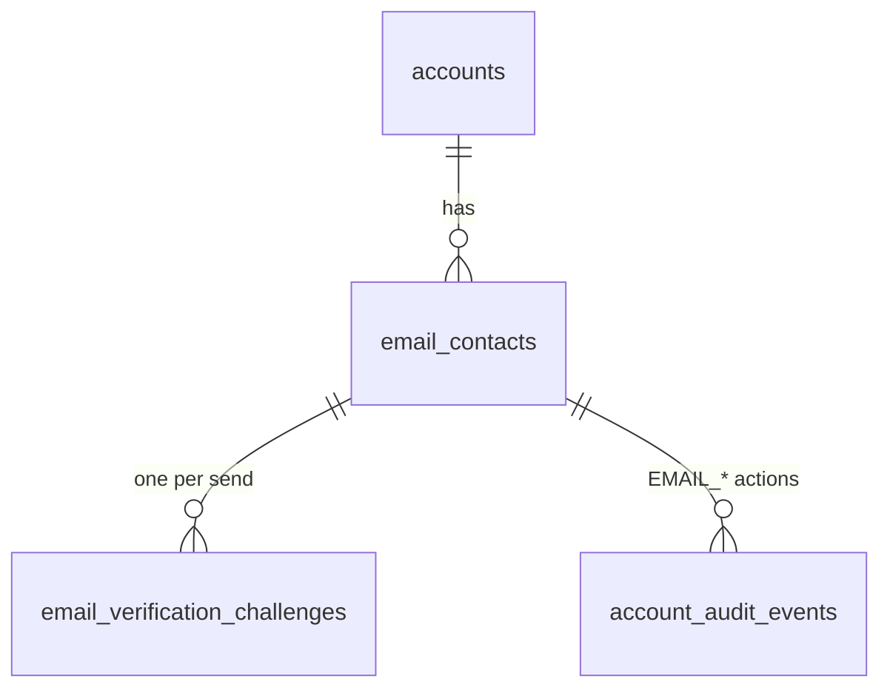
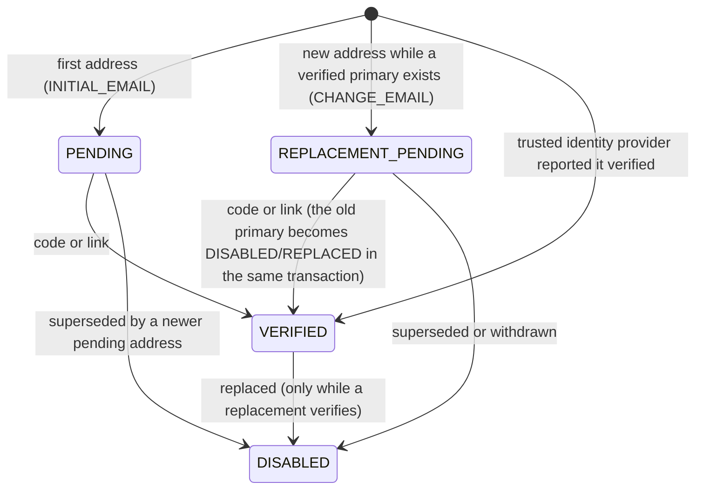

# Email contact and verification

The email contact (ID-002) is the address BananaGig holds for a person and the proof that the person controls it. Keycloak remains the authentication authority and keeps the login identifier; BananaGig owns the marketplace contact and its verification state. Verified contact data is what the booking gate (CU-03/CU-04), chat, reviews, two-factor codes (CU-09.13) and account recovery will consume later; ID-002 stores and exposes the state and does not gate anything.

Requirements served: CU-03.04 to CU-03.06 (verify email by code or link, resend, change address, clear errors), SV-03.01 (code rules from configuration, single use, hashes only), SV-03.02 (one verified email per account), SV-03.04 (abuse protection: rate limits by account, IP, device, address), SV-03.05 (private, masked), CU-09.15 (a change is verified before it replaces the old address and the old one stays active until then).

Email is personal data. No code, token, hash or full address appears in a log line, an audit `changes` object, an event, an error or an API response. The API returns the address MASKED (`c***@b***.localhost`) to its owner only.

## Scope

In scope: the email contact tables, the canonical form, the verification challenge (code and magic link), the resend and attempt limits, the reusable rate-limit foundation, the `EmailSender` port with the SMTP/Mailpit adapter, the managed copy and configuration, five authenticated API operations, the account-level `emailVerificationStatus`, the trusted-identity-provider policy, five outbox events, audit, and the `/verify-email` web page.

Out of scope (nothing exists for any of these): phone verification (ID-003), password recovery (DEBT-0017), the onboarding carousel and sign-up forms, provider onboarding, profile and account screens, marketing email and notification preferences, SMS, account deletion, booking gating, a production email provider (DEBT-0049).

## Ownership and trust boundary

| Question | Answer |
|---|---|
| Who owns the marketplace contact? | BananaGig: `identity.email_contacts` |
| Is the Keycloak email copied? | No. The login email stays in Keycloak. Access tokens carry no email claim. |
| When is an address VERIFIED? | Only by proof: the code or the magic link, or a TRUSTED identity provider reported it verified. |
| A plain email claim? | Never trusted, never persisted (at most a prefilled suggestion). |
| A Keycloak realm user with `emailVerified=true`? | Not trusted: an administrator or an import can set the flag. |
| Where is the trust decision? | One pure function, `decideIdpEmail` (`packages/accounts/src/email-policy.ts`), tested table by table. |

### Verified social email (explicit policy)

`decideIdpEmail(assertion, trustedProviders)` returns `VERIFIED` if and only if all three hold:

1. the claim canonicalizes (the same function as every other address);
2. `email_verified` is exactly the boolean `true` (the string `"true"`, `1`, `"yes"` and a missing flag do not count);
3. the login was brokered through an identity provider in `trustedProviders` (Keycloak identity-provider alias, for example `google`, `apple`; the set is supplied by the caller from deployment configuration and is EMPTY by default).

Otherwise it returns `SUGGESTION` (usable to prefill a form, never stored) or `IGNORE`. `EmailVerificationService.bootstrapIdpEmail` applies a `VERIFIED` decision only when the account has no live email contact yet and the address is not VERIFIED on another account; it creates a VERIFIED primary contact with source `IDP_VERIFIED`, with no challenge and no message (audit `EMAIL_ADDED` and `EMAIL_VERIFIED`, events `EmailContactAdded` and `EmailVerified` with method `IDP`). Apple private-relay addresses are ordinary addresses. Today nothing calls it: tokens carry no email claim and no brokered provider is configured (DEBT-0053); the rule is implemented, explicit and tested so the first brokered login only has to supply the typed assertion.

## Canonical form

`canonicalizeEmail` (`packages/contracts/src/email.ts`) is the only normalization. Every comparison, uniqueness check, lookup and delivery uses its result; no second "display" copy is stored.

| Rule | Policy |
|---|---|
| Whitespace | outer whitespace trimmed; exactly one `@` |
| Characters | control, bidirectional-override and unpaired-surrogate characters are refused (`INVALID_CHARACTERS`); this also closes header injection (CR/LF) |
| Domain | case-insensitive: mapped through IDNA to lower-case ASCII (punycode); at least two labels; labels of 1 to 63 letters, digits and hyphens, not starting or ending with a hyphen; at most 253 characters; no IP literal, no trailing dot, no all-numeric top-level label |
| Local part | an ASCII dot-atom (RFC 5322 `atext` separated by single dots), at most 64 characters; no quoted strings, no comments, no internationalized local part (`UNSUPPORTED`) |
| Local-part case | **folded to lower case** (documented policy): mailbox providers treat it case-insensitively, and a case-sensitive reading would let two verified identities differ only by case |
| Dots and `+tags` | **kept**. No Gmail-style folding is invented: `a.b+c@x.com` stays `a.b+c@x.com` |
| Length | at most 254 characters |
| Idempotent | `canonicalizeEmail(canonical) === canonical` |

Issue codes (`REQUIRED`, `TOO_LONG`, `INVALID_FORMAT`, `INVALID_CHARACTERS`, `UNSUPPORTED`) map to managed messages `account.email.error.<code>`; the result never carries the rejected value. `maskEmail` produces the only form that leaves the server: first character of the local part and of the first domain label, then the last label.

## Data model

`identity.email_contacts`: `email_contact_id`, `account_id`, `email_normalized`, `status`, `is_primary`, `source`, `verified_at`, `disabled_at`, `disabled_reason`, timestamps. `identity.email_verification_challenges`: `challenge_id`, `email_contact_id`, `purpose`, `code_hash`, `magic_token_hash`, `expires_at`, `used_at`, `consumed_via`, `attempt_count`, `invalidated_at`, `invalidation_reason`, `delivery_status`, `last_sent_at`, `created_at`, `correlation_id`. Details, constraints and the review are in `docs/data/DATA_MODEL.md` and `docs/data/NORMALIZATION_LOG.md`.

### Contact lifecycle

`emailVerificationStatus` (account level, derived): `NONE` (no live contact), `PENDING` (a contact exists and none is verified), `VERIFIED` (a verified primary exists, even while a replacement is pending).

### Uniqueness policy

| Case | Behaviour | Enforced by |
|---|---|---|
| Verified duplication | one VERIFIED address belongs to at most ONE account; there is no takeover and no transfer | partial unique index `uq_email_contacts__verified_address` |
| Pending duplication | allowed across accounts: a pending claim proves nothing, so it neither blocks the real owner nor reveals that anyone else holds the address | no index on the address for pending rows |
| Same account | one primary, one open candidate, one live row per address | `uq_email_contacts__primary_per_account`, `uq_email_contacts__open_per_account`, `uq_email_contacts__live_address_per_account` |
| Proving a mailbox another account already verified | `409 ACCOUNT_EMAIL_UNAVAILABLE` after a correct code or link; nothing changes; recovery of a lost mailbox is a support process (DEBT-0051) | a pre-check and, underneath, the unique index |
| Replacement | the candidate is `REPLACEMENT_PENDING`; the primary stays VERIFIED and primary until the candidate verifies; verification disables the old primary (`REPLACED`) and promotes the candidate atomically; a superseded or withdrawn candidate leaves the primary untouched | guard triggers and a deferred invariant trigger |

No answer before proof reveals whether an address is held elsewhere: setting the address and sending the verification answer identically whatever any other account holds.

## Verification challenge

One challenge per send. A resend creates a new challenge and supersedes the open one in the same transaction, so at most one challenge per contact is open, the number of sends in a window is the number of rows, and the send history is kept.

- **Code**: `verification.email.code.length` digits (default 6), drawn digit by digit from the operating-system CSPRNG (`randomInt`), leading zeros allowed.
- **Magic token**: 32 random bytes, base64url (43 characters).
- **At rest**: HMAC-SHA-256 hex of each, keyed with `VERIFICATION_HASH_SECRET` (a deployment secret outside the database; a development placeholder is in `.env.example`). The code hash is bound to the challenge id; hashes are domain-separated; comparison is constant-time. The plaintext exists only in memory during the send and in the delivered message.
- **Expiry**: `verification.email.validity_minutes` (default 10); an expired challenge is refused for code and link (`ACCOUNT_EMAIL_CODE_EXPIRED`) and counts no attempt.
- **Attempts**: `verification.email.max_attempts` (default 5). A wrong code increments `attempt_count` under the challenge row lock and is committed even though the call fails; the attempt that reaches the maximum locks the challenge (`ACCOUNT_EMAIL_VERIFICATION_LOCKED`, 429). A new code is requested with a resend.
- **Earlier codes**: a code from an earlier email of the same address (superseded by a resend) never verifies; it is answered `ACCOUNT_EMAIL_CODE_USED` ("already used or replaced") and costs no attempt.
- **Single use**: `used_at` is set under the row lock together with the contact transition; repeating a successful confirmation by code or link is an idempotent success (`changed: false`) with no second audit row or event.
- **Concurrency**: confirmations lock the account row, then the account's contact rows, then the challenge row. Two identical submissions, a code and a link, a resend racing a verify, a replacement race and two accounts verifying the same address concurrently all end in exactly one outcome.

### Code and magic link

The same email carries both. The link is `<web>/verify-email#token=<token>`. The token is in the URL **fragment**, which is never sent to a server, so it cannot reach an access log, a trace, a proxy or a Referer header. The page reads it in the browser, removes it from the address bar and history, and shows a confirm button; opening the link verifies nothing (a mail scanner that prefetches it changes nothing). The web server POSTs the token in a body to `POST /api/v1/account/email/verification/confirm-link`. A person who is not signed in signs in and opens the link again: the fragment does not survive the login redirect, deliberately, so the token is never stored in the login transaction.

## Limits and abuse protection

| Limit | Where it is counted | Fails |
|---|---|---|
| Resend cooldown (`resend_seconds`, 30) | PostgreSQL: from the creation of the account's newest challenge that is neither FAILED nor used (a delivery in flight holds a second send back; a failed delivery and a verified address do not) | `429 ACCOUNT_EMAIL_RESEND_TOO_SOON` + `Retry-After` |
| Per hour (`max_per_hour`, 5) and per day (`max_per_day`, 10) | PostgreSQL: challenges created by the account (failed deliveries count) | `429 ACCOUNT_EMAIL_SEND_LIMIT` + `Retry-After` |
| Wrong attempts (`max_attempts`, 5) | PostgreSQL: `attempt_count` | `429 ACCOUNT_EMAIL_VERIFICATION_LOCKED` |
| Requests per account, per source address and per device per hour (`requests.max_per_hour`, 30) | Valkey, the reusable limiter | `429 ACCOUNT_EMAIL_RATE_LIMITED` |
| Sends to one address across all accounts per hour (`address.max_per_hour`, 5) | Valkey (address HMAC) | `429 ACCOUNT_EMAIL_RATE_LIMITED` |

A send refused by the cooldown or a cap is detected BEFORE the Valkey limiter is consumed (and again under the account lock), so a refused request never spends the per-address budget of emails to one address.

The values are CFG-001 parameters (CRITICAL, second approver, owner security), read fresh on every call, never defaulted in code. The first six are the PRD values; the last two are an engineering assumption flagged for the security owner (TECH_DEBT). If the configuration cannot be read the operation fails closed (`UNAVAILABLE`). The Valkey limiter fails CLOSED for operations that send mail (set the address, send) and fails open for confirmation, which is bounded by the attempt counter in PostgreSQL. A refusal never names the refusing dimension. See `docs/engineering/RATE_LIMITING.md`.

## Delivery

`EmailSender` (`@bananagig/platform`) is the provider-neutral port: `to`, `templateKey`, optional `templateVersion`, typed `variables`, `locale`, `correlationId`. `SmtpEmailSender` renders through the `EmailRenderer` port and delivers with nodemailer: Mailpit locally and in CI (`SMTP_HOST`, `SMTP_PORT`), any SMTP relay elsewhere (STARTTLS required unless `insecureLocal`). A production provider (SES, Postmark, ...) is another class behind the same port (DEBT-0049). The identity service never touches SMTP.

Sending is two-phase: the challenge commits, the message is delivered OUTSIDE any transaction, then the outcome is recorded. A failed delivery closes its challenge (`DELIVERY_FAILED`) and does not start the resend cooldown (`503 ACCOUNT_EMAIL_DELIVERY_FAILED`, retryable). A crash between delivery and recording leaves a `PENDING` delivery whose code is still valid.

## Content and configuration

No user-visible copy is written in code. The composition root renders `account.email.verification.subject` (EMAIL_SUBJECT) and `.body` (EMAIL_BODY) from the content registry (CFG-002) with typed variables `verification_code` (STRING), `verification_url` (URL) and `expiry_minutes` (COUNT); the code and the URL are marked `SENSITIVE_PERSONAL`. The subject does not carry the code. 34 managed entries (`account.email.*`) cover the email, the verification screen, the link page, the status labels and every error message; migration 0010 seeds them with the real lifecycle. The eight `verification.email.*` parameters are seeded through the real change workflow (draft, submit, second-approver approval, publish, activate).

## API

All operations are under `/api/v1/account`, authenticated (web identity context), act on the caller's own account only (no route has an account id, contact id or subject), validate bodies strictly BEFORE Ajv can coerce them (`{"code": 123456}` is a 400), and answer `Cache-Control: no-store`.

| Operation | Purpose |
|---|---|
| `GET /account/email` | the email state for the verification screen: status, masked primary and pending address, `resendAvailableAt`, `attemptsRemaining`, `codeLength`, `validityMinutes` |
| `POST /account/email` `{email}` | set the address: the first address (`INITIAL_EMAIL`) or a pending replacement (`CHANGE_EMAIL`); sends nothing |
| `POST /account/email/verification/send` `{}` | send or resend the verification email (cooldown, hourly and daily caps) |
| `POST /account/email/verification/confirm-code` `{code}` | confirm with the code |
| `POST /account/email/verification/confirm-link` `{token}` | confirm with the magic-link token (a POST: a GET that changes state is triggered by link scanners) |

`GET /account/me` carries `email: { emailVerificationStatus, primary, pending }`, cheap (no configuration read) and masked. Error codes are `ACCOUNT_EMAIL_*` with a managed message key in `details.messageKey` and `Retry-After` on the 429s.

## First email versus change email

`INITIAL_EMAIL`: the account has no verified primary; the address is `PENDING`. `CHANGE_EMAIL`: a verified primary exists; the new address is `REPLACEMENT_PENDING` and the old address stays VERIFIED and primary until the new one verifies (CU-09.15). Setting the primary address again withdraws a pending change (the withdrawn candidate stays as a `DISABLED`/`SUPERSEDED` row, which is its record; no separate audit action exists); setting a different address supersedes the pending one. Fresh two-factor authentication before a change (CU-09.14), the notice to the old address and the account screens are later checkpoints (DEBT-0050); the data model and lifecycle are complete.

## Events and audit

Transactional outbox, aggregate `identity_account`, identifiers only: `bananagig.identity.email-contact-added.v1`, `email-verification-sent.v1`, `email-verified.v1`, `email-verification-failed.v1`, `email-change-requested.v1`. Audit (`identity.account_audit_events`) gains `EMAIL_ADDED`, `EMAIL_CHANGE_REQUESTED`, `EMAIL_VERIFICATION_REQUESTED`, `EMAIL_VERIFICATION_FAILED`, `EMAIL_VERIFICATION_LOCKED`, `EMAIL_VERIFIED`, `EMAIL_PRIMARY_CHANGED` with the contact id and, in `changes`, the masked address, statuses, purpose, method and attempt numbers.

## Web

`/verify-email` (server component, `no-referrer`, not indexed) renders the code form, the resend control with its countdown, the change-address form and the magic-link landing from managed copy. The browser submits forms to same-origin handlers (`POST /auth/email/<set|send|confirm-code|confirm-link>`: Origin checked, session required) that call the API with the session's token and forward the browser's address as `x-forwarded-for`; outcomes come back as `?ok=` or `?error=<API code>` and never carry a value.

## Tests

Unit: canonicalization, masking, strict request validation, crypto, policy parsing, the trusted-provider table, the limiter, the SMTP adapter, the API layer, the web handlers and page. Integration: the data model (constraints, guards, deferred invariants, seeds), the service (every flow, every race), the HTTP API with Mailpit and Valkey. Smoke: the `Email verification` scenario (real tokens, Mailpit, no secret in responses or Loki).

## Operations

- Rotating `VERIFICATION_HASH_SECRET` invalidates open challenges (they expire in minutes); no data migration.
- Local: Mailpit UI at `http://mail.localhost:8080` (devtools profile); the integration tests read it through its API (`packages/testing/src/mailpit.ts`).
- Changing a limit is a configuration change request (second approver), not a deployment.
