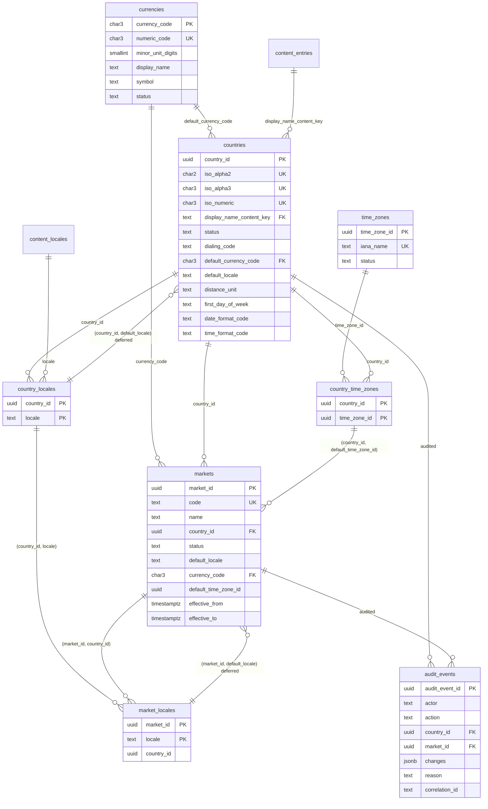
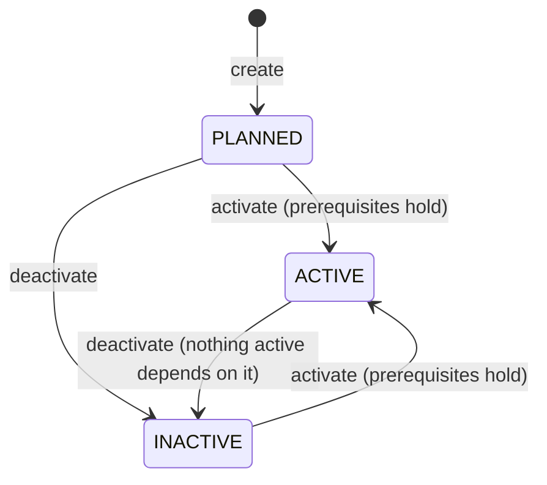

# Geography Registry

The geography registry (GEO-001) holds the platform reference data that says where BananaGig operates and how a place behaves: countries, currencies, time zones and markets, plus the data-driven defaults of each market (locale, currency, time zone, distance unit, first day of the week, date and time format). Everything is a row in the `geography` schema, never a constant in code. Decisions: ADR-0021 (reference-data model and locale authority) and ADR-0022 (cross-domain reference integrity through ports).

It is the sibling of the configuration registry (`docs/engineering/CONFIGURATION.md`, which values apply) and the content registry (`docs/engineering/CONTENT.md`, which words are shown): geography answers "where, in which currency, locale and time zone". It owns no locales (the content registry does) and no copy (the country display name is a content entry).

## Purpose and scope

In scope:

- Countries (ISO 3166-1) with their default currency, default and supported locales, time zones, dialing code and display formats.
- Currencies (ISO 4217) with the number of minor-unit digits as data, and IANA time zones.
- Markets: first-class, dated operating areas inside one country, each with its own default locale, currency and operational time zone.
- Activation (PLANNED, ACTIVE, INACTIVE) guarded by the database, with an extensible readiness registry in code.
- Public reads of ACTIVE data, audited management writes, outbox events, and two ports that let configuration and content use geography without importing it.

Not in scope (no table, column or code exists for any of them):

| Not here | Where it belongs |
|---|---|
| Addresses, address formats, address autocomplete, geocoding, coordinates, service areas and geofences | later address and geocoding checkpoints (DEBT-0034 notes the time zone override) |
| Search and discovery by place | the search domain (OpenSearch holds derived data only) |
| Tax rates, tax registration, invoicing rules | a later tax checkpoint (registers a readiness check, DEBT-0032) |
| Payments, payment providers, payouts, fees and prices | a later payments checkpoint; prices and fees are configuration values, never geography columns |
| Translations of country names | the content registry (a country name is a content entry) |
| An admin console, bulk import of ISO datasets, per-market format overrides | DEBT-0031 (no import and no management API for currencies, time zones and locale activation); overrides need their own review |

## Data model

Schema `geography` (migration `db/migrations/0007_geography_registry.sql`; relationships in `docs/data/ERD.md`, columns in `docs/data/DATA_DICTIONARY.md`, normalization review in `docs/data/NORMALIZATION_LOG.md`).



`content_locales` and `content_entries` in the diagram are `content.locales` and `content.entries`. All foreign keys are `ON DELETE RESTRICT` (the two deferred default-locale keys use the default NO ACTION); rows are never deleted. Constraints worth knowing:

- A country default locale must be one of its supported locales, and a market default locale one of the market's supported locales, which in turn must be supported by the country. These are composite foreign keys; the two default-locale keys are `DEFERRABLE INITIALLY DEFERRED` so a row and its first link can be written in one transaction. `market_locales.country_id` repeats the market's country on purpose (intentional denormalization, enforced by a composite foreign key).
- A market default time zone must be one of its country's time zones (composite foreign key).
- A market window is half-open, `[effective_from, effective_to)`, and `effective_to > effective_from`. `markets.name` is at most 120 characters (`ck_markets__name_not_blank`); `markets.code` is at most 60.
- Link rows (`country_locales`, `country_time_zones`, `market_locales`) are immutable: they are inserted or deleted, never updated.

## Locale ownership and dependency direction

`content.locales` is the single locale authority (ADR-0021). There is no `geography.locales` table and no locale column set on countries. Geography references locales by foreign key (`geography.country_locales.locale -> content.locales (locale)`), and reads `content.locales.is_active` under `FOR SHARE` when it validates an activation.

GEO-001 extended `content.locales` additively: `display_name` (NOT NULL; an insert trigger stores the tag when none is given, and `registerLocale` derives a proper English name with `Intl.DisplayNames` unless the caller sends `displayName`) and the generated columns `language`, `script` and `region`, derived from the tag so they cannot drift. The content API exposes them (`displayName`, `language`, `script`, `region`).

Dependency direction:

| Layer | Direction |
|---|---|
| Database foreign keys, trigger reads | `geography -> content` only (`geography.country_locales.locale`, `geography.countries.display_name_content_key`) |
| One cross-schema trigger | `trg_locales__geography_guard` on `content.locales` (function `geography.guard_locale_deactivation`, owned by geography): refuses deactivating a locale that is the default of an ACTIVE country or market. Deactivating a non-default supported locale is allowed on purpose; public geography reads then hide it from `supportedLocales` |
| Packages | `@bananagig/geography` depends on contracts, database, observability, platform and configuration (for the cache types); it does not import `@bananagig/content`, and content does not import geography. `scripts/check-boundaries.mjs` (`pnpm deps:check`) enforces the allowed edges |
| Runtime wiring | `apps/api/src/index.ts` creates the geography service and passes its two ports to configuration and content (ADR-0022) |

The geography service reads `content.locales` and `content.entries` with SQL for these checks (an accepted, read-only exception to "other domains use the content service", recorded in ADR-0021) because the checks must run inside the same transaction and under the same share locks as the activation.

## Currency conventions

- Currencies are ISO 4217: `currency_code` is the upper-case alpha code (`char(3)`, the primary key and the foreign key target), `numeric_code` the three-digit code.
- `minor_unit_digits` (0 to 4) is data, not a constant: USD 2, JPY 0, KWD 3. Code, numeric code and `minor_unit_digits` are immutable (a trigger refuses changes) because stored amounts depend on them.
- Money everywhere else is `amount_minor bigint` plus a `currency char(3)` code (`docs/data/DATABASE_CONVENTIONS.md`). To format, take the digits from the currency row, build the decimal string from minor units with BigInt and let `Intl.NumberFormat` render it; never divide a Number. Note that the content registry's money formatting (`packages/content/src/format.ts`) currently takes its fraction digits from `Intl`, not from this table; for ISO currencies the two agree.
- `symbol` is a display hint only (1 to 8 characters, optional). `display_name` is a stable English label, not localized copy.
- A country has a default currency; a market has its own currency (its own fact, not copied from the country).

## Time zone conventions

- A time zone is identified by its IANA name (`America/Los_Angeles`). UTC offsets are never an identity because they change with daylight saving time; no offset is stored anywhere.
- The database validates the name: a format check (`ck_time_zones__iana_name_format`, at most 64 characters) and an insert trigger that refuses the `posix/` and `right/` alias trees and requires a NEW name to exist in PostgreSQL's own tz database (`pg_timezone_names`, exact case). It runs on insert only, so it reflects the server's tzdata at that moment and nothing re-validates a registered name when tzdata is updated. The identity (`time_zone_id`, `iana_name`) is immutable.
- The service pre-validates for clear errors (`packages/geography/src/validation.ts`): the name must be in `Intl.supportedValuesOf('timeZone')` (exact case) or be one of 19 listed IANA names that Node's CLDR-based list spells differently (for example `Asia/Kolkata`; the list has `Asia/Calcutta`) and that the runtime resolves to a listed zone. Fixed-offset and alias names (`Etc/GMT+5`, `EST`, `us/pacific`, `UTC+5`, `posix/...`, `right/...`) are therefore rejected, and so is `UTC`, because the list does not contain it (it would be accepted only on a runtime that lists it). A name outside the list is `400 VALIDATION_FAILED`; a valid name the database does not know is `404 GEOGRAPHY_TIME_ZONE_NOT_FOUND` (`details.reason` `UNKNOWN_IANA_ZONE`). The database stays the final authority, so a name Node's ICU knows but PostgreSQL does not (or the reverse) is refused by one of them.
- Instants are stored as `timestamptz`. The zone is used to display times and to decide which local day an instant falls on.
- Each market has one default operational time zone, chosen from its country's zones. There is no zone lookup from an address or coordinates; the address checkpoint will override the market default per service location (DEBT-0034).
- `createCountry` and `updateCountry` register unknown, valid IANA zones as PLANNED. Nothing activates a time zone through the API (DEBT-0031): a zone becomes ACTIVE by migration or SQL.

## Countries

A country row (`geography.countries`) carries identity (ISO alpha-2, alpha-3, numeric: unique and immutable), `display_name_content_key`, `dialing_code` (`+` and 1 to 4 digits; not unique, `+1` is shared), `default_currency_code`, `default_locale` (plus the sets `country_locales` and `country_time_zones`) and four format settings.

- **ISO code validation.** The alpha-2 code must be a region known to the runtime's CLDR data (`Intl.DisplayNames` type `region` with `fallback: 'none'`; the groupings `EU`, `EZ`, `UN`, `QO`, `XA`, `XB` are refused), so an unassigned code such as `QQ` is rejected. `ZZ` ("Unknown Region") is the DEV/TEST code and is admitted only by the `allowTestKeys` gate (see Development and test gating). Alpha-3 and numeric codes are checked for format and uniqueness only: nothing verifies that the three codes name the same country (DEBT-0031). There is no ISO dataset in the repository, so "ISO" here means these checks, not a verified copy of the standard.
- **Display name.** A foreign key to `content.entries (key)`; the text is managed content resolved through the content API (the seed is `geography.country.us.name`, `en-US` body `United States`). The convention is `geography.country.<alpha-2 lower>.name`; the database enforces only the dotted lower-case format and that the entry exists.
- **Format settings** live on the country only (single source) and are enum codes checked by the database, never format strings:

| Column | Values |
|---|---|
| `distance_unit` | `MILES`, `KILOMETERS` |
| `first_day_of_week` | `MONDAY` to `SUNDAY` |
| `date_format_code` | `MDY`, `DMY`, `YMD` (order of the date parts) |
| `time_format_code` | `12_HOUR`, `24_HOUR` |

- **Rendering uses Intl.** The registry stores choices only; it contains no formatting code. A consumer renders with `Intl.DateTimeFormat` and `Intl.NumberFormat` using the market locale and applies the codes to what Intl cannot know from a locale alone: miles or kilometers, the first day of the week, 12-hour or 24-hour time, and the order of date parts. A country can use a Spanish default locale and still use miles and `MDY`, which is why these are country facts and not derived from the locale.
- **Creation and change.** `createCountry` creates the country PLANNED with its locale and time zone links. `updateCountry` changes the provided fields; `supportedLocales` and `timeZones` replace the sets; a request that changes nothing writes nothing. ISO codes are identity. While a country is ACTIVE its locale and time zone links can be added but not removed (API reason `LINKS_FROZEN`, kept as the error name; the database refuses the DELETE), and its default currency and default locale must stay ACTIVE.

## Markets

A market is an operating area inside one country, for example `la-oc` ("LA & OC") inside `US`.

- **Fields.** Unique lower-case kebab-case `code` (at most 60 characters), `name` (at most 120), country, default locale, supported locales (a subset of the country's), currency, default time zone (one of the country's) and the effective window. Code and country are identity and immutable.
- **Inheritance.** The distance unit, first day of week and date and time formats come from the country at read time; there are no copies and no per-market overrides.
- **Effective window derived, never stored.** A market is in effect when `status = 'ACTIVE'` and `[effective_from, effective_to)` contains the evaluation time. There is no `is_current` or `is_ready` column. Public reads evaluate the window in memory on every call (never cached), so a market closes and opens exactly on time. `createMarket` defaults `effectiveFrom` to the service clock (not the database clock) so the window is evaluated with the same clock.
- **Canonical scope reference forms.** A `COUNTRY` scope reference is the ISO alpha-2 code in upper case (`US`); a `MARKET` scope reference is the market code in lower-case kebab form (`la-oc`). Resolution in configuration and content matches references by exact string, so any other spelling would silently never match; the validator therefore rejects non-canonical forms.
- **Changing a market.** `updateMarket` replaces `supportedLocales` when given and emits `market-defaults-changed` when the default locale, currency or default time zone changes. For an ACTIVE market the new values must satisfy the readiness checks before the row is written.
- **Defaults.** `resolveMarketDefaults(code)` returns what a consumer needs to render or price for a market: market, country (code, dialing code), currency (code, `minorUnitDigits`, symbol), locale, supported locales, time zone, the four format settings and the window. There is no code fallback: a missing market, country, currency or time zone is a typed error, and the public view also requires every dependency to be ACTIVE and the market to be in effect.

## Activation and readiness

Activation rules are enforced twice. The service checks first and returns a clear typed error; the database triggers are the safety net (and the only enforcement for direct SQL).

| Subject | Becomes ACTIVE only with | Cannot be deactivated while |
|---|---|---|
| Country | ACTIVE default currency, ACTIVE default locale in `content.locales`, at least one ACTIVE linked time zone (so: create PLANNED, link, then activate; creating a country directly ACTIVE fails) | an ACTIVE market belongs to it |
| Market | ACTIVE country, ACTIVE currency, ACTIVE default time zone, ACTIVE default locale | (nothing depends on a market) |
| Currency, time zone, locale | n/a | an ACTIVE country or market uses it (a locale only when it is their default; a time zone also not while it is the only ACTIVE zone of an ACTIVE country) |

### Concurrency

An activation locks the rows it relies on `FOR SHARE` (country activation: currency, locale and its ACTIVE time zone rows; market activation: country, currency, time zone and locale), and a deactivation needs the row lock, so the two serialize and exactly one wins; the loser sees the committed state and fails with a clear error. Two identical activations are idempotent. Rules the code and the triggers follow:

- **One lock order.** The markets of the country (in `market_id` order: `FOR UPDATE` for the market being changed, `FOR SHARE` for all markets of a country being changed), then the country row, then the currency, time zone and locale rows (`FOR SHARE`). The service documents it in the header of `packages/geography/src/service.ts` and the migration in the comment above the guards.
- **Load, then lock, then read again.** The service locks a row with a bare single-table `SELECT 1 ... FOR UPDATE` (or `FOR SHARE`) and reads it with a second statement. In READ COMMITTED a `SELECT ... JOIN ... FOR UPDATE` re-evaluates only the locked row after a lock wait, so joined columns and the `ARRAY(subselect)` columns (locales, time zones) would stay stale and produce wrong audit diffs or spurious 404 and 409 answers.
- **Sibling rules lock the owner first.** `guard_time_zones` deactivating a zone locks the affected ACTIVE countries (`FOR UPDATE`, `country_id` order) before it checks that each keeps another ACTIVE zone, because a plain read of siblings cannot see a concurrent, uncommitted change of another zone (write skew). `guard_country_links` share-locks the country row before it reads the status, so removing a link serializes with an activation of that country. The zone check in `guard_countries` runs only when a country BECOMES ACTIVE; for an ACTIVE country the zone rule is kept by the zone guard and the frozen links.
- **Removing a link a market uses** is pre-checked with plain reads before any delete (typed `IN_USE`), because the foreign key check would lock the market row in the opposite order.
- **An inherent remaining limit.** A time zone row is locked by the UPDATE itself before its trigger can lock the country, so a raw SQL zone deactivation racing a market activation can deadlock. PostgreSQL aborts one side; the service maps SQLSTATE `40P01` and `40001` to `CONFLICT` with `details.reason` `CONCURRENT_UPDATE` and `retryable: true`, and the same request can simply be repeated. The API offers no zone deactivation, so this needs raw SQL.

### Readiness registry

Readiness (what a market still lacks before it should go live) is DERIVED in code each time, never stored. `ReadinessCheck { code, description, required?, evaluate(ctx) }`; `evaluate` receives a `ReadinessContext` (the market, its country, currency, locale, time zone and the evaluation time) and returns `{ passed, detail }`. Built-ins: `COUNTRY_ACTIVE`, `CURRENCY_ACTIVE`, `LOCALE_ACTIVE`, `TIME_ZONE_ACTIVE`.

Activation (and updating the default locale, currency or time zone of an ACTIVE market) runs every registered check:

- a failing built-in dependency raises `INVALID_STATE` with `details.reason` `COUNTRY_NOT_ACTIVE`, `CURRENCY_NOT_ACTIVE`, `LOCALE_NOT_ACTIVE` or `TIME_ZONE_NOT_ACTIVE` and `details.checks`;
- a failing custom check with `required` true (the default) raises `NOT_READY` with `details.checks` (code and detail of every failing required check); a failing check with `required: false` is reported by the readiness endpoint but does not block;
- a check that throws counts as failed with a fixed detail (the error text is logged, never returned).

`GET /api/v1/geography/markets/:code/readiness` (geography-read) returns every check, evaluated now and never cached.

How a later domain registers a check (at process start-up, before the API serves requests):

```ts
import { registerReadinessCheck } from '@bananagig/geography';

const unregister = registerReadinessCheck({
  code: 'TAX_CONFIGURED', // UPPER_SNAKE, unique in the registry; a duplicate throws
  description: 'Tax rules exist for the market country',
  required: true,
  evaluate: async (ctx) => ({ passed: await taxConfiguredFor(ctx.country.code), detail: `tax for ${ctx.country.code}` }),
});
```

Planned codes: TAX, PAYMENT_PROVIDER, ADDRESS_FORMAT, AUTOCOMPLETE, CONTENT_TRANSLATION (none exists yet, DEBT-0032). Rules for a check: keep it fast (it runs while the market row is locked, so no slow network calls), return identifiers and facts only (no secrets or personal data in `detail`), and add a test that a failing check blocks activation with `NOT_READY`. Custom checks are application-level only: the database triggers know the four built-ins, and readiness is evaluated at activation and at default changes, not continuously, so an ACTIVE market whose custom check later fails stays ACTIVE until an operator deactivates it.

## Status machine

`status` exists on currencies, time zones, countries and markets (`PLANNED`, `ACTIVE`, `INACTIVE`; rows are never deleted).



PLANNED is the initial status only: the database guards refuse any UPDATE that sets a row back to PLANNED. Every other transition is allowed by the database subject to the activation and deactivation rules above (ACTIVE and INACTIVE move freely in both directions). INACTIVE means retired but reactivatable. Deactivating a PLANNED row moves it to INACTIVE; only an already-INACTIVE row is a no-op. Activation and deactivation are idempotent: when the row is already in the requested state nothing is written (no audit row, no event, no cache bump). Retiring a PLANNED country or market (PLANNED to INACTIVE) writes the audit row but emits no event, because it was never ACTIVE and no consumer saw it.

## Visibility

The service never reads roles; callers pass `{ management: true }` (or `includeInactive: true` for defaults), which shows every status plus the management-only fields and bypasses the cache. The API decides with `hasGeographyPermission(principal, 'read')`: the admin context plus `geography-read`, or `geography-write`, which implies read.

| | Public (anonymous, or without the admin context plus `geography-read` or `geography-write`) | Management (`geography-read` or `geography-write`) |
|---|---|---|
| Rows | ACTIVE only (PLANNED and INACTIVE behave as not found); markets also only while in effect | every status; defaults also for PLANNED and INACTIVE markets |
| Fields | public fields only; `effectiveTo` is always `null` | plus `status`, `createdAt`, `updatedAt` and the real `effectiveTo` |
| Country `supportedLocales` and `timeZones` | only locales ACTIVE in the content registry and only ACTIVE time zones | every linked locale and time zone |
| Market and defaults `supportedLocales` | only locales ACTIVE in the content registry | every linked locale |
| Never exposed | audit rows, actors, readiness internals (the readiness endpoint itself needs `geography-read`) | audit rows and actors are still never returned |

A planned retirement (`effectiveTo`) is management information: the market and defaults DTOs map it to `null` for public callers (`apps/api/src/modules/geography/dto.ts`), exactly like content versions. `effectiveFrom` is shown. At the service level a non-canonical code (`us`, `LA-OC`) is not found without a query; at the API level the path schema rejects it first with 400 `VALIDATION_FAILED`.

Every public geography GET sets `Vary: Authorization` (the `optionalAuthenticated()` hook adds it before anything can answer, so 401 and 404 carry it too), because the body differs between anonymous and privileged callers; the content public routes do the same. The same visibility is applied to content: public content resolution consults `isVisible` (see Ports) so a market or country that is not public here is dropped from a public content context.

## Permissions (temporary)

Same stopgap as configuration and content (DEBT-0021, DEBT-0028): the admin identity context plus client roles on `bananagig-admin`, guards in `apps/api/src/plugins/auth.ts` (`requireGeographyPermission`, `hasGeographyPermission`).

| Role | Allows |
|---|---|
| `geography-read` | all statuses and management fields on the public read routes, defaults for non-ACTIVE markets, `GET /markets/:code/readiness` |
| `geography-write` | create and update countries and markets, activate and deactivate them; implies `geography-read` (a write-only administrator would otherwise get the management view back from a mutation and a 404 from the matching GET), never the reverse |

Content and configuration roles grant nothing here; on the public routes a token without the admin context plus `geography-read` is treated as anonymous, and on the management routes it is 403. There is no approval workflow: reference data changes are audited, not approved. The realm file `infra/keycloak/bananagig-realm.json` defines both roles and maps them to the two dev admins; an existing Keycloak needs the realm re-imported. Only the two `*GeographyPermission` helpers should change when application RBAC replaces this.

## API

Base `/api/v1/geography`; standard envelope `{ data, meta: { correlationId } }`; unknown request fields are rejected. Spec: `docs/api/openapi.yaml` (generated; never hand-edit). Guards run in `preValidation`, so 401 precedes 400.

| Method and path | Access |
|---|---|
| GET `/countries`, `/countries/:code` | public with visibility rules (optional bearer: no header is anonymous, a presented token must be valid); `Vary: Authorization` |
| GET `/markets` (`?countryCode=`), `/markets/:code` | public with visibility rules |
| GET `/markets/:code/defaults` | public (ACTIVE markets in effect); `geography-read` also gets PLANNED and INACTIVE markets |
| GET `/currencies`, `/time-zones` | public (ACTIVE only); `geography-read` gets every status |
| GET `/markets/:code/readiness` | `geography-read` (or `geography-write`) |
| POST `/countries` (201, created PLANNED), PUT `/countries/:code`, POST `/countries/:code/activation` | `geography-write` |
| POST `/markets` (201, created PLANNED), PUT `/markets/:code`, POST `/markets/:code/activation` | `geography-write` |

Activation takes `{ active: boolean, reason }`; every mutation requires a `reason` (1 to 1000 characters). Path parameters are validated (`US`, `la-oc` form), so `/countries/us` is a 400.

Request bodies are validated strictly BEFORE Fastify's ajv step (`strictBody` in `apps/api/src/modules/geography/routes.ts`, listed after the authorization hook so 401 and 403 still win over 400). Ajv coercion stays on app-wide for query strings and would turn `{"active":1}` into `true`; here that body is a 400 `VALIDATION_FAILED`. Free text typed by an administrator (the market `name`, up to 120 characters, and every `reason`) uses the contracts `adminText` rule (`packages/contracts/src/geography.ts`): it rejects C0 and C1 control characters (including NUL, newlines and tabs), bidirectional override and isolate controls (U+202A to U+202E, U+2066 to U+2069), unpaired surrogates, and text that is blank once whitespace, NBSP and zero-width spaces are ignored. A NUL or untranslatable character that still reaches the database (SQLSTATE `22021`, `22P05`) maps to `VALIDATION_FAILED` with `details.reason` `FORBIDDEN_CHARACTER`.

Errors use the standard model with code `GEOGRAPHY_<code>` (`constraint` and driver `cause` are stripped from `details`). All 28 guard `RAISE`s in migration 0007 carry `DETAIL = 'geography_rule:<KEY>'` (15 keys) and the service classifies trigger failures (SQLSTATE `23000`) on that key only, never on the message text, which contains user-chosen codes. Deactivating a content locale that is the default of an ACTIVE country or market is raised by the same guard but reaches the caller as a CONTENT error: `409 CONTENT_INVALID_STATE` with `details.reason` `LOCALE_IN_USE_BY_GEOGRAPHY` (content matches the key `geography_rule:LOCALE_IS_ACTIVE_DEFAULT`).

| Service code | HTTP | Meaning |
|---|---|---|
| `COUNTRY_NOT_FOUND`, `MARKET_NOT_FOUND`, `CURRENCY_NOT_FOUND`, `TIME_ZONE_NOT_FOUND`, `LOCALE_NOT_FOUND` | 404 | unknown, or not visible to this caller. A currency, locale or time zone named in a request body that is not registered is a 404 with its own code (`GEOGRAPHY_CURRENCY_NOT_FOUND`, `GEOGRAPHY_LOCALE_NOT_FOUND`, `GEOGRAPHY_TIME_ZONE_NOT_FOUND`) |
| `VALIDATION_FAILED` | 400 | invalid field (`details.field`, `details.reason`), including the `TEST_KEY` gate and `FORBIDDEN_CHARACTER` |
| `CONFLICT` | 409 | duplicate ISO code or market code; a deadlock victim or serialization failure (`details.reason` `CONCURRENT_UPDATE`, `retryable: true`: repeat the request) |
| `INVALID_STATE` | 409 | activation with a failing built-in dependency (`details.reason` as above, plus `NO_ACTIVE_TIME_ZONE`), deactivation while something depends on the row (`IN_USE`, `COUNTRY_HAS_ACTIVE_MARKETS`), `LINKS_FROZEN`, `PLANNED_IS_INITIAL`, `IMMUTABLE` |
| `NOT_READY` | 409 | a required custom readiness check failed (`details.checks` kept) |
| `UNAVAILABLE` | 503 | database unreachable (category DEPENDENCY, generic message) |

## Events

Through the transactional outbox (ADR-0012) in the same transaction as the change; payloads carry identifiers only, never values. Aggregate types `geography_country` and `geography_market`, `aggregate_id` the country or market id. Spec: `docs/events/asyncapi.yaml`.

| Event type | Emitted when | Payload |
|---|---|---|
| `bananagig.geography.country-activated.v1` | a country becomes ACTIVE | `countryCode` |
| `bananagig.geography.country-deactivated.v1` | an ACTIVE country becomes INACTIVE (retiring a PLANNED one emits nothing) | `countryCode` |
| `bananagig.geography.market-created.v1` | a market is created (PLANNED) | `marketCode`, `countryCode` |
| `bananagig.geography.market-activated.v1` | a market becomes ACTIVE | `marketCode`, `countryCode` |
| `bananagig.geography.market-deactivated.v1` | an ACTIVE market becomes INACTIVE (retiring a PLANNED one emits nothing) | `marketCode`, `countryCode` |
| `bananagig.geography.market-defaults-changed.v1` | a market update changes its default locale, currency or default time zone (`cause` `MARKET`); a country update changes distance unit, first day of week, date format or time format, once per market of that country (`cause` `COUNTRY`) | `marketCode`, `countryCode`, `changedFields` (names only), `cause` |

Country creation, country updates that change no format, and retiring a PLANNED country or market emit no event (they are audited). Activation is idempotent: activating an already ACTIVE row writes nothing and emits nothing. The seed emits none.

Audit: every management mutation writes a `geography.audit_events` row (actor, action, country or market, `changes` as `{field: [old, new]}`, reason, correlation id) in the same transaction. Reference values are public, so values are recorded; audit rows and actors are never returned by the API.

## Cache and invalidation

PostgreSQL is the source of truth; Valkey only accelerates public reads (`packages/geography/src/cache.ts`; it reuses `ConfigCache` and `ValkeyConfigCache` from configuration).

| Key | Purpose |
|---|---|
| `bg:{env}:geo:v1:<what>:<geographyGen>.<contentLocGen>` | one cached public read (`country:US`, `countries`, `market:la-oc`, `markets`, `defaults:la-oc`, `currencies`, `currency:USD`, `timezones`) |
| `bg:{env}:geo:gen` | geography generation, bumped after every committed change |
| `bg:{env}:content:locgen` | the content registry's locale generation, read by key name (DEBT-0033) |

- **Generation.** A committed change bumps `geo:gen` after commit; the generation is read before the database, so a slow reader that started before the bump can only write under a dead key. Invalidation is instant.
- **Locgen coupling.** Public reads list only locales that are ACTIVE in content, which changes without any geography write, so every key also carries content's `locgen`; a locale activation therefore invalidates geography reads too.
- **TTL and staleness bound.** If a bump is lost (Valkey unreachable at that moment, or an evicted counter), stale entries live until the TTL. The service default is 300 s; the API passes `CONFIG_CACHE_TTL_SECONDS` (default 30 s), so that is the running bound. Valkey failures never change a result.
- **Deadline.** Every cache call has a 250 ms deadline; when the generation read does not answer the rest of the cache is skipped for that request, so a hung cache costs one deadline per read at most. A malformed cached entry is a miss.
- **What is cached.** Only ACTIVE, public data and only keys that exist (misses are never cached, so callers cannot grow the key space). Management reads, readiness and the market window check are never cached. The market window is evaluated in memory on every read.
- **Downstream memo.** Content's market-default provider adds a 60 s in-process memo (see Ports), so a changed market default reaches content in about a minute plus the bound above.

## Ports for configuration and content

Geography must be usable by the two lower-level registries without any of them importing it (ADR-0022). The ports are optional: without them configuration and content behave exactly as before. Content has three uses: scope reference validation on writes, market default locale derivation on reads, and a visibility filter on public reads.

### ScopeReferenceValidator (configuration and content writes)

Declared in `packages/configuration/src/scope-reference.ts` (content re-exports the types); implemented by `createGeographyScopeReferenceValidator(service)` in `packages/geography/src/scope-validator.ts`, which declares the same shape structurally. For `COUNTRY` and `MARKET` it requires the canonical form, an existing row, and status PLANNED or ACTIVE (INACTIVE is retired and invalid). Other scope types (including `PLATFORM`) are not geography's domain and are valid and untouched; DEBT-0024 stays open for them. It reads with the management view, so PLANNED rows (the seeded `la-oc`) are accepted for configuration and content before the market is live. That acceptance is inherent to the contract: a caller that gets `valid` knows the reference is PLANNED or ACTIVE, and a rejected one is anything else.

It returns ONE generic reason (`the scope reference is not valid`) for an unknown, an INACTIVE and a non-canonical reference. Configuration and content authors do not hold `geography-read`, so a specific message ("does not exist", "is INACTIVE") would let them read the registry's state. The reason appears as `details.check` of `SCOPE_REFERENCE_INVALID`.

- Configuration calls it at `createChangeRequest` (when `scopeRef` is set) and again at `publish`; content at `createVersion` and `publish`. The publish check runs before the transaction and holds no row lock during validator I/O, so a small window remains in which an entity can be deactivated between the check and the commit (accepted); existing rows are never re-validated.
- Fail-closed: an invalid reference is `VALIDATION_FAILED` with `details { reason: 'SCOPE_REFERENCE_INVALID', scopeType, check }`; a validator that throws (database outage) is `UNAVAILABLE` with `details.reason` `SCOPE_REFERENCE_UNAVAILABLE` at the service level; the API maps `UNAVAILABLE` to its generic 503 (`CONFIGURATION_UNAVAILABLE`, `CONTENT_UNAVAILABLE`) without details. A write is never accepted on a reference that could not be verified.
- Resolution is not validated for existence, and configuration resolution never touches geography: an unknown market in a configuration context simply matches nothing, and a MARKET value does not imply its COUNTRY value (the caller supplies each). Public CONTENT resolution does consult geography, for visibility only (next section).

### MarketDefaultsProvider (content reads)

Declared in `packages/content/src/market-defaults.ts` with two methods; implemented by `createMarketDefaultsProvider(service, { ttlMs = 60000, maxEntries = 500 })` over the PUBLIC geography reads:

- `defaultLocale(marketCode)` returns the default locale of an ACTIVE market in effect (a PLANNED, INACTIVE, out-of-window or unknown market yields `null`).
- `isVisible('COUNTRY' | 'MARKET', ref)` (optional on the port) says whether the reference is what the public geography API shows: it exists, is ACTIVE and, for markets, is in effect. Without a country lookup in the service it answers false (fail closed).

Both memoize in process for 60 s (including `null` and `false`, bounded to 500 entries per kind), share concurrent lookups, and serve the last value, even when stale, if the database errors. Only already-validated references reach the memo, so arbitrary input cannot grow it. A market's visibility reuses the default-locale memo (one public read answers both).

- **Visibility filter for PUBLIC content calls.** `ContentService.resolveMany` with `includeInternal === false` calls `isVisible` for `context.country` and `context.market` and DROPS a member that is not visible (not ACTIVE, outside its effective window, unknown, or the check throws: fail closed, warning without the reference), before anything is hashed, cached or resolved. A PLANNED, INACTIVE or unknown market is therefore indistinguishable from no market, so an anonymous caller cannot read MARKET-scoped copy of a market that is not live or tell an unknown market from a PLANNED one. Management callers (`content-read`) and snapshots keep seeing everything. A provider without `isVisible` keeps the previous behaviour (no filter). Because the provider answers from the public geography reads with the 60 s memo, a visibility change reaches public content in about a minute plus the geography cache bound.

- When `context.market` is set (and, for a public call, survived the visibility filter) and `context.marketDefaultLocale` is not, content asks `defaultLocale` once and merges the answer into the effective context BEFORE it hashes, builds cache and last-known-good keys, queries and snapshots, so keys and snapshots record what was used. An explicit `marketDefaultLocale` wins and skips the provider.
- Degrade, never fail: a null, malformed or throwing `defaultLocale` means no market default (a warning with the market code only is logged); a request is never failed by it. (The visibility check degrades the other way on purpose: a throwing `isVisible` drops the market or country, so nothing unverified is served.) An inactive derived default is skipped by the fallback chain, the request is not cached, and a snapshot drops it.
- The locale chain is unchanged: requested, its language, market default, platform default.

## Seeds

Migration 0007 seeds deterministic launch reference data (no outbox events; audit rows by `system:migration`): currency `USD` (840, 2 digits, ACTIVE); time zones `America/New_York`, `America/Chicago`, `America/Denver`, `America/Los_Angeles` (ACTIVE); the content entry `geography.country.us.name` taken through the real content lifecycle (five audit rows, no trigger disabled); country `US` (USA, 840, `+1`, `USD`, `en-US`, `MILES`, `SUNDAY`, `MDY`, `12_HOUR`) created PLANNED, linked, then activated; and market `la-oc` ("LA & OC", `en-US`, `USD`, `America/Los_Angeles`) seeded PLANNED.

`la-oc` is a business assumption: the launch market is Los Angeles and Orange County. It is inert (invisible publicly, resolving nothing for content) until the owner confirms the name and scope and activates it with `POST /api/v1/geography/markets/la-oc/activation`. No other country, currency or market is seeded, and the United States has only those four time zones (Phoenix, Anchorage, Honolulu and the rest are absent, so `GET /countries/US` lists a partial set; DEBT-0031).

## Development and test gating

The test country `ZZ` (alpha-3 `ZZZ`, numeric `999`) and market codes starting `devtest-` exist only when the service option `allowTestKeys` is true (`apps/api/src/index.ts` sets it to `cfg.env !== 'production'`; the same gate as `devtest.*` keys in configuration and content). A violation is 400 `VALIDATION_FAILED` with `details.reason` `TEST_KEY`. Entities cannot be deleted, so tests and smoke create unique `devtest-<run>` markets and reuse `ZZ`; smoke also reuses the private-use locale `qaa`, registering it through the content API when it is missing (locale registration has no `allowTestKeys` gate in content).

## Operations and troubleshooting

- **Activating a market.** Create it (`POST /markets`, PLANNED), check `GET /markets/:code/readiness`, then `POST /markets/:code/activation`. To open a new country: activate its currency, locales and time zones first (SQL or migration today, DEBT-0031), create the country, then activate it, then its markets.
- **Closing a market.** Deactivate it (INACTIVE, hidden publicly, reactivatable) or set `effectiveTo`; a country needs all its markets deactivated first.
- **Cache.** Nothing to flush; deleting `bg:{env}:geo:*` keys is safe. Management reads (`geography-read`) always bypass the cache and are the authoritative view while diagnosing.

| Symptom | Likely cause |
|---|---|
| 404 `GEOGRAPHY_MARKET_NOT_FOUND` for a market that exists | it is PLANNED or INACTIVE, outside its effective window, or you are not sending a `geography-read` (or `geography-write`) token (public view) |
| 409 `GEOGRAPHY_CONFLICT`, `details.reason` `CONCURRENT_UPDATE` | a deadlock or serialization failure aborted the change; nothing was written, repeat the request |
| 400 `VALIDATION_FAILED`, `FORBIDDEN_CHARACTER`, or a field error on `name` or `reason` | control, bidirectional-override or unpaired surrogate characters, or blank text |
| 404 `GEOGRAPHY_TIME_ZONE_NOT_FOUND`, `GEOGRAPHY_CURRENCY_NOT_FOUND`, `GEOGRAPHY_LOCALE_NOT_FOUND` on a write | the named zone, currency or locale is not registered (a zone must also be activated by SQL or migration before a country can use it, DEBT-0031) |
| 400 `VALIDATION_FAILED` on `/countries/us` or `/markets/LA-OC` | the path parameter is not in canonical form (`US`, lower-case kebab) |
| 409 `GEOGRAPHY_INVALID_STATE`, `details.reason` `COUNTRY_NOT_ACTIVE`, `CURRENCY_NOT_ACTIVE`, `LOCALE_NOT_ACTIVE`, `TIME_ZONE_NOT_ACTIVE` | a dependency is not ACTIVE; activate it first (`details.checks` names it) |
| 409 `GEOGRAPHY_INVALID_STATE`, `NO_ACTIVE_TIME_ZONE` | the country has no ACTIVE linked time zone (zones registered through the API start PLANNED) |
| 409 `GEOGRAPHY_NOT_READY` | a required custom readiness check failed; see `details.checks` or `GET /markets/:code/readiness` |
| 409 `GEOGRAPHY_INVALID_STATE`, `COUNTRY_HAS_ACTIVE_MARKETS` or `IN_USE` | deactivate the dependent markets or countries first |
| 409 `GEOGRAPHY_INVALID_STATE`, `LINKS_FROZEN` | an ACTIVE country's locales or time zones cannot be removed; deactivate the country or only add |
| 409 `CONTENT_INVALID_STATE`, `details.reason` `LOCALE_IN_USE_BY_GEOGRAPHY`, when deactivating a locale | the locale is the default of an ACTIVE country or market (database guard); deactivate or change those first |
| `CONFIGURATION_VALIDATION_FAILED` or `CONTENT_VALIDATION_FAILED` with `SCOPE_REFERENCE_INVALID` | the COUNTRY or MARKET reference is non-canonical, unknown or INACTIVE (one generic reason; the registry's state is not disclosed to authors) |
| 503 `CONFIGURATION_UNAVAILABLE` or `CONTENT_UNAVAILABLE` on a write with a COUNTRY or MARKET reference | the reference could not be verified (the service reason is `SCOPE_REFERENCE_UNAVAILABLE`; the API response is generic); retry |
| a market default locale change or a market opening or closing not reaching public content | content's provider memo (60 s) plus the cache bound |
| public content ignores the `market` of a request (platform copy comes back) | the market is not visible publicly (PLANNED, INACTIVE, out of its window or unknown); a `content-read` token resolves with it anyway |
| 400 `TEST_KEY` | `ZZ` or `devtest-*` outside DEV/TEST |
| time zone refused as invalid or unknown | the name is not in Node's canonical list (aliases, fixed offsets, `UTC` and `posix/` or `right/` names are refused), or PostgreSQL's tz data does not know it; use the canonical IANA spelling |

## Testing

Counts as of the final GEO-001 code (unit counts from `pnpm --filter <package> test`, integration counts from listing the `*.itest.ts` files; the numbers change with every test, so treat them as a snapshot).

- Unit (`packages/geography/src/*.test.ts`, 69 tests in 5 files): ISO and currency code validation, minor-unit digits, locale canonicalization, IANA validation, scope reference forms, format enums, readiness registry, cache generations and deadlines, error mapping (guard keys, `CONCURRENT_UPDATE`, `FORBIDDEN_CHARACTER`), the ports.
- Database (`packages/testing/src/geography-seed.itest.ts`, 42 tests, real PostgreSQL in an isolated database): seeds, constraints, immutability, status machine, link rows, activation rules, deactivation guards, the `geography_rule` DETAIL keys, and deterministic race tests for concurrent activation and deactivation (including the country time zone case).
- Service integration (`packages/geography/src/geography.itest.ts`, 55 tests): lookups, lifecycle, typed errors, audit rows, outbox events, cache behaviour, concurrent updates.
- API (`apps/api/src/geography.test.ts`, 37 unit tests; `apps/api/src/geography.itest.ts`, 11 tests, and `apps/api/src/geography-integration.itest.ts`, 19 tests): access control (including write implies read), visibility, strict bodies, `Vary`, error mapping, and configuration and content integration with the real services (public content visibility filter, market default locale).
- Contracts: `packages/contracts/src/contracts.test.ts` (124 tests, all registries) covers the geography schemas including `adminText`.
- Configuration and content integration tests cover the validator and provider ports (`packages/configuration/src/configuration.itest.ts`, 52 tests; `packages/content/src/content.itest.ts`, 95 tests). Content unit tests (754) cover the visibility filter and derivation with fake providers.
- Smoke: the Geography scenario in `apps/smoke/src/index.ts` (smoke is 30 checks): anonymous US/USD/en-US reads, `la-oc` adapted to its status (it is PLANNED as seeded, hidden publicly; the owner may have activated or retired it, and the scenario follows), a `devtest-<run>` market lifecycle on the reused country `ZZ` and locale `qaa`, the content market-default proof (`fr-CA` with the market resolves `qaa`, without it `en-US`) and the configuration scope proof (`la-oc` accepted unless INACTIVE, `no-such-market` rejected with `SCOPE_REFERENCE_INVALID`).
- Use `devtest-*` markets and `ZZ` only in tests, with `allowTestKeys` on, and isolated databases (`createIsolatedDatabase`).
